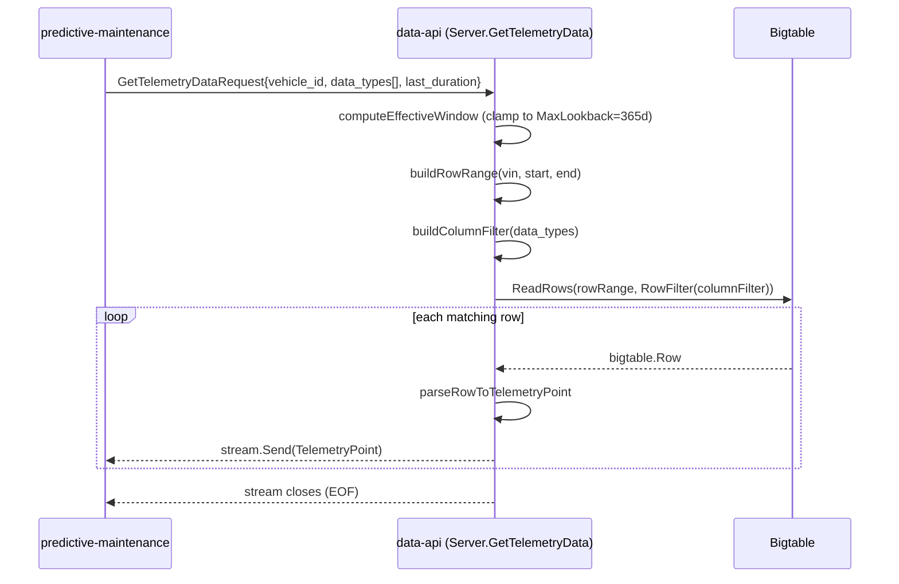

# data-api — Serving Telemetry Windows for Predictive Maintenance

> Audience: engineers working on the predictive-maintenance (PM) pipeline or
> anyone adding a new query pattern against stored telemetry. This document
> explains what `data-api` does, how a "give me 30 days of X for VIN Y"
> request actually turns into a Bigtable scan, and where its behavior
> surprises a first-time reader.
>
> Service: `base-services/data-api`. Proto contract:
> `proto/data-api.proto` (repo root). Go implementation:
> `src/main.go`, `src/service/server.go`, `src/service/bigtable.go`,
> `src/service/time.go`. Citations below are file + function/type name, not
> line numbers.

---

## 1. What this service is, in plain terms

`nats-bigtable-connector` (see its own `docs/pm-telemetry-ingestion.md`)
writes every telemetry reading into Bigtable as it arrives, but Bigtable
itself has no concept of "give me a time window" or "give me these three
columns" as a friendly API — it only knows "give me rows between these two
row keys, optionally filtered by column pattern." `data-api` is the
translation layer that sits in front of Bigtable and turns "I want
VIN1002's last 30 days of `dynamic:battery.voltage`" into the exact
row-key range and column filter Bigtable needs, then streams the matching
rows back over gRPC. Every other service that needs historical
telemetry — `predictive-maintenance`, `trip_analyzer`, the offline
evaluator — goes through this one API rather than touching Bigtable
directly, so the row-key/column-naming conventions only need to be known
in one place.

---

## 2. The one RPC



`proto/data-api.proto` defines exactly one RPC:

```protobuf
service TelemetryDataAPI {
  rpc GetTelemetryData(GetTelemetryDataRequest) returns (stream TelemetryPoint);
}
```

**Request** (`GetTelemetryDataRequest`): `vehicle_id` (VIN), `data_types`
(a list of `"family:qualifier"` strings, e.g. `"dynamic:battery.voltage"`),
and a `oneof time_selector` — either `latest` (bool, "just the newest
point"), `last_duration` (a `google.protobuf.Duration`, "the last N
seconds from now"), or `time_range` (explicit `start`/`end` timestamps,
used by the offline evaluator to score a fixed historical window).

**Response** (`TelemetryPoint`, one per matching Bigtable row): a
`timestamp` plus a `map<string, bytes> values` keyed by the full
`"family:qualifier"` column name. Values are handed back as raw bytes with
**no server-side type decoding** — the caller is expected to know that a
`dynamic:battery.voltage` value is really an ASCII-formatted float string
(a consequence of how the connector writes it; see that service's docs)
and parse it itself.

Server-side, `Server.GetTelemetryData` (`src/service/server.go`) is the
single entry point for all three selector variants; it picks
`s.queryLatestTelemetry` or `s.queryTelemetry` (`src/service/bigtable.go`)
depending on which `oneof` branch was set.

---

## 3. How a 30-day window becomes a Bigtable scan

**In plain terms:** Bigtable can only efficiently answer "give me
everything between key A and key B" — it has no native concept of a date
range. Since the connector writes every row's key as `{VIN}#{timestamp}`
(see that service's docs), a time-window query becomes: build the row key
for "VIN + window start" and the row key for "VIN + window end," and ask
Bigtable to scan everything alphabetically between them. Because the
timestamp format sorts correctly as plain text, this key-range scan is
exactly equivalent to a real time-range query — no secondary index needed.

Concretely (`src/service/bigtable.go`, `s.queryTelemetry`):

1. `computeEffectiveWindow(req, s.opt.MaxLookback)` (`src/service/time.go`)
   resolves whichever `time_selector` was sent into a concrete
   `{Start, End}` pair, clamping `Start` to `now - MaxLookback` (365 days,
   set in `main.go`) — so an accidentally huge window is silently
   *truncated*, not rejected. Malformed input (a negative/zero
   `last_duration`, an `end` before `start`, or no selector set at all) is
   the one thing that *does* produce an error:
   `codes.InvalidArgument`.
2. `s.buildRowRange(vin, startTime, endTime)` formats both boundaries as
   `"{VIN}#{RFC3339Nano-ish timestamp}"` (same `TimestampFormat` the
   connector uses) and builds a `bigtable.RowRange` — a contiguous
   key-range scan, not a filter scanning the whole table.
3. `s.buildColumnFilter(data_types)` splits each `"family:qualifier"`
   string on the first `:`, groups qualifiers by family, and builds a
   `ChainFilters(FamilyFilter(family), ColumnFilter("^(q1|q2|...)$"))` per
   family, OR'd together across families with `InterleaveFilters`. Each
   qualifier is regex-escaped, but matched **exactly** — there is no
   prefix or wildcard matching here (see §4).
4. `tbl.ReadRows(ctx, rowRange, callback, bigtable.RowFilter(columnFilter))`
   runs the scan; each row is parsed by `s.parseRowToTelemetryPoint` (row
   key's trailing timestamp segment is parsed back into a `time.Time`;
   every matching cell becomes one `"family:qualifier" → value` entry) and
   streamed to the client immediately via `stream.Send` — there is no
   buffering of the full result set, so a client can start processing
   results before the scan finishes.

A row whose key doesn't parse as a valid timestamp, or that matched the
column filter but ended up with zero cells, is **silently skipped** (with
a warning log for the unparsable-key case) rather than aborting the whole
query — a single corrupt row never fails an entire 30-day pull.

---

## 4. No wildcards — per-wheel/per-pad sensors must be requested by name

This is the detail most likely to surprise a new consumer of this API.

**In plain terms:** you might expect to ask for "all tire pressure
sensors" and get back FL/FR/RL/RR automatically. You can't — this API has
no concept of "give me everything matching a pattern." Every column you
want, you must name explicitly and completely, one string per column.

`buildColumnFilter`/`buildSingleColumnFilter` build an **exact-match**
regex (`^(qualifier)$`) per entry in `data_types` — there is no prefix
scan, no glob, no "give me `TIRE_PRESSURE.*`" shortcut. This is why
`predictive-maintenance`'s `Processor.run` explicitly lists all four wheel
qualifiers (`dynamic:TIRE_PRESSURE.FL`, `.FR`, `.RL`, `.RR`) and all four
pad qualifiers (`dynamic:BRAKE_WEAR.FL`, …) in its request's `data_types`
array, rather than asking for `dynamic:TIRE_PRESSURE.*` — the caller
carries the knowledge of "there are four wheels named FL/FR/RL/RR," not
this service. If a sixth wheel position ever needed adding, `data-api`
itself would need zero changes — only the caller's `data_types` list would
grow.

The one place a "get everything for this family" shortcut *does* exist is
the `latest` selector: `queryLatestTelemetry` (`src/service/bigtable.go`)
loops over each requested column individually, running one
`ReadRows(..., bigtable.LimitRows(1), bigtable.ReverseScan())` per column —
so "latest" still requires a named column list, it just fetches each one's
single newest value with its own small scan rather than one combined scan.

---

## 5. Local dev wiring and the emulator

**In plain terms:** in local development there is no real Google Cloud
Bigtable — a lightweight in-memory emulator stands in for it, listening on
a fixed port. Both this service (the reader) and `nats-bigtable-connector`
(the writer) are pointed at the *same* emulator instance/table, so writes
from the connector really do show up when this service reads them back —
it behaves like a real shared database, just entirely local and wiped
clean on restart.

`bigtable.NewClient(ctx, gcpProject, btInstance)` (`src/main.go`) uses the
standard `cloud.google.com/go/bigtable` client, which auto-detects the
`BIGTABLE_EMULATOR_HOST` env var and transparently redirects every call
there instead of real GCP — no emulator-specific code exists in this
service; it's entirely a client-library behavior. `local-dev/docker-compose.yml`
wires `data-api`, `nats-bigtable-connector`, and the `bigtable-emulator`
container to the same `GCP_PROJECT=test-project`,
`BT_INSTANCE=test-instance`, `BT_TABLE=telemetry` triple, which is what
makes the shared-database illusion work.

---

## 6. Auth, error handling, and edge cases

- **No authentication or transport security in this service's own code.**
  `main.go` constructs a bare `grpc.NewServer()` — no TLS credentials, no
  interceptors, no token validation. In local dev the endpoint is reachable
  in plaintext. The standalone test client (`client/main.go`) supports an
  optional `-tls` client flag, but that's a client-side dialing option for
  testing against an external TLS-terminating proxy, not evidence of
  server-side auth — if this ever serves a real fleet, auth needs to be
  added at this layer or in front of it (e.g. a gateway/sidecar), not
  assumed to already exist.
- **Unknown VIN**: there is no "VIN not found" concept. A row-key range for
  a VIN with no data simply matches zero rows — the RPC completes
  successfully with an empty stream (clean EOF), not an error. A caller
  cannot distinguish "this VIN has never existed" from "this VIN exists but
  reported nothing in this window" from the response alone.
- **Empty but valid window** (e.g. a genuinely quiet 30-day span): same as
  above — zero rows, no error.
- **Empty `data_types` list**: `buildColumnFilter` returns
  `bigtable.BlockAllFilter()`, meaning the scan runs but matches nothing —
  again a clean empty stream rather than an error, so a caller that
  forgets to populate `data_types` won't get an obvious failure signal.
- **Bigtable-level failures** (connectivity, malformed state) are logged
  server-side with detail, but surfaced to the client only as a generic
  `status.Error(codes.Internal, "failed to execute query")` — the actual
  Bigtable error text never crosses the gRPC boundary, so debugging a
  failure from the caller's side means checking `data-api`'s own logs, not
  the gRPC error message.

---

## 7. Configuration

| Env var | Default (local dev) | Purpose |
|---|---|---|
| `GRPC_ADDR` | `0.0.0.0:8080` | gRPC listen address |
| `GCP_PROJECT` | `test-project` | Passed to `bigtable.NewClient` |
| `BT_INSTANCE` | `test-instance` | Bigtable instance ID |
| `BT_TABLE` | `telemetry` | Table name opened via `btClient.Open` — must match the connector's `BT_TABLE` |
| `BIGTABLE_EMULATOR_HOST` | `bigtable-emulator:8086` | Not read directly by this service's code; consumed by the Bigtable SDK to redirect to the emulator |
| `LOG_LEVEL` | (unset → production logger) | `"debug"` switches to `zap.NewDevelopment()` |
| `TEST_ENV` | (unset) | When `"true"`, pins "now" to a fixed timestamp in `computeEffectiveWindow` for deterministic integration tests — not set in the live compose stack |

Consumers dial this service via `DATA_API_GRPC_ADDR` (e.g.
`data-api:8080` inside the compose network, exposed as host port `9090`).
`MaxLookback` (365 days) is a hardcoded constant in `main.go`, not
currently configurable via env var — worth knowing if a future use case
needs a longer historical query than a year.

---

## 8. Quick reference

| Question | Function / File |
|---|---|
| What RPC does this service expose? | `proto/data-api.proto` · `TelemetryDataAPI.GetTelemetryData` |
| Where does a request get routed by selector type? | `src/service/server.go` · `Server.GetTelemetryData` |
| How is a time window resolved and clamped? | `src/service/time.go` · `computeEffectiveWindow` |
| How is the row-key range built? | `src/service/bigtable.go` · `buildRowRange` |
| How is the column filter built (and why no wildcards)? | `src/service/bigtable.go` · `buildColumnFilter`, `buildSingleColumnFilter` |
| How does `latest` differ from a windowed query? | `src/service/bigtable.go` · `queryLatestTelemetry` vs. `queryTelemetry` |
| How is a Bigtable row turned into a `TelemetryPoint`? | `src/service/bigtable.go` · `parseRowToTelemetryPoint` |
| What happens on a bad time range? | `src/service/time.go` · `computeEffectiveWindow` (returns `codes.InvalidArgument`) |
| What happens on an unknown VIN or empty window? | `src/service/bigtable.go` · `queryTelemetry` (empty stream, no error) |
| What env vars configure it? | `src/main.go` (top of `main`) |
