# Predictive Maintenance — Use Case at a Glance

## Purpose

Nexus SDV's predictive-maintenance prototype uses vehicle telemetry to identify
early signs of degradation in three component areas:

- the 12V starter battery;
- brake pads; and
- tires, analyzed per wheel when per-wheel telemetry is available.

The current detector is deterministic and explainable. It does not use a machine-learning model or an LLM. The detector service polls the Data API for each scheduled VIN, evaluates a recent telemetry window, and publishes a `PmMessage` on NATS for the web dashboard to consume.

This is a local-first prototype. The repository documents a future GCP deployment path, but the predictive-maintenance service is currently wired into the local Docker Compose stack rather than the production `iac/` deployment.

For Indian-vehicle validation, the simulator's complete signal set must not be
assumed to exist on a stock passenger vehicle. OBD-II can provide useful speed
and duty-cycle context, but clean resting battery voltage, direct per-wheel tire
pressure, and direct pad-wear measurements may require added instrumentation or
a telematics partnership. See [Indian vehicle telemetry availability](implementation/13-indian-vehicle-telemetry-availability.md).

## The problem being addressed

Vehicle telemetry contains signals that change before a component becomes unusable. A single reading is often insufficient: the system needs a time window, a component-specific interpretation, and an explanation of why a result was classified as healthy, advisory, action, or critical.

The prototype turns those signals into component health results. A result contains a 0–100 health score, a severity, evidence values, a plain-language explanation, and a timestamp. Healthy results are also supported in the live demo so the dashboard can show the current state of each monitored VIN.

## What is monitored

| Component | Input used by the current processor | Current interpretation |
|---|---|---|
| 12V battery | `dynamic:battery.voltage` and `dynamic:battery.temp` | Temperature-compensated resting-voltage EWMA and 30-day slope. Cranking inputs are supported by the detector contract, while the current processor does not collect cranking samples. |
| Brake pads | `dynamic:BRAKE_WEAR.FL`, `.FR`, `.RL`, `.RR` when available | Latest per-pad wear fraction. If per-pad telemetry is absent, the processor falls back to a velocity/brake-pedal energy estimate. |
| Tires | `dynamic:TIRE_PRESSURE.{wheel}` plus `dynamic:TIRE_TEMP.{wheel}` | Temperature-compensated pressure trend per wheel. If per-wheel telemetry is absent, the processor can use the legacy single tire channel. |

The `dynamic:` names above are the exact qualifiers requested by `Processor.run`. They are not general examples or proposed names.

## End-to-end flow

```mermaid
flowchart LR
    V["Vehicle client or simulator<br/>generates telemetry"]
    N1["NATS telemetry subjects<br/>telemetry-generic.* / telemetry.*"]
    C["nats-bigtable-connector<br/>writes telemetry rows"]
    B["Bigtable telemetry table<br/>dynamic family"]
    A["data-api gRPC<br/>streams a VIN time window"]
    P["predictive-maintenance Processor<br/>collects and normalizes samples"]
    D["Detectors<br/>battery / brake / tire"]
    N2["NATS PM subjects<br/>pm.{VIN}.{component}"]
    S["Web SSE route<br/>subscribes to pm.>"]
    U["/demo and /pm dashboards<br/>show health and evidence"]

    V --> N1 --> C --> B
    B --> A --> P --> D --> N2 --> S --> U
```

In the local demo, the simulator supplies controlled degradation trajectories so an operator can observe a detector move from healthy to an alert state. The detector does not read the simulator's internal ground-truth state; it reads telemetry through the same storage and Data API path used by the service.

## What happens during one analysis cycle

For each scheduled VIN, the service performs the following cycle:

1. It requests the configured telemetry window from the Data API. The default battery lookback is 30 days and the default polling interval is 60 seconds.
2. It decodes the returned `TelemetryPoint` values into time-series samples.
3. It temperature-compensates battery voltage before battery detection and converts tire temperature from Celsius to Kelvin before tire detection.
4. It groups tire samples by wheel and brake wear samples by pad when those qualifiers exist.
5. It runs the component detectors and creates one result per available component or wheel/pad.
6. It serializes each result as a `PmMessage` and publishes it to NATS.
7. The web application's `/api/pm/stream` route subscribes to `pm.>` and forwards decoded messages to the dashboard over Server-Sent Events.

## How a result should be read

The result has two related but different concepts:

- **Health score** is a continuous 0–100 meter intended to show the degree of degradation.
- **Severity** is an alert classification produced by component-specific threshold rules: `healthy`, `advisory`, `action`, or `critical`.

For example, a battery can still have a comparatively high continuous score while crossing the configured action voltage threshold. The score communicates condition; severity communicates the recommended urgency.

Evidence and explanation are part of the output so a consumer can understand why the detector produced the result. Examples include compensated pressure, voltage EWMA, slope, wear fraction, threshold values, and the affected wheel or pad.

## Scope and limitations of this page

This page explains the use case and current system boundary. It does not yet define the physical sensor theory, detector mathematics, protobuf fields, or service internals in depth. Those are covered in the detailed pages so readers can choose the level of detail they need without mixing business context with algorithmic implementation.

For the detailed path, continue with [algorithms](algorithms/README.md), then
[implementation](implementation/README.md), and finally [validation](validation/README.md).

## Source basis

The statements on this page are based on the following repository sources:

- [`sample-services/predictive-maintenance/README.md`](../../../sample-services/predictive-maintenance/README.md) — supported components, thresholds, message subjects, configuration, and local-first deployment status.
- [`sample-services/predictive-maintenance/src/predictive_maintenance/core/processor.py`](../../../sample-services/predictive-maintenance/src/predictive_maintenance/core/processor.py) — Data API request, telemetry qualifiers, normalization, detector dispatch, and PM publication.
- [`sample-services/predictive-maintenance/src/predictive_maintenance/core/detectors.py`](../../../sample-services/predictive-maintenance/src/predictive_maintenance/core/detectors.py) — deterministic detector behavior, health scores, severity rules, evidence, and explanations.
- [`sample-services/predictive-maintenance/proto/pm-message.proto`](../../../sample-services/predictive-maintenance/proto/pm-message.proto) — PM message fields.
- [`sample-clients/data-web-client/src/app/api/pm/stream/route.ts`](../../../sample-clients/data-web-client/src/app/api/pm/stream/route.ts) — web subscription to `pm.>` and SSE delivery.
- [`docs/superpowers/research/2026-08-15-pm-use-case-end-to-end.md`](../../../docs/superpowers/research/2026-08-15-pm-use-case-end-to-end.md) — repository-maintained end-to-end trace of the physical signal, transport, storage, detector, and UI path.
- [`docs/superpowers/research/2026-08-18-indian-vehicle-telemetry-availability.md`](../../../docs/superpowers/research/2026-08-18-indian-vehicle-telemetry-availability.md) — Indian vehicle signal availability and non-circular validation approaches.

Where this page says “current processor” or “current prototype,” that wording is intentional: it describes observed repository behavior, not a generalized production design.
