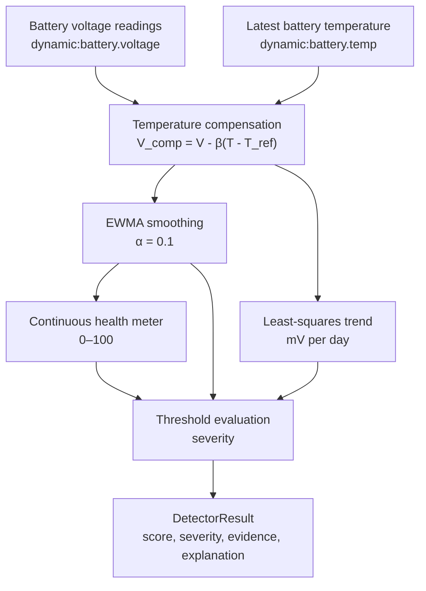

# 12V Battery Health Algorithm

## What this algorithm is intended to detect

The battery detector looks for evidence that the 12V starter battery is losing
health. It uses two complementary signals:

1. a slow change in temperature-compensated resting voltage; and
2. a cranking signature based on minimum voltage and estimated internal
   resistance.

The first signal is intended to identify gradual deterioration. The second is
intended to identify a battery that is likely to fail during starting.

The current live pipeline supplies the resting-voltage path. The detector
function accepts cranking samples, and unit tests exercise that path, but the
current simulator and processor do not publish or collect cranking samples.

## Inputs and their meaning

| Input | Unit | Meaning | Current pipeline status |
|---|---:|---|---|
| `dynamic:battery.voltage` | V | Battery terminal voltage reported as a telemetry value. | Collected by `Processor.run` and used by the live detector. |
| `dynamic:battery.temp` | °C | Battery temperature used to normalize voltage readings. | Collected by `Processor.run`; the latest observed value is forward-filled. |
| Resting sample timestamp | Unix seconds | Time coordinate used to calculate the voltage trend. | Taken from each `TelemetryPoint.timestamp`. |
| `V_min` during cranking | V | Lowest voltage observed while the starter is operating. | Supported by `detect_battery`, but not currently supplied by the live processor. |
| `I_crank` | A | Current during cranking, used to estimate internal resistance. | Supported by `detect_battery`, but not currently supplied by the live processor. |

The processor requests `dynamic:battery.voltage` and `dynamic:battery.temp` in
its Data API request. It does not request `dynamic:battery.soc`, and the
current implementation has no state-of-charge term in the score.

## Physical and engineering basis

For a lead-acid starter battery at rest, open-circuit voltage is related to
state of charge and is affected by temperature. Comparing raw voltages without
temperature normalization can confuse environmental temperature changes with
battery degradation.

The repository implementation uses the following engineering model:

```text
V_comp = V_rest - β × (T - T_ref)

β     = -0.011 V/°C
T_ref = 30 °C
```

The 30 °C reference is the value currently defined in `detectors.py` and is
described in the battery first-principles research document as the
India-calibrated reference used by this prototype.

The dual-channel design itself—slow resting-voltage trend plus a faster
cranking-voltage/internal-resistance signal—comes from the vehicle-battery
health approach described in [US20110082621A1](https://patents.google.com/patent/US20110082621A1/en).
The newer [US11742681](https://patents.justia.com/patent/11742681) continuation
also informs the use of voltage and temperature telemetry and the framing of a
cranking internal-resistance baseline. These sources motivate the detector
design; they do not establish that the current prototype thresholds are
universally valid for every vehicle or battery.

## Processing flow



## Step 1: Temperature compensation

`Processor.run` collects voltage readings together with the most recently seen
battery temperature. It applies compensation before calling
`detect_battery`:

```text
for each voltage sample (time, voltage, temperature):
    compensated_voltage = voltage
                         - BATTERY_BETA
                         × (temperature - BATTERY_V_REF)
```

With the current constants, a 40 °C reading of 12.10 V becomes:

```text
12.10 - (-0.011 × (40 - 30)) = 12.21 V
```

The detector receives the compensated value and does not repeat the
temperature calculation.

### What `detect_battery` is responsible for

`detect_battery` receives a chronological list of already compensated resting
voltages and, optionally, cranking observations. It does not decide whether a
measurement was taken with the engine off, pair voltage with temperature, or
read a message format. Those responsibilities remain outside the detector so
the same algorithm can be tested with a simple list of observations.

Its first decision is whether enough information exists. Fewer than five
resting readings with no cranking observation return a healthy, no-alert result
because no meaningful trend can be estimated. When enough data exists, the
function calculates present level, direction of change, score, severity, and
evidence in that order.

## Step 2: EWMA voltage level

The detector smooths the compensated readings with an exponentially weighted
moving average. The first sample initializes the average:

```text
ewma[0] = compensated_voltage[0]
ewma[i] = (1 - α) × ewma[i-1] + α × compensated_voltage[i]
α = 0.1
```

This gives recent readings more influence while reducing sensitivity to an
individual noisy sample.

## Step 3: Voltage trend

The detector calculates an ordinary least-squares slope using the actual sample
timestamps converted to calendar days:

```text
x = timestamp / 86,400
slope_v_per_day = Σ((x - mean_x) × (y - mean_y)) / Σ((x - mean_x)²)
slope_mv_per_day = slope_v_per_day × 1,000
```

The current advisory trend threshold is `-0.5 mV/day`. A more negative slope
indicates a sustained decline in compensated resting voltage.

## Step 4: Continuous health score

When resting-voltage data is available, the current implementation maps EWMA
voltage to a continuous score:

```text
score = round(clamp(
    (ewma - 10.5) / (12.63 - 10.5) × 100,
    0,
    100
))
```

The implemented endpoints are 12.63 V = 100 and 10.5 V = 0. A negative slope
can cap the score at 55. Cranking violations can cap it at 20 or 30, depending
on which cranking rule is violated.

The score is a condition meter. It is not the same thing as alert severity.

## Step 5: Severity rules

The current battery severity logic is threshold-driven:

| Condition | Severity or effect |
|---|---|
| EWMA below 12.4 V | Advisory |
| EWMA below 12.2 V | Action |
| EWMA below 11.8 V | Critical |
| Cranking `V_min` below 9.5 V | Critical when cranking data is present |
| Cranking internal resistance above 1.5× baseline | Score cap; severity is determined by the remaining severity logic |

If none of the explicit thresholds fires, the detector uses score bands: 70 or
above is healthy, 50–69 is advisory, and below 50 is action.

## Current implementation pseudocode

```text
analyze_battery(resting_samples, cranking_samples):
    if fewer than 5 resting samples and no cranking samples:
        return healthy, score=100, "Insufficient data — no alert"

    ewma = smooth(resting_samples, alpha=0.1)
    slope = linear_slope(resting_samples, x="calendar days")
    score = map_voltage_to_score(ewma, low=10.5, high=12.63)

    if slope < -0.5 mV/day:
        score = min(score, 55)

    for each cranking sample:
        internal_resistance = (12.6 - V_min) / I_crank
        if V_min < 9.5 V:
            score = min(score, 20)
        if internal_resistance > 1.5 × baseline:
            score = min(score, 30)

    if ewma < 11.8 V:
        severity = critical
    else if ewma < 12.2 V:
        severity = action
    else if ewma < 12.4 V:
        severity = advisory
    else if any cranking V_min < 9.5 V:
        severity = critical
    else:
        severity = score_band(score)

    return score, severity, evidence, explanation
```

## Output evidence

For resting-voltage analysis, the detector emits evidence equivalent to:

```text
ewma_voltage
slope_mv_day
threshold_advisory
threshold_action
```

The evidence values are strings because `PmMessage.evidence` is a
`map<string, string>`. When a wheel or pad is relevant to other detectors, the
same message pattern carries that component identity; battery results remain
vehicle-level.

## Important implementation limitations

- The live processor does not collect a cranking series, so the cranking path
  is currently dormant end-to-end.
- The processor forward-fills the latest battery temperature; it does not pair
  every voltage reading with a temperature measured at exactly the same
  timestamp.
- There is no ignition-state gate in the current detector, so the processor
  does not prove that every voltage sample is a true unloaded resting reading.
- State of charge is not requested or used by the current detector, despite
  being discussed in the broader design and research material.
- Thresholds and temperature coefficients are prototype calibration values, not
  universal values for every battery chemistry, vehicle, or climate.
- For Indian vehicle validation, OBD-II control-module voltage must not be
  treated as clean resting OCV. A direct voltage tap and an ignition/engine-off
  gate are required to validate this detector honestly.

## Sources

- [US20110082621A1 — Method and system for predicting battery life based on vehicle battery, usage, and environmental data](https://patents.google.com/patent/US20110082621A1/en) — external origin for combining resting voltage, cranking voltage, temperature, and usage signals.
- [US11742681 — Methods for analysis of vehicle battery health](https://patents.justia.com/patent/11742681) — external reference for voltage/temperature analysis and cranking internal-resistance baseline framing.
- [`2026-08-18-pm-algorithms-sources.md`](../../../../docs/superpowers/research/2026-08-18-pm-algorithms-sources.md) — canonical repository source register and provenance notes for the external references and literature-typical constants.
- [`detectors.py`](../../../../sample-services/predictive-maintenance/src/predictive_maintenance/core/detectors.py) — constants, EWMA, slope, score, severity, evidence, and cranking logic.
- [`processor.py`](../../../../sample-services/predictive-maintenance/src/predictive_maintenance/core/processor.py) — Data API qualifiers, battery temperature forward-fill, compensation, and detector invocation.
- [`pm-message.proto`](../../../../sample-services/predictive-maintenance/proto/pm-message.proto) — output message and evidence map contract.
- [`2026-08-14-pm-algorithms-battery-first-principles.md`](../../../../docs/superpowers/research/2026-08-14-pm-algorithms-battery-first-principles.md) — physical rationale, formulas, worked examples, and known gaps.
- [`2026-08-14-pm-algorithms-implementation.md`](../../../../docs/superpowers/research/2026-08-14-pm-algorithms-implementation.md) — theory-to-code mapping and implementation caveats.
- [`2026-08-18-indian-vehicle-telemetry-availability.md`](../../../../docs/superpowers/research/2026-08-18-indian-vehicle-telemetry-availability.md) — Indian vehicle signal availability and direct-instrumentation options.
