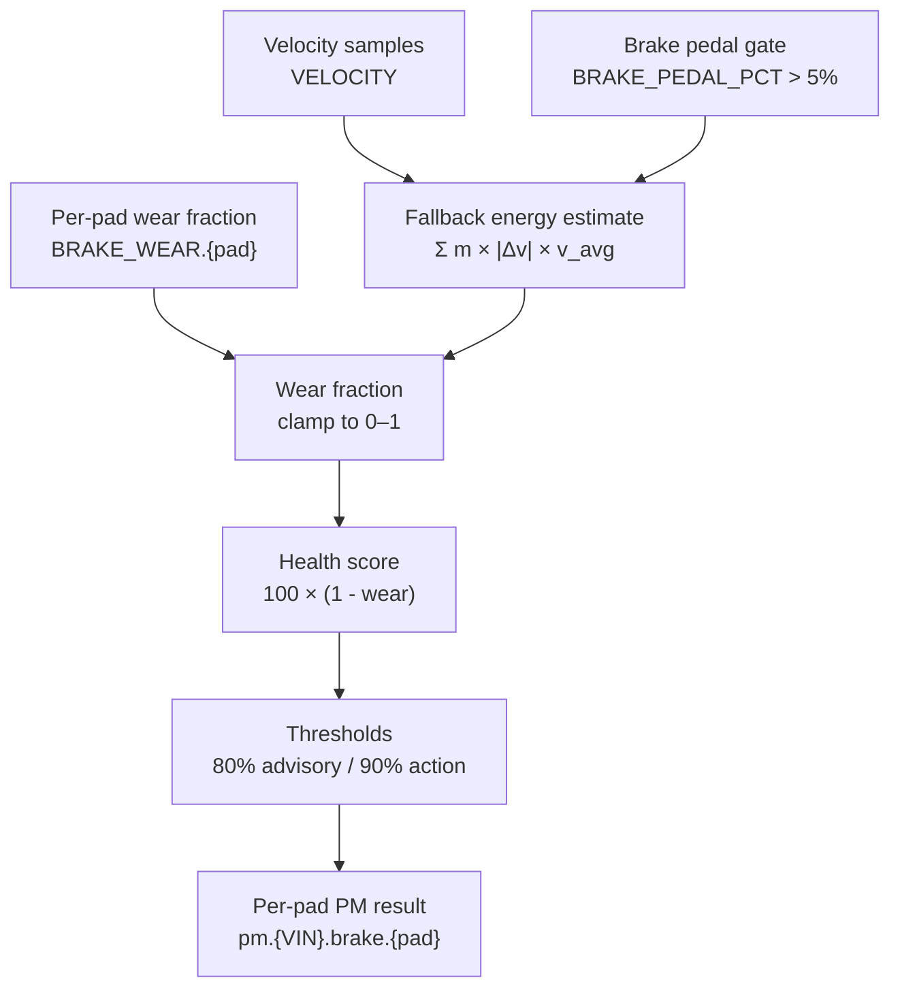

# Brake-Pad Wear Algorithm

## Purpose

The brake detector estimates remaining pad health for each wheel. The current
primary path consumes a per-pad wear fraction from telemetry. A legacy energy
path remains available when per-pad wear columns are missing.

## Inputs

| Input | Unit | Use |
|---|---:|---|
| `dynamic:BRAKE_WEAR.{FL,FR,RL,RR}` | fraction, 0–1 | Primary per-pad wear input. |
| `dynamic:VELOCITY` | m/s | Fallback energy calculation. |
| `dynamic:BRAKE_PEDAL_PCT` | % | Fallback gate; it is pedal position, not braking force. |

The processor keeps the last observed wear fraction for each pad and calls the
detector independently for `FL`, `FR`, `RL`, and `RR`. If no per-pad columns
exist, it estimates braking work from velocity changes and publishes one legacy
brake result.

## Physical basis of the fallback

Braking converts vehicle kinetic energy into heat. For a sampled interval, the
processor approximates dissipated work as:

```text
W_interval = m × |a| × v_avg × Δt
           = m × |Δv| × v_avg
```

where `m = 1,500 kg`, `a = Δv/Δt`, and `v_avg = (v_previous + v_current)/2`.
The implementation uses the timestamps of adjacent telemetry rows, not the PM
poll interval.

The configured lifetime reference is `6.0e9 J` (6 GJ). This is a calibration
constant for the prototype, not a universal pad-life law.

## Processing flow



## Score and severity

For either path:

```text
health_score = round(clamp(100 × (1 - wear_fraction), 0, 100))
```

The current thresholds are:

| Wear fraction | Severity |
|---:|---|
| `> 0.90` | `action` |
| `> 0.80` | `advisory` |
| `≤ 0.80` | `healthy` |

Severity is evaluated from the wear fraction directly. It is not inferred from
the generic score bands used by the battery and tire detectors.

### What `detect_brake` is responsible for

`detect_brake` is intentionally simple. It receives one wear fraction and an
optional pad name; it does not inspect velocity, pedal position, energy, or
telemetry history. The processor has already chosen one of two acquisition
paths: a direct per-pad fraction or a legacy energy estimate. Keeping the
detector independent of that choice ensures that the same thresholds and output
format apply to both paths.

## Current implementation pseudocode

```text
for each pad in FL, FR, RL, RR:
    if BRAKE_WEAR.pad exists:
        wear = latest value in the analysis window
    else if velocity and brake-pedal samples exist:
        for each adjacent sample pair:
            if pedal > 5% and deceleration < -0.5 m/s² and v_avg > 0.5 m/s:
                energy += 1500 × |Δv| × v_avg
        wear = min(1, energy / 6e9)
        publish legacy single brake result
    else:
        produce no brake result

    score = round(100 × (1 - clamp(wear, 0, 1)))
    severity = action if wear > 0.90
             else advisory if wear > 0.80
             else healthy
    publish evidence and explanation
```

The per-pad subject is `pm.{VIN}.brake.{pad}`. Evidence includes the wear
fraction and, for per-pad results, the pad label.

## Simulator behavior

The simulator derives per-pad values from its braking-energy accumulator and
applies demo bias factors: FL `1.4×`, FR `1.25×`, RL `0.8×`, and RR `0.55×`.
This makes front-pad wear appear earlier in the demo. These multipliers are
simulator conventions, not detector-side vehicle physics.

## Limitations

- The 6 GJ budget is not fleet-calibrated.
- Odometer distance is not persisted, so wear rate per kilometer and remaining
  useful life are not calculated.
- Driving-style factors are not implemented.
- The live processor uses a finite telemetry lookback, so the estimate reflects
  the available analysis window rather than a lifetime vehicle history.
- The simulator and detector intentionally share the same energy identity;
  validation therefore demonstrates implementation consistency, not real-world
  predictive accuracy.
- Indian OBD-II access makes the fallback velocity-energy path the most
  immediately testable path on a stock vehicle, but OBD-II does not provide
  direct pad-wear ground truth. Independent inspections are required for
  validation.

## Sources

- [`detectors.py`](../../../../sample-services/predictive-maintenance/src/predictive_maintenance/core/detectors.py) — wear-to-score and severity rules.
- [`processor.py`](../../../../sample-services/predictive-maintenance/src/predictive_maintenance/core/processor.py) — per-pad collection, fallback energy calculation, mass, budget, and publication.
- [`2026-08-14-pm-algorithms-brake-first-principles.md`](../../../../docs/superpowers/research/2026-08-14-pm-algorithms-brake-first-principles.md) — energy model, simulator alignment, and known gaps.
- [`2026-08-18-pm-algorithms-sources.md`](../../../../docs/superpowers/research/2026-08-18-pm-algorithms-sources.md) — canonical calibration notes. The current source register identifies the brake model as physics-derived but does not provide a named external brake publication; the 6 GJ value must therefore be treated as a prototype calibration assumption.
- [`2026-08-18-indian-vehicle-telemetry-availability.md`](../../../../docs/superpowers/research/2026-08-18-indian-vehicle-telemetry-availability.md) — Indian OBD-II availability and the absence of direct pad-wear telemetry in the target validation context.
