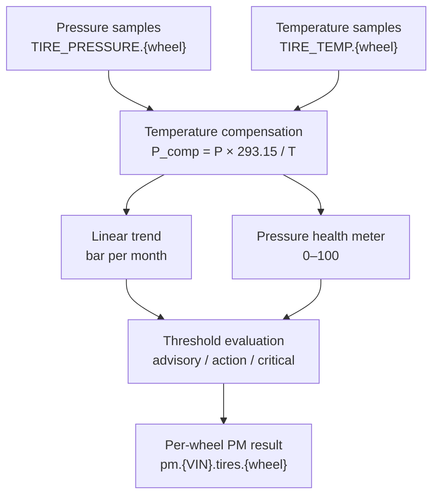

# Tire Health Algorithm

## Purpose

The tire detector identifies slow pressure loss while accounting for pressure
changes caused by temperature. When per-wheel telemetry is available, it runs
independently for `FL`, `FR`, `RL`, and `RR`.

## Inputs

| Input | Unit | Use |
|---|---:|---|
| `dynamic:TIRE_PRESSURE.{wheel}` | bar | Tire pressure time series. |
| `dynamic:TIRE_TEMP.{wheel}` | °C | Temperature used for pressure normalization. |

The processor converts temperature to Kelvin and only passes samples containing
both pressure and temperature to the detector.

## Physical basis

With tire volume approximately constant, the ideal-gas relationship gives:

```text
P × V = n × R × T
P ∝ T
```

The detector normalizes each reading to 20 °C:

```text
P_comp = P × 293.15 / T_kelvin
```

Without this step, normal temperature changes can look like a slow leak. The
20 °C reference is independent of the battery detector's 30 °C reference.

## Processing flow



## Trend, score, and severity

The detector fits a least-squares line with time expressed in months:

```text
slope_bar_per_month = linear_slope(months, compensated_pressure)
```

Current rules:

| Condition | Severity or effect |
|---|---|
| Compensated pressure `< 1.2 bar` | `critical` |
| Compensated pressure `< 1.8 bar` | `action` |
| Slope `< -0.15 bar/month` | `advisory` |
| Otherwise | Generic score band |

The continuous score is:

```text
score = round(clamp((last_compensated_pressure - 0.9) / (2.3 - 0.9) × 100, 0, 100))
```

A slope violation caps the score at 55. The detector requires at least 14
usable pressure/temperature samples; otherwise it returns healthy with an
insufficient-data explanation.

### What `detect_tires` is responsible for

`detect_tires` receives one wheel's chronological pressure and Kelvin
temperature pairs. It discards physically invalid temperatures, normalizes the
remaining pressure readings to the reference temperature, then asks two
questions: “is the latest normalized pressure unsafe?” and “is the normalized
series falling too quickly?” It does not decide which wheel to analyse or pair
raw pressure and temperature rows; the processor supplies that already grouped
series.

## Current implementation pseudocode

```text
for each wheel:
    samples = all rows containing pressure and temperature for that wheel
    compensated = [pressure × 293.15 / (temperature + 273.15)]

    if fewer than 14 compensated samples:
        return healthy, score=100, "Insufficient tire data"

    slope = linear_slope(sample_time_in_months, compensated_pressure)
    last_pressure = compensated[-1]
    score = map(last_pressure, 2.3 bar → 100, 0.9 bar → 0)

    if slope < -0.15 bar/month:
        score = min(score, 55)

    severity = critical if last_pressure < 1.2 bar
             else action if last_pressure < 1.8 bar
             else advisory if slope < -0.15 bar/month
             else score_band(score)

    publish pm.{VIN}.tires.{wheel}
```

If per-wheel qualifiers are absent, the processor uses the legacy single tire
channel and publishes `pm.{VIN}.tires`.

## Limitations and future direction

- The current processor does not apply the planned steady-driving filter; all
  rows with both pressure and temperature are eligible.
- A slow leak near `0.1 bar/month` can remain below the slope threshold until
  the absolute pressure floor is reached.
- The current schema has per-wheel pressure and temperature, but not per-wheel
  wheel-speed signals. UNECE Regulation No. 64 describes the indirect-TPMS
  direction in which an underinflated wheel is localized through relative wheel
  speed; that is future work here, not current behavior.
- The tire temperature reference and thresholds require fleet and tire-class
  calibration before production use.
- Indian vehicle validation cannot assume that an OEM TPMS exposes pressure
  values. Indirect TPMS may only signal a relative pressure change, so direct
  per-wheel TPMS or added instrumentation is needed for this pressure-based
  detector.

## Sources

- [`detectors.py`](../../../../sample-services/predictive-maintenance/src/predictive_maintenance/core/detectors.py) — temperature reference, slope threshold, pressure floor, score, and severity.
- [`processor.py`](../../../../sample-services/predictive-maintenance/src/predictive_maintenance/core/processor.py) — per-wheel collection, Celsius-to-Kelvin conversion, fallback channel, and publication.
- [`2026-08-14-pm-algorithms-tires-first-principles.md`](../../../../docs/superpowers/research/2026-08-14-pm-algorithms-tires-first-principles.md) — ideal-gas derivation, worked examples, and implementation gaps.
- [`2026-08-18-pm-algorithms-sources.md`](../../../../docs/superpowers/research/2026-08-18-pm-algorithms-sources.md) — canonical external-source register and calibration notes.
- [UNECE vehicle regulations — Regulation No. 64](https://unece.org/transport/vehicle-regulations) — external reference for the indirect-TPMS, relative-wheel-speed direction identified as future work.
- [`2026-08-18-indian-vehicle-telemetry-availability.md`](../../../../docs/superpowers/research/2026-08-18-indian-vehicle-telemetry-availability.md) — Indian vehicle TPMS availability and validation approaches.
