# Vehicle-to-Cloud Overview

The PM system is a chain of adapters and services. Each boundary has a
different responsibility; the detector does not read simulator state or
Bigtable directly.

## Responsibilities

| Component | Responsibility | Does not do |
|---|---|---|
| Vehicle client/simulator | Generate or acquire timestamped telemetry and publish protobuf bytes. | Does not classify health. |
| NATS | Route telemetry and PM messages by subject. | Does not persist history. |
| Bigtable connector | Decode telemetry and write timestamped cells. | Does not run detectors. |
| Bigtable | Store historical telemetry by VIN/time row key. | Does not decide severity. |
| Data API | Filter rows/qualifiers and stream `TelemetryPoint`s. | Does not interpret component health. |
| PM processor | Normalize points, call detectors, publish `PmMessage`s. | Does not own physical sensor acquisition. |
| Web SSE route | Decode PM messages and stream JSON to browser consumers. | Does not recalculate algorithms. |

## Full path

```mermaid
flowchart LR
    V["Vehicle client or simulator<br/>physical/simulated values"]
    T["TelemetryMessage / MetricsReport"]
    N1["NATS telemetry subjects"]
    C["nats-bigtable-connector"]
    B["Bigtable telemetry table"]
    A["Data API gRPC stream"]
    P["Processor.run per VIN"]
    D["Pure component detectors"]
    N2["NATS pm subjects"]
    S["/api/pm/stream SSE adapter"]
    U["/demo and /pm consumers"]

    V --> T --> N1 --> C --> B
    B --> A --> P --> D --> N2 --> S --> U
```

## Runtime sequence

1. Service startup parses `SCHEDULED_VINS`, connects to NATS and Data API, and
   schedules one job per VIN.
2. Each job requests a 30-day default lookback and the exact dynamic qualifiers
   needed by the detectors.
3. The Data API streams rows; the processor decodes values, pairs related
   readings, applies unit/temperature normalization, and dispatches detectors.
4. Each result becomes a PM protobuf and is published on a VIN/component
   subject. The demo publishes healthy states as well as anomalies.
5. The web route subscribes to `pm.>`, decodes results, and forwards them as
   SSE. The UI renders state and evidence; it does not recompute health.

## Local versus production boundary

The local Compose stack wires the detector to the local Data API, NATS, and
Bigtable emulator. The repository's GCP `iac/` deployment does not currently
include this service. For Indian vehicle validation, the vehicle-client
simulator would be replaced or supplemented by an adapter that emits the same
telemetry contract; signal availability is documented separately.

## Sources

- [`main.py`](../../../../sample-services/predictive-maintenance/src/predictive_maintenance/main.py)
- [`processor.py`](../../../../sample-services/predictive-maintenance/src/predictive_maintenance/core/processor.py)
- [`docker-compose.yml`](../../../../local-dev/docker-compose.yml)
- [`local-dev/ARCHITECTURE.md`](../../../../local-dev/ARCHITECTURE.md)
- [`2026-08-15-pm-use-case-end-to-end.md`](../../../../docs/superpowers/research/2026-08-15-pm-use-case-end-to-end.md)
