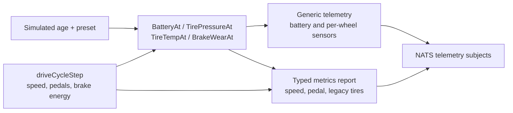

# How Vehicle Data Is Generated

This page explains how the local vehicle simulator creates the telemetry that
the predictive-maintenance service reads. It describes behavior, not source
code: each function below is explained by its responsibility, the state it
changes, and the data it produces.

The simulator is a controlled telemetry source. It creates a virtual vehicle
that drives, ages, and develops component faults. It is not connected to an
actual vehicle ECU or physical sensor.

## The functions that create PM data

| Function | Purpose | Produces data for |
|---|---|---|
| `publishOnce` | Runs one complete simulation cycle. | All telemetry published in a tick. |
| `driveCycleStep` | Moves the virtual vehicle through acceleration, cruising, braking, and idling. | Speed, pedal position, route position, brake energy. |
| `BatteryAt` | Converts simulated battery age and preset into battery condition. | Resting voltage, cranking voltage, internal resistance. |
| `BatteryTempAt` | Creates battery temperature for the current simulated age. | `battery.temp`. |
| `TirePressureAt` | Converts tire age and wheel position into pressure. | `TIRE_PRESSURE.{wheel}`. |
| `TireTempAt` | Creates a wheel temperature that responds to underinflation. | `TIRE_TEMP.{wheel}`. |
| `BrakeWearAt` | Converts accumulated braking energy into one pad's wear fraction. | `BRAKE_WEAR.{pad}`. |
| `buildBatteryTelemetry` | Places battery values into a generic telemetry message. | Battery NATS message. |
| `buildChassisWheelTelemetry` | Places wheel pressure, temperature, and wear into four generic messages. | Per-wheel chassis NATS messages. |
| `buildChassisReport` | Places speed, pedals, legacy tire values, and route state into a typed metrics report. | Legacy/fallback telemetry path. |
| `buildPayloads` | Chooses which message builders run for the selected telemetry mode. | Final NATS publish list. |

## 1. `publishOnce`: the simulation conductor

`publishOnce` is called once per configured simulator interval. It is the
function that coordinates everything; it does not itself contain the physics
of every component.

For each call, it performs these decisions in order:

1. Applies a requested reset, if the dashboard asked the simulator to start
   again from a healthy state.
2. Refreshes the NATS authentication token if needed.
3. Advances the simulated age of the battery. Demo speed and degradation
   acceleration make simulated time pass faster than wall-clock time.
4. Asks the battery, tire, and brake functions for the current component state.
5. Advances the drive cycle to obtain current speed, braking, pedals, route
   position, and cumulative braking energy.
6. Produces a simulator-only ground-truth record for status and offline
   evaluation.
7. Stops the simulated vehicle when its configured terminal condition is
   reached, such as a dead battery or flat tire.
8. Builds protobuf payloads and publishes them to NATS.

The important design point is that a tick creates **both** raw telemetry and
simulator ground truth. Only raw telemetry enters the PM pipeline. Ground truth
is kept outside the detector so the UI and evaluator can compare results later.

## 2. `driveCycleStep`: how the virtual vehicle drives

`driveCycleStep` is a small driving model. It receives the current drive state,
elapsed time, and demo speed multiplier. It updates the drive state in place.

The drive state contains current velocity, phase, phase duration, pedal
positions, engine values, fuel level, route distance, GPS position, heading,
and total brake energy.

The function rotates through four phases:

| Phase | What happens | PM relevance |
|---|---|---|
| Accelerate | Speed rises; accelerator is set; brake is zero. | Provides velocity changes before a braking event. |
| Cruise | Speed varies gently around either city or highway target speed. | Creates normal driving context. |
| Brake | Speed decreases; brake pedal becomes 20–60%. | Creates velocity and brake-pedal inputs for the fallback brake algorithm. |
| Idle | Speed decays toward zero; both pedals are zero. | Creates periods with no braking work. |

During the brake phase, the function calculates the energy removed from the
moving vehicle. It uses vehicle mass, speed change, and average speed over the
simulation interval. That energy is added to `brakeEnergyJ`, a running total
representing braking work across the trip.

The demo speed multiplier speeds up distance traveled and brake-energy
accumulation, but the reported speed values remain on a normal driving scale.
That lets the demo reach maintenance thresholds quickly without displaying an
unrealistic 400 km/h vehicle.

After the phase update, the function derives engine RPM, engine power, fuel
level, steering angle, GPS location, and heading. These fields make the typed
vehicle report look like a coherent trip, although most are not PM inputs.

## 3. `BatteryAt` and `BatteryTempAt`: how a battery ages

`BatteryAt` receives the battery's simulated age and its preset: healthy,
degrading, or critical. It returns three properties of the virtual battery:

- resting voltage: how much terminal voltage the battery holds without a heavy
  starting load;
- cranking minimum voltage: the expected voltage sag during starter-motor load;
- internal resistance: the electrical resistance that rises as the battery
  degrades.

Healthy batteries remain near the healthy plateau. Degrading and critical
batteries follow a gradual early decline, then a stronger terminal collapse
after the configured horizon. This creates a visible progression from a healthy
reading, to warning thresholds, to a battery that can no longer hold charge.

`BatteryTempAt` provides the environmental context for voltage. It creates a
30 °C average with a daily temperature cycle. A degrading battery receives
additional self-heating. `publishOnce` adds small measurement noise to both
voltage and temperature before publishing, so the detector must identify trend
instead of reacting to a perfectly smooth curve.

### What the simulator publishes and does not publish

The simulator publishes battery voltage, temperature, current, and state of
charge. It calculates cranking minimum voltage and internal resistance but does
not place those values in a telemetry message. Therefore the live system runs
the battery trend path, while the detector's cranking path is currently only
exercised by unit tests.

## 4. `TirePressureAt` and `TireTempAt`: how one tire develops a leak

Each wheel has its own tire curve. The front-left wheel starts degrading first;
front-right, rear-left, and rear-right start after 15, 30, and 45 simulated
days respectively. This deliberately creates a useful per-wheel demo instead
of making all tires fail together.

`TirePressureAt` models three stages:

1. **Slow leak:** pressure decreases gradually from the 2.3 bar healthy
   baseline toward 1.9 bar.
2. **Underinflation:** below 1.9 bar, the leak rate doubles because the tire is
   treated as flexing more under load.
3. **Structural collapse:** after pressure reaches 1.2 bar, it approaches a
   near-flat value of about 1.0 bar.

`TireTempAt` starts with a daily ambient cycle around 28 °C. Once pressure is
below 1.9 bar, it adds heat to represent increased sidewall flexing. The heat
is capped so it remains bounded. The detector receives both signals because a
pressure change caused by temperature should not be misclassified as a leak.

## 5. `BrakeWearAt`: how braking becomes pad wear

The simulator does not pretend to have a physical pad-thickness sensor. It
uses the braking energy accumulated by `driveCycleStep` as a wear proxy.

`BrakeWearAt` takes the total brake energy and converts it to a fraction of a
6 GJ lifetime budget. It then applies a pad-specific multiplier:

| Pad | Multiplier | Intended demo effect |
|---|---:|---|
| FL | 1.40 | Fails first. |
| FR | 1.25 | Wears quickly. |
| RL | 0.80 | Wears more slowly. |
| RR | 0.55 | Fails last. |

The multipliers represent a front-heavy braking pattern and make it possible
to demonstrate per-pad PM results. The degrading and critical presets multiply
the wear rate again. The final fraction is always limited to the 0–1 range.

## 6. How values become telemetry messages

`buildBatteryTelemetry` creates one generic message containing battery
voltage, current, state of charge, and temperature. The message is published
to `telemetry-generic.{VIN}.battery`.

`buildChassisWheelTelemetry` creates four generic messages, one per wheel.
Each message contains pressure, temperature, and brake wear for that wheel and
is published to `telemetry-generic.{VIN}.chassis`. The connector preserves the
sensor names as Bigtable qualifiers, which is how the detector later finds
`TIRE_PRESSURE.FL`, `TIRE_TEMP.FL`, and `BRAKE_WEAR.FL`.

`buildChassisReport` creates a typed report on `telemetry.{VIN}`. It contains
the current vehicle speed, brake-pedal position, ignition state, GPS, steering,
and legacy single-channel tire values. The typed report remains useful for the
legacy tire fallback and the velocity-based brake-energy fallback.

`buildPayloads` decides whether to publish generic messages, typed reports, or
both. In the PM demo, both paths are emitted so newer per-wheel logic and older
fallback logic can coexist.

## 7. Why history backfill exists

Battery and tire algorithms need historical samples to calculate a trend. A new
local stack would otherwise have no 30-day history and could not demonstrate a
trend alert.

At startup, the simulator emits daily battery and tire samples for the previous
backfill period. It does **not** advance the drive cycle by a day per sample.
Doing that would create unrealistic speed changes and falsely large brake
energy. Brake wear starts accumulating only during live simulation.

## 8. What changes for a real vehicle

The data contract can stay the same, but the generating functions would be
replaced by acquisition adapters:

- direct battery-voltage and temperature instrumentation;
- direct per-wheel TPMS pressure and temperature;
- OBD-II or another speed source for brake-energy inference; and
- independent inspection or tester data for ground truth.

The Indian vehicle research document explains why stock OBD-II alone does not
provide all of these signals.

## Implementation basis

This explanation is derived from the vehicle client's simulation and payload
code, its degradation model, the associated unit tests, and the repository's
end-to-end PM research. See [the source list](../reference/01-research-sources.md)
and [Indian vehicle telemetry availability](13-indian-vehicle-telemetry-availability.md).
