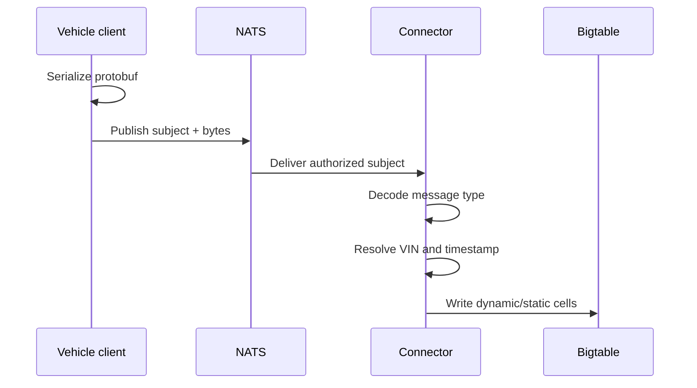

# Data Ingestion and Transport

The ingestion path separates vehicle publishing from persistence. NATS carries
protobuf bytes; the connector is responsible for decoding and translating
those bytes into Bigtable cells.

## Subject routing

| Subject | Payload | VIN source | PM-relevant fields |
|---|---|---|---|
| `telemetry-generic.{VIN}.battery` | `TelemetryMessage` | `device_id` | `battery.voltage`, `battery.temp`, current, SoC. |
| `telemetry-generic.{VIN}.chassis` | `TelemetryMessage` | `device_id` | Per-wheel pressure, temperature, and wear. |
| `telemetry.{VIN}` | `MetricsReport` | Subject token | Typed velocity, brake pedal, legacy tire values. |

The connector's generic path uses each `SensorReading.sensor` as a qualifier.
The typed path unpacks `MetricsReport.report_data`, reads the typed fields, and
formats them under uppercase qualifiers such as `VELOCITY` and
`BRAKE_PEDAL_PCT`.

## What the connector does with each message

The connector has two independent NATS subscriptions. They are important
because generic and typed messages do not take the same decoding path.

| Subscription | Step-by-step behavior | Result |
|---|---|---|
| `telemetry-generic.>` | Decode `TelemetryMessage`; iterate through each sensor reading; choose `dynamic` or `static` family from `DataType`; use the message device ID and reading timestamp to form the row key; write the sensor name and raw string value. | One Bigtable cell per reading. |
| `telemetry.>` | Decode `MetricsReport`; read VIN from the subject; unpack `VehicleTelemetryData` from `Any`; ignore fields that are absent; format each populated scalar; write one mutation containing the available fields. | One Bigtable row containing the populated typed fields. |

This difference explains an important PM behavior: a per-wheel generic message
may create a row containing one wheel's three readings, while a typed chassis
report can create one row containing speed, pedal position, and legacy tire
fields. The processor must therefore understand missing and separately-timed
values; it cannot assume a complete vehicle snapshot on every row.

## Persistence behavior

The connector writes one row per message timestamp. A generic message may
contain several sensor cells; per-wheel messages are separate messages and can
therefore produce separate rows at the same or nearby timestamp. The PM
processor does not assume that all related sensors share one row: it pairs
signals while streaming points from the Data API.

## Authentication boundary

Vehicle publishing uses the NATS authentication flow configured by the local
stack. The connector account subscribes to telemetry subjects and writes to
Bigtable. The PM service uses its configured NATS account to publish `pm.*`;
the web client separately subscribes to `pm.>`.

## Failure behavior

- A publish error causes the vehicle client to attempt reconnection.
- The connector is a separate persistence service; a valid NATS publish does
  not by itself prove that a Bigtable write succeeded.
- The PM processor handles Data API collection exceptions by logging and ending
  that analysis cycle; the scheduler remains alive.
- The web SSE route returns `503` when its NATS connection cannot be created.

The connector also checks that the `telemetry` table and its `dynamic` and
`static` families exist at startup and periodically thereafter. This is needed
for the local Bigtable emulator, which loses its schema when the container is
restarted.

## Sources

- [`nats-bigtable-connector/src/main.go`](../../../../base-services/nats-bigtable-connector/src/main.go)
- [`vehicle-client/main.go`](../../../../sample-clients/vehicle-client/main.go)
- [`local-dev/ARCHITECTURE.md`](../../../../local-dev/ARCHITECTURE.md)
- [`pm-detector-service.md`](../../../../sample-services/predictive-maintenance/docs/pm-detector-service.md)
- [`route.ts`](../../../../sample-clients/data-web-client/src/app/api/pm/stream/route.ts)
