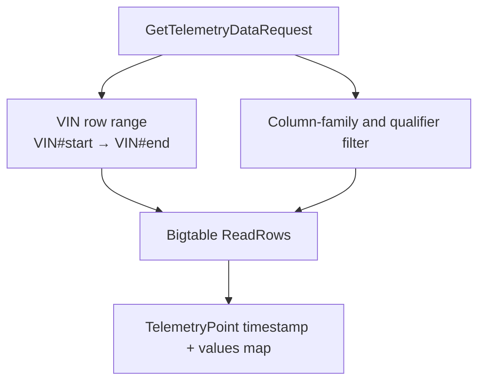

# Storage and Query Path

Bigtable is the historical telemetry boundary between ingestion and
predictive-maintenance analysis.

## Row and column layout

Rows use:

```text
{VIN}#{RFC3339Nano timestamp}
```

The `#` lets the Data API scan a contiguous VIN/time range. PM values are
normally in the `dynamic` family. Examples:

```text
dynamic:battery.voltage
dynamic:battery.temp
dynamic:TIRE_PRESSURE.FL
dynamic:TIRE_TEMP.FL
dynamic:BRAKE_WEAR.FL
dynamic:VELOCITY
dynamic:BRAKE_PEDAL_PCT
```

Static identity cells such as make, model, year, and firmware use the `static`
family and are not detector inputs.

## Data API request

`Processor.run` sends a `GetTelemetryDataRequest` containing:

```text
vehicle_id = VIN
data_types = requested family:qualifier names
last_duration = battery_window_days × 86400 seconds
```

The current request includes battery voltage/temperature, typed velocity and
brake pedal, legacy tire fields, per-wheel tire fields, and per-pad wear
fields. The default `battery_window_days` is 30.

## Server-side filtering



The Data API builds a row range for the VIN and time selector, constructs
family/qualifier filters, and streams each matching row as a `TelemetryPoint`.
The values map uses full keys such as `dynamic:TIRE_PRESSURE.FL`, which is why
the processor can index the response directly.

## How the Data API turns a request into points

`GetTelemetryData` first validates the time selector and constrains it to the
server's maximum lookback. It then chooses one of two query modes:

| Request type | Query behavior | Why PM uses it |
|---|---|---|
| Time range or last duration | Scans forward through every matching row in the VIN/time range. | A detector needs a series, not only the newest reading. |
| Latest | Runs a reverse scan per requested column and returns one most-recent row. | Useful to other consumers; not the current PM trend path. |

For a normal PM request, the query function constructs a row-key range from
`VIN#start` to `VIN#end`. It groups requested columns by family, builds a safe
qualifier expression for each family, and passes that filter to Bigtable. Each
returned row is parsed into a `TelemetryPoint` with the timestamp recovered
from the row key and the full `family:qualifier` names retained in the values
map. Rows with malformed timestamps or no returned cells are skipped.

## Important data-shape consequences

- Related sensors may arrive in different rows because generic per-wheel
  messages are published separately.
- Battery temperature is forward-filled by the processor because it may not be
  present on the same row as every voltage reading.
- Tire detection requires pressure and temperature in the same point; missing
  one of the pair drops that sample.
- The 30-day query is repeated on every poll. The current processor does not
  maintain a lifetime accumulator across cycles.
- The Data API clamps lookback according to its service-level maximum; the PM
  service's configured window must remain within that bound.

## Sources

- [`base-services/data-api/src/service/bigtable.go`](../../../../base-services/data-api/src/service/bigtable.go)
- [`base-services/data-api/src/service/server.go`](../../../../base-services/data-api/src/service/server.go)
- [`processor.py`](../../../../sample-services/predictive-maintenance/src/predictive_maintenance/core/processor.py)
- [`2026-08-15-pm-use-case-end-to-end.md`](../../../../docs/superpowers/research/2026-08-15-pm-use-case-end-to-end.md)
