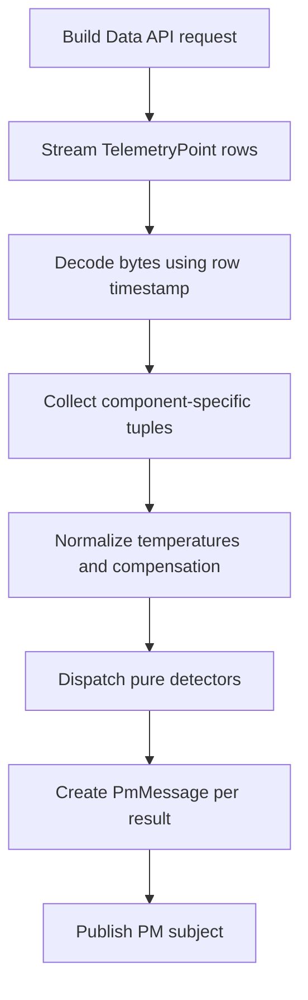

# Predictive-Maintenance Processing

`Processor.run(vin)` is the only current boundary where stored bytes become
detector inputs. It is scheduled independently for each configured VIN.

## Processing sequence

## Collection rules

| Component | Collection rule | Detector input |
|---|---|---|
| Battery | Decode voltage; update last-known temperature whenever a temperature cell appears. | `(timestamp, compensated_voltage)` list. |
| Tires | Accept a point only when the pressure and temperature qualifiers for the same wheel are present. Add 273.15 to temperature. | `(timestamp, pressure_bar, temperature_kelvin)` per wheel. |
| Brakes | Keep the latest `BRAKE_WEAR.{pad}` value per pad. If none exist, integrate qualifying velocity/brake-pedal pairs. | Wear fraction per pad or accumulated energy. |

The processor uses actual row spacing for brake `dt`. It does not use the
60-second PM poll interval as a substitute for telemetry sample spacing.

## Normalization and fallback selection

Battery compensation is applied in the processor because it owns the streamed
voltage/temperature pairing. Tire compensation is applied inside
`detect_tires` after the processor converts Celsius to Kelvin. Per-wheel/per-pad
columns take precedence over legacy channels; fallbacks are selected only when
the newer columns are absent from the returned window.

### How `Processor.run` makes those choices

After the Data API stream ends, the function examines the collections it built:

| Available data | Function decision | Published component key |
|---|---|---|
| At least one battery-voltage sample | Compensate every voltage with its saved temperature and call the battery detector. | `battery` |
| Any per-wheel pressure/temperature series | Call tire detection once for every wheel that has samples. | `tires.FL`, `tires.FR`, `tires.RL`, `tires.RR` as available |
| No per-wheel tire series, but legacy tire series | Call tire detection once with the legacy channel. | `tires` |
| Any per-pad wear values | Keep the latest value for each pad and call brake detection per pad. | `brake.FL`, `brake.FR`, `brake.RL`, `brake.RR` as available |
| No pad-wear values, but qualifying velocity/pedal pairs | Convert accumulated energy to a fraction of the 6 GJ budget. | `brake` |
| No usable values for a component | Do not create a result for that component. | No PM subject |

This is why an older vehicle client can still drive the dashboard through
legacy subjects, while a newer client yields separate wheel and pad results.

## Scheduling and lifecycle

At service startup, `main.py` parses `SCHEDULED_VINS`, connects to NATS and the
Data API, creates a `Processor`, and schedules one analysis job per VIN. The
default interval is 60 seconds. Shutdown cancels the scheduler and closes both
clients. A poll exception is logged and returns from that cycle rather than
crashing the service.

## Publish behavior

The processor checks NATS connectivity, builds a subject from the VIN and
component key, serializes `PmMessage`, and publishes each result. In the live
demo, healthy results are published every poll so the dashboard reflects the
current state. The result key is `battery`, `tires.{wheel}`, `brake.{pad}`, or a
legacy `tires`/`brake` fallback.

## Sources

- [`processor.py`](../../../../sample-services/predictive-maintenance/src/predictive_maintenance/core/processor.py)
- [`main.py`](../../../../sample-services/predictive-maintenance/src/predictive_maintenance/main.py)
- [`scheduler.py`](../../../../sample-services/predictive-maintenance/src/predictive_maintenance/core/scheduler.py)
- [`pm-detector-service.md`](../../../../sample-services/predictive-maintenance/docs/pm-detector-service.md)
