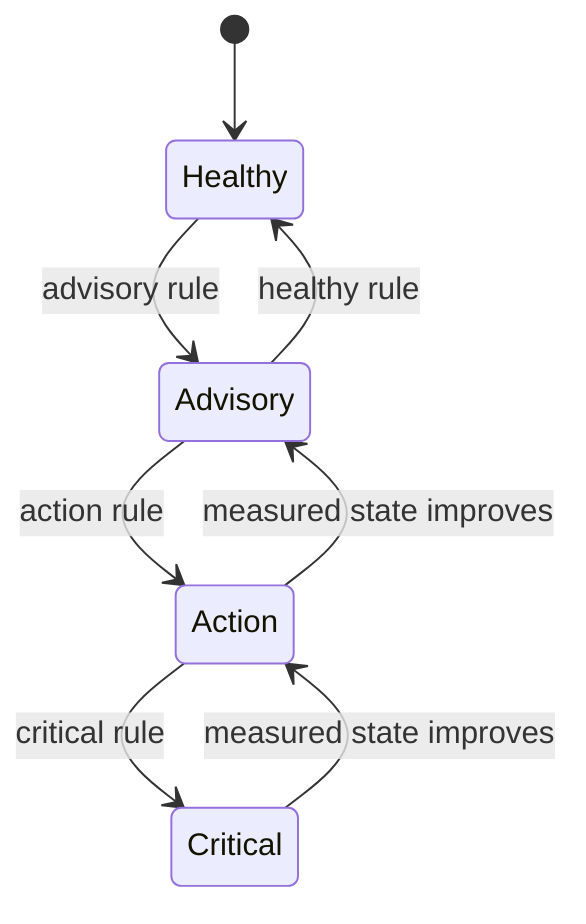

# Alert Model and Message Flow

The PM result is a component state with supporting evidence. It is not a raw
sensor event and it is not a work-order record.

## Message fields

```text
vin          vehicle identity
component    battery, tires.{wheel}, brake.{pad}, or legacy component
health_score continuous 0–100 condition meter
severity     healthy | advisory | action | critical
evidence     string measurements and thresholds
explanation  human-readable detector summary
timestamp    result creation time
```

The `evidence` map preserves detector context without making the PM protobuf
depend on every component's formula. Battery evidence includes EWMA and slope;
tire evidence includes compensated pressure and slope; brake evidence includes
wear fraction and pad identity.

## Subject identity

```text
pm.{VIN}.battery
pm.{VIN}.tires.{FL|FR|RL|RR}
pm.{VIN}.brake.{FL|FR|RL|RR}
```

The subject is part of the routing contract. The web SSE route subscribes to
`pm.>` because `pm.*` would match only one token after `pm` and would miss the
four-token per-wheel/per-pad subjects.

## State interpretation



The detector computes each state independently on every poll. The current demo
publishes healthy states as well as anomalies so the dashboard can refresh its
latest-state view. Consumers should retain the newest message by VIN and
component; they should not interpret every message as a new incident.

## Severity is not score

Health score describes degree of degradation. Severity describes urgency and is
component-specific. For example, the battery action voltage threshold can fire
while the continuous score remains above the generic action band. The dashboard
must display both values rather than deriving one from the other.

## Sources

- [`pm-message.proto`](../../../../sample-services/predictive-maintenance/proto/pm-message.proto)
- [`processor.py`](../../../../sample-services/predictive-maintenance/src/predictive_maintenance/core/processor.py)
- [`detectors.py`](../../../../sample-services/predictive-maintenance/src/predictive_maintenance/core/detectors.py)
- [`route.ts`](../../../../sample-clients/data-web-client/src/app/api/pm/stream/route.ts)
- [`sample-services/predictive-maintenance/README.md`](../../../../sample-services/predictive-maintenance/README.md)
