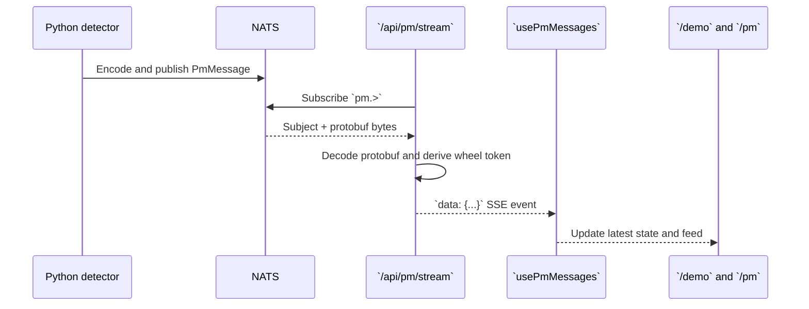

# Dashboard and Consumer Integration

The web client consumes PM state through a server-side NATS-to-SSE adapter. It
does not query Bigtable or call the Python detector directly.

## Message path

## Route behavior

The route:

1. checks the session unless `DEMO_MODE=true`;
2. creates a NATS connection;
3. subscribes to `pm.>`;
4. sends an SSE connection comment so proxies flush the stream;
5. races NATS messages against client disconnect;
6. decodes the PM protobuf and emits JSON; and
7. unsubscribes and closes the stream on cancellation.

For per-wheel/per-pad subjects, the protobuf has the component but not a
dedicated wheel field. The route extracts the fourth subject token and attaches
it to the JSON event so React consumers can group the result.

## UI responsibilities

`usePmMessages` is the browser-side message store. When a page mounts, it first
restores up to 250 prior messages from session storage, removes duplicate
VIN/component/wheel/timestamp combinations, and opens an `EventSource`. Every
new valid message is prepended, capped at 250 entries, and persisted again.
The hook deliberately leaves EventSource reconnection enabled after transient
errors; it only closes the stream when the component unmounts.

The dashboard treats messages as latest component state. It uses:

- VIN and component for identity;
- health score for gauges and summaries;
- severity for color and urgency;
- evidence for detail panels; and
- explanation for readable alert context.

Once a PM message exists, its score and severity are authoritative. Before the
first message arrives, `pm-health.ts` derives a **provisional** state from live
simulator values so a fresh demo does not show an empty panel. It can also force
a terminal simulator ground-truth condition when the detector's 60-second poll
result is stale. This is a demo continuity mechanism, not a second production
detector. The UI should not replace the service's PM result when one exists.

## Failure and security behavior

The route returns `401` when a non-demo request lacks a session and `503` when
NATS cannot be reached. The stream sends no raw telemetry or credentials. The
NATS password is server-side configuration and is not included in SSE events.

## Sources

- [`route.ts`](../../../../sample-clients/data-web-client/src/app/api/pm/stream/route.ts)
- [`usePmMessages.ts`](../../../../sample-clients/data-web-client/src/hooks/usePmMessages.ts)
- [`pm-health.ts`](../../../../sample-clients/data-web-client/src/lib/pm-health.ts)
- [`pm-console.md`](../../../../sample-clients/data-web-client/docs/pm-console.md)
