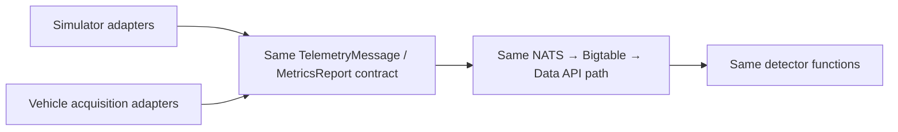

# Simulation and Real-Vehicle Differences

The local simulator is a controlled source of telemetry and labels. It is not
a substitute for a vehicle acquisition adapter or independent maintenance
ground truth.

## Comparison

| Concern | Current simulator | Real Indian vehicle validation |
|---|---|---|
| Battery voltage | `BatteryAt` plus 10 mV noise; always available. | Direct voltage tap is needed for clean resting OCV; OBD-II system voltage is noisy for this purpose. |
| Battery temperature | Simulated bonnet temperature with cycle and degradation heat. | Temperature sensor placement and calibration must be defined. |
| Cranking | `V_min` and `R_int` are calculated internally but discarded before publish. | Requires synchronized starter voltage and current measurements. |
| Tire pressure | Direct per-wheel curve, 2.3 bar baseline, staged leak and collapse. | Requires direct TPMS or added sensors; indirect TPMS may expose only relative wheel-speed behavior. |
| Tire temperature | Per-wheel curve with ambient cycle and flex heat. | Requires a temperature-capable TPMS or wheel sensor. |
| Brake wear | Energy accumulator converted into biased per-pad fractions. | Direct wear may be unavailable; energy inference needs calibration and independent inspections. |
| Truth labels | Generated from the same curves used to publish telemetry. | Must come from testers, inspections, service records, or labeled failures. |

## Why the distinction matters

The simulator can prove that:

- the connector stores the intended qualifiers;
- the Data API returns the intended rows;
- the processor reconstructs detector inputs correctly; and
- thresholds and subjects behave as specified.

It cannot prove that the threshold values predict real component failures. The
simulator's ground truth shares equations with the detector, so its evaluation
is necessarily non-independent.

## Migration pattern

A real-vehicle adapter should emit the same sensor names, units, timestamps,
VIN identity, and message subjects. Only the source of the values should
change. The Indian-vehicle acquisition options and limitations are documented
in [Indian vehicle telemetry availability](13-indian-vehicle-telemetry-availability.md).

## Sources

- [`degradation.go`](../../../../sample-clients/vehicle-client/degradation.go)
- [`main.go`](../../../../sample-clients/vehicle-client/main.go)
- [`evaluate_detectors.py`](../../../../sample-services/predictive-maintenance/scripts/evaluate_detectors.py)
- [`2026-08-18-indian-vehicle-telemetry-availability.md`](../../../../docs/superpowers/research/2026-08-18-indian-vehicle-telemetry-availability.md)
