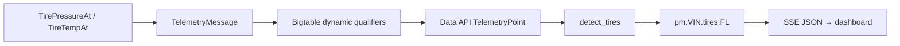

# End-to-End Worked Example: Slow Front-Left Tire Leak

This example follows one per-wheel signal from simulator generation to a
dashboard state. It shows where each transformation occurs.

## 1. Generation

For the front-left wheel, the simulator evaluates:

```text
P_raw = TirePressureAt("FL", ageDays)
T_c   = TireTempAt("FL", ageDays)
```

The pressure curve starts at 2.3 bar. As simulated age increases, it moves
toward the 1.9 bar flex threshold, then declines faster, then approaches the
structural-collapse floor. The temperature curve includes the ambient cycle
and additional flex heat below 1.9 bar.

## 2. Message creation

`buildChassisWheelTelemetry` formats the values as strings in a generic
`TelemetryMessage`:

```text
sensor = TIRE_PRESSURE.FL, value = "2.18"
sensor = TIRE_TEMP.FL,     value = "34.40"
sensor = BRAKE_WEAR.FL,    value = "0.12"
```

The message is published to `telemetry-generic.{VIN}.chassis`.

## 3. Persistence

The connector maps the readings to dynamic qualifiers and writes a row keyed by
the message timestamp:

```text
row key: {VIN}#{RFC3339Nano}
dynamic:TIRE_PRESSURE.FL = "2.18"
dynamic:TIRE_TEMP.FL     = "34.40"
dynamic:BRAKE_WEAR.FL    = "0.12"
```

The values remain encoded bytes until the Data API returns them.

## 4. Query and normalization

During its next scheduled run, the processor requests the FL pressure and
temperature qualifiers for the configured lookback window. For each returned
point it:

```text
pressure_bar = float(raw_pressure)
temperature_kelvin = float(raw_temperature) + 273.15
append(timestamp, pressure_bar, temperature_kelvin)
```

Rows without both FL values are not added to the tire series.

## 5. Detection

`detect_tires` converts each pair to the 20 °C reference:

```text
P_comp = P_raw × 293.15 / T_kelvin
```

It then fits a line in months and maps the latest compensated pressure to a
0–100 score. The current rules classify below 1.8 bar as action, below 1.2 bar
as critical, and a slope below -0.15 bar/month as advisory.

## 6. Publication and UI

The processor creates a `PmMessage` with component `tires.FL` and publishes:

```text
subject: pm.{VIN}.tires.FL
evidence: p_comp_bar, slope_bar_month, threshold_slope, floor_bar, wheel=FL
```

The web route subscribes to `pm.>`, decodes the protobuf, derives `wheel=FL`
from the subject, and emits an SSE JSON event. The dashboard updates the
front-left tire state without recalculating the detector.



## What this example does not prove

It proves that the current simulator, connector, Data API, processor, detector,
NATS subject, and dashboard agree on the signal contract. It does not prove
that a real Indian vehicle exposes direct per-wheel pressure or that the
threshold predicts a real tire failure. Those require instrumented vehicles and
independent inspection labels.

## Sources

- [`main.go`](../../../../sample-clients/vehicle-client/main.go)
- [`degradation.go`](../../../../sample-clients/vehicle-client/degradation.go)
- [`processor.py`](../../../../sample-services/predictive-maintenance/src/predictive_maintenance/core/processor.py)
- [`detectors.py`](../../../../sample-services/predictive-maintenance/src/predictive_maintenance/core/detectors.py)
- [`route.ts`](../../../../sample-clients/data-web-client/src/app/api/pm/stream/route.ts)
- [Tire health algorithm](../algorithms/03-tire-health.md)
