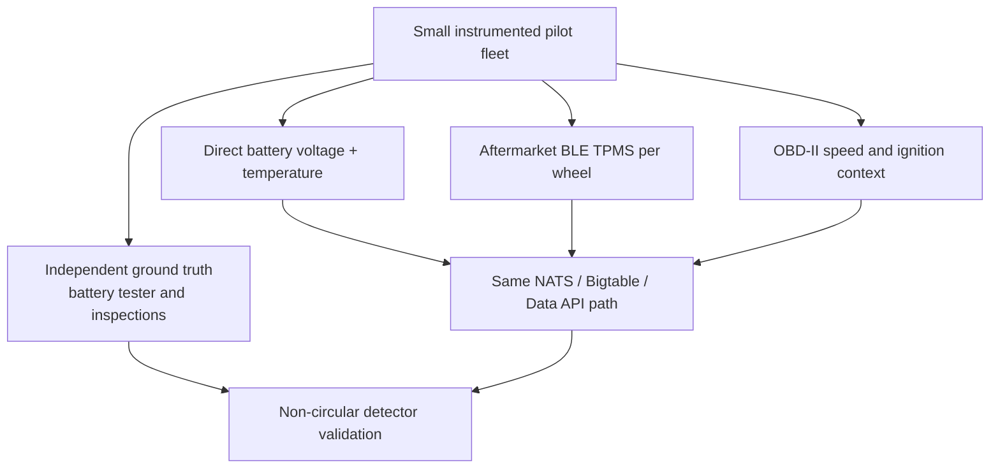

# Indian Vehicle Telemetry Availability

The simulator provides all signals needed by the prototype, but a stock Indian
passenger vehicle does not necessarily expose those signals through its OBD-II
port or connected-car service. This is a validation limitation, not merely an
integration detail.

## What is realistically available

| PM input | Stock-vehicle availability described by the research | Consequence |
|---|---|---|
| Clean resting battery voltage | OBD-II control-module voltage is system/alternator voltage and may be affected by load. | The battery EWMA requires a direct voltage measurement plus an engine-off/ignition gate. |
| Per-wheel tire pressure | Some vehicles use indirect TPMS based on ABS wheel-speed comparison; it may not expose pressure values. | The current pressure-and-temperature detector needs aftermarket TPMS or equivalent direct sensing. |
| Brake-pad wear | Direct pad-wear sensing is not generally available in the target vehicle class. | Use calibrated velocity-based energy inference or add a suitable wear measurement for a pilot. |
| Vehicle speed and duty cycle | Standard OBD-II speed and related context PIDs are available. | The fallback brake-energy path can be evaluated with an OBD-II logger. |

The implication is that OBD-II alone can support an initial brake-energy and
pipeline experiment, but it cannot fully validate the battery and tire
detectors.

Availability varies by make, model, variant, model year, and ECU configuration.
The table is a planning boundary derived from the repository research note;
each pilot vehicle must be checked directly before a signal is treated as
available.

## Recommended validation paths

The research note ranks a small, instrumented pilot as the most direct route:
use the existing ESP32 client and add a battery voltage/temperature path,
aftermarket BLE TPMS, and OBD-II or GPS speed. A telematics-vendor partnership
is the scale path; an OBD-II logger is the immediate partial path.

## What must not be claimed

- OBD-II control-module voltage is not equivalent to unloaded resting OCV.
- Indirect TPMS detection is not the same as a direct pressure measurement.
- Simulator ground truth is not independent validation.
- Open Indian driving datasets provide behavioral context, not battery, tire,
  or brake-health labels.
- An undocumented connected-car API is not a durable product integration.

## Sources

- [`2026-08-18-indian-vehicle-telemetry-availability.md`](../../../../docs/superpowers/research/2026-08-18-indian-vehicle-telemetry-availability.md) — repository research basis for availability gaps and acquisition approaches.
- [`iot-client`](../../../../sample-clients/iot-client)
- [`2026-08-18-pm-algorithms-sources.md`](../../../../docs/superpowers/research/2026-08-18-pm-algorithms-sources.md)
- [OBD-II PIDs](https://en.wikipedia.org/wiki/OBD-II_PIDs)
- [BS6 Phase 2 and OBD-II context](https://www.tvsmotor.com/media/blog/bs6-phase-2-rde-and-obd-2-compliance-explained)
- [Tata iRA connected-car context](https://www.spinny.com/blog/tata-ira-connected-car/)
- [Tata Safari TPMS availability reference](https://www.carbike360.com/car-faqs/does-tata-safari-come-with-a-tyre-pressure-monitoring-system-4)
- [iRA EV community wrapper](https://pypi.org/project/ira-ev-api-wrapper/) — referenced only as an example of an undocumented, per-VIN integration; not a recommended product dependency.
- [LocoNav developer APIs](https://developers.loconav.com/)
- [ESP32 OBD-II logger example](https://github.com/roypeter/esp32-obd2-logger)
- [India Driving Dataset](https://blogs.iiit.ac.in/idd-dataset/) — behavioral context only, not component-health ground truth.
