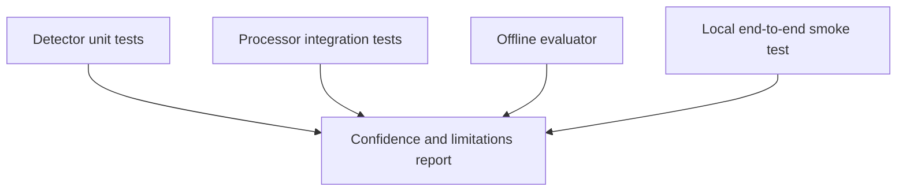

# Validation Strategy

Validation is layered so failures can be localized.



## Layers

- **Unit tests** verify EWMA, slopes, temperature compensation, wear mapping,
  severity, evidence, and insufficient-data behavior.
- **Processor tests** verify Data API qualifiers, per-wheel/per-pad dispatch,
  fallback paths, cadence, and PM publication.
- **Offline evaluation** replays telemetry and simulator ground truth to
  calculate precision, recall, and lead time.
- **Local smoke tests** exercise the running stack from telemetry ingestion to
  dashboard-facing PM messages.

The test suite should be treated as a contract for current behavior, not as
proof that simulator formulas predict field failures.

## What each layer proves

| Layer | Evidence | Does not prove |
|---|---|---|
| Detector unit test | A known sample series produces the expected score, severity, and evidence. | Correct telemetry acquisition or storage. |
| Processor test | Requested qualifiers, timestamp handling, fallback selection, and subjects are correct. | Physical validity of a sensor value. |
| Offline evaluator | Replay and label comparison are reproducible over a simulator soak. | Independent fleet performance, because simulator labels share model assumptions. |
| Local smoke test | Running services deliver telemetry through storage and expose PM output. | Production availability, security posture, or vehicle calibration. |

## Recommended execution order

```text
cd sample-services/predictive-maintenance
uv run pytest tests/test_detectors.py tests/test_processor.py tests/test_processor_cadence.py

cd local-dev
make test
```

For a detector change, run the focused unit test first, then the processor
tests, then the end-to-end smoke path. A passing unit test is not sufficient if
the changed qualifier or subject is not exercised through the running stack.

## Sources

- [`tests/`](../../../../sample-services/predictive-maintenance/tests/)
- [`evaluate_detectors.py`](../../../../sample-services/predictive-maintenance/scripts/evaluate_detectors.py)
- [`local-dev/scripts/test-local-flow.sh`](../../../../local-dev/scripts/test-local-flow.sh)
- [`sample-services/predictive-maintenance/README.md`](../../../../sample-services/predictive-maintenance/README.md)
