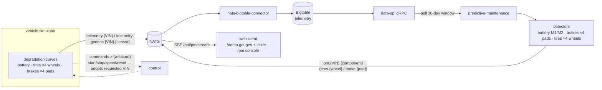

# Predictive Maintenance — Usage & Operations Guide

Date: 2026-08-10
Status: **Guide** — how to run, use, deploy, test, and validate the
predictive-maintenance prototype (companion to the design spec and the
service READMEs).

This is the operator's view of the Predictive Maintenance Copilot:
what it does, how to stand it up, how to read the dashboard, how the
detection math works, how to get real validation numbers, and how to
deploy it beyond the local stack.

## 1. What this is

A telemetry-driven predictive-maintenance service on the Nexus SDV platform.
It watches each monitored VIN's slow signals (12 V battery, per-wheel tire
pressure, per-pad brake wear), runs **deterministic** detectors (no ML, no
LLM), and publishes `pm.{VIN}.{component}` alerts on NATS that the web
dashboard renders.



End-to-end detail (control channel, ground-truth side channel, evaluator
input) is diagrammed in `research/2026-08-14-pm-algorithms-implementation.md`
§8.7.

Everything in this guide runs in the local docker-compose stack — no GCP
needed. Target market context (India calibration) is in the research docs.

## 2. Quick start

```bash
cd local-dev
make pm-demo
```

This ensures the stack + `vehicle-simulator` + `predictive-maintenance` are
up, then opens **http://localhost:3000/pm**.

First run takes ~2–3 minutes (builds images with `--no-cache`). `make pm-demo`
is idempotent — re-running it is a no-op when everything is already up.

## 3. What you see

### /pm — single-vehicle live console

- **Vehicle picker** — choose any pool VIN (defaults to the discovered
  simulator); the console shows that vehicle's live KPIs (speed, battery
  voltage/health, brake wear, tire pressure), the route panel (lap × progress
  on the demo loop), and the component badges. The simulator subscribes the
  `commands.>` wildcard, so picking a different VIN + **Start** makes it
  adopt that VIN (identity, degradation curves and publish subjects repoint
  to it).
- **Demo speed** — 1×/5×/20× toggle (fast-forward the degradation story).
- **Start/Stop/Reset demo** — explicit simulator control. **Reset demo**
  restores the vehicle to healthy *and clears the accumulated alert feed*
  (see §8 for what each clears).
- **Live charts** — a 10-minute rolling window of health, voltage, brake wear
  and tire pressure, so the death arc (§5) is visible as it happens.
- **PM events** — newest-first alert feed with severity, component and the
  detector's plain-language explanation. A **Clear alerts** button wipes the
  feed (in-memory + sessionStorage); new alerts re-appear only when a
  component actually crosses a severity band again.

### /demo — live pipeline

The demo page gains per-component **health gauges**, **alert chips** on the
vehicle schematic (pulsing when a component is alerting), and a **PM ALERTS
ticker** with its own **Clear alerts** button. Only `battery` maps to a
schematic node; brake/tires alerts live on /pm (the demo schematic shows the
vehicle's physical zones).

## 4. How detection works (the math)

| Component | Method | Rules |
|---|---|---|
| **12V battery** | Resting voltage trend (EWMA + 30-day least-squares slope), temperature-compensated to a 30 °C reference (`V_comp = V − β·(T − 30)`, β ≈ −0.011 V/°C); cranking signature (`V_min`, `R_int = (V_rest − V_min)/I_crank`) | EWMA < 12.4 V or slope < −0.5 mV/day → advisory; < 12.2 V → action; < 11.8 V → critical; `V_min` < 9.5 V or `R_int` > 1.5× baseline → action/critical |
| **Brake pads** | Per-pad wear fraction (`BRAKE_WEAR.{FL,FR,RL,RR}` published by the sim); legacy fallback: energy integral from driving data `W = Σ m·a·v·Δt` (1500 kg; 6 GJ pad budget) | wear > 80 % → advisory; > 90 % → action |
| **Tires** | Temperature-compensated pressure `P_comp = P·T_ref/T` (T_ref 20 °C) per wheel (`TIRE_PRESSURE.{FL,FR,RL,RR}` + `TIRE_TEMP.{FL,FR,RL,RR}`), slope over steady-driving samples | slope < −0.15 bar/month → advisory; `P_comp` < 1.8 bar → action; < 1.2 bar → critical |

Tires and brakes are **per wheel / per pad**: the detector runs ×4 for each
(battery stays single-channel) and publishes `pm.{VIN}.tires.{wheel}` /
`pm.{VIN}.brake.{pad}`; the /pm console shows a worst-wheel summary with
per-wheel detail in the expand dialog. **Health meters are continuous in the
signal** (battery 12.63 V → 10.5 V = 100 → 0; tires 2.3 bar → 0.9 bar = 100
→ 0), while severity comes from the threshold rules — a battery at 12.10 V
scores ~75 yet still alerts as action.

- **Publish cadence**: an alert is published when a component's severity
  changes or its health band crosses (green ≥ 70 / amber 50–69 / red < 50) —
  not every poll. **Healthy VINs publish nothing.** (The /pm demo console
  additionally streams a per-poll state message so the board always reflects
  live health.)
- **No LLM**: the `explanation` is a deterministic template from the
  evidence. This keeps alerts auditable and the demo key-free.
- All thresholds live in `core/detectors.py` as constants; the code→math
  reference (`docs/superpowers/research/2026-08-14-pm-algorithms-implementation.md`)
  and the first-principles companions (`2026-08-14-pm-algorithms-{battery,brake,tires}-first-principles.md`)
  derive them.

## 5. Configuration

The service is env-driven (pydantic-settings). Key variables (full table in
`sample-services/predictive-maintenance/README.md` + `example.env`):

| Variable | Default | Notes |
|---|---|---|
| `DATA_API_GRPC_ADDR` | `data-api:8080` | data-api gRPC |
| `NATS_HOST/PORT/USER/PASSWORD` | `nats:4222` connector/connector-pass | account needs `pm.>` pub perms |
| `SCHEDULED_VINS` | (empty → local stack uses VIN_POOL) | which VINs to monitor |
| `POLL_INTERVAL_SECONDS` | `60` | per-VIN poll |
| `BATTERY_WINDOW_DAYS` | `30` | battery trend lookback |

### Degradation presets (simulator)

The vehicle-simulator emits physics-informed degradation trajectories. Per
VIN, controlled by the `degradation` control action or the
`DEGRADATION_PRESET` env:

- `healthy` — battery stable ±0.05 V, no tire leak, no brake wear.
- `degrading` — battery declines 12.63 → ~12.1 V over the horizon, tires leak
  0.2 bar/month, brake wear accumulates from driving.
- `critical` — full decline to 12.0 V / 15.3 mΩ, deterministic alerts.
- `demo` (default) — pool's first VIN critical, rest mixed.

**The death arc** (degrading/critical only): a real component doesn't stop at
the horizon — it dies. Past its horizon the battery enters a death collapse
(V_rest dives 12.0 → ~10.5 V, internal resistance spikes to ~30 mΩ — the
car won't start), and the tire goes flat in three phases (slow puncture →
flex-heated self-accelerating leak → structural collapse to ~1.0 bar, running
up to +14 °C hot). So a long demo ends with every component permanently
critical — "vehicle is scrap" — and **Reset demo** is the way back.

### Fast demo (speed multiplier)

The 1×/5×/20× toggle on /demo and /pm sends a `speed` control action. It
accelerates **time** for everything that integrates over time (battery age,
route distance/laps, brake energy), while every *instant* published value
(velocity, voltages, pressures) stays at normal 1× scale — so charts and
detector math never see a ×N artifact. `DEGRADATION_ACCEL` (compose env) is a
second multiplier; the demo stack sets it so the whole advisory → action →
death arc fits in a 1–3 minute showcase.

**Timing note**: aging is `dt · speed · DEGRADATION_ACCEL` per tick. At 1×
with accel 1 a `critical` battery reaches 12.0 V after ~60 wall days; at 20×
with the demo stack's accel the same arc takes minutes. The backfill seeds
~30 days of history at startup (`BACKFILL_DAYS`), so the slope rules fire
within a minute of live time.

## 6. Data flow & subjects

- **Ingest** (existing): simulator publishes battery JSON on
  `telemetry-generic.{VIN}.battery` and MetricsReport on `telemetry.{VIN}`
  (VELOCITY, BRAKE_PEDAL_PCT, TIRE_PRESSURE.{FL,FR,RL,RR},
  TIRE_TEMP.{FL,FR,RL,RR}, BRAKE_WEAR.{FL,FR,RL,RR}, …) → connector →
  Bigtable → data-api.
- **Detection**: the service polls data-api (`dynamic:battery.*`, `VELOCITY`,
  `BRAKE_PEDAL_PCT`, per-wheel `TIRE_PRESSURE.*`, `TIRE_TEMP.*`,
  `BRAKE_WEAR.*`) per VIN per poll, running `detect_tires` ×4 and
  `detect_brake` ×4.
- **Alerts**: `pm.{VIN}.{component}` on NATS — battery stays
  `pm.{VIN}.battery`; tires/brakes publish one subject per wheel/pad
  (`pm.{VIN}.tires.{wheel}` / `pm.{VIN}.brake.{pad}`). The web SSE route
  (`/api/pm/stream`) subscribes `pm.>` and streams to the dashboard.
- **NATS permissions**: the local-dev `connector` account is granted
  `pm.>` pub/sub (see `local-dev/README.md` §4). If you add a new account or
  edit `setup-automated.sh`, keep `pm.>` in both the subscribe and publish
  allowlists.

## 7. Testing

```bash
# Service (Python)
cd sample-services/predictive-maintenance
uv run pytest tests/ -v

# Simulator (Go)
cd sample-clients/vehicle-client
go test ./...

# Web client
cd sample-clients/data-web-client
bun run build && bun test            # full suite (bun runner)

# End-to-end local flow (stack up)
cd local-dev
make test                            # incl. the pm-loop assertion (Test 6)
```

The e2e assertion (Test 6 in `local-dev/scripts/test-local-flow.sh`) checks
the detector's polling loop is alive and never errors — deterministic. A
`pm.*` publish assertion is best-effort (healthy VINs publish nothing).

## 8. Validation — getting real numbers

The /pm validation card shows placeholder values until you run the offline
evaluator over a soak with known ground truth:

1. **Soak** — bring the stack up with a degrading fleet, e.g.:
   ```bash
   cd local-dev
   make pm-demo
   # restart the simulator with a critical fleet if you want deterministic alerts:
   docker compose --env-file .env.base-services --env-file .env.sample-services \
     up -d vehicle-simulator   # DEGRADATION_PRESET=demo default; or set critical
   ```
   The simulator writes ground-truth labels (`local-dev/data/sim-ground-truth.jsonl`,
   one JSON object per VIN per tick, via the `GROUND_TRUTH_LABELS` env + the
   `./data` bind volume). For a shorter soak, run the simulator with an
   accelerated clock (aging is real-time; accelerate by raising the sim tick
   or adding an aging multiplier — currently real-time by design).
2. **Evaluate** — from `sample-services/predictive-maintenance`:
   ```bash
   uv run python scripts/evaluate_detectors.py --vins VIN1001,VIN1002,... --soak-days 60
   ```
   It polls the same data-api window, re-runs the detectors, compares against
   the labels, and writes real precision / recall / mean lead time into
   `sample-clients/data-web-client/public/pm-validation.json`.
3. **Commit** the rewritten JSON so the /pm validation card reflects it.

Until step 2/3 happen the card stays placeholder — that is intentional; the
file self-identifies with `"placeholder": true`.

## 9. Deployment

### Local / demo

`local-dev/docker-compose.yml` service `predictive-maintenance` (container
`nexus-predictive-maintenance`), env injected from the `.env.*` files;
`SCHEDULED_VINS` defaults to `VIN_POOL`. `make pm-demo` is the one-command
entry.

### GCP / production (not yet wired)

The prototype is local-first: `iac/` (cloudbuild/helm) does not deploy
`predictive-maintenance` yet. To ship it, mirror `trip_analyzer`'s deployment
path:

1. Add a production `Dockerfile` (from `Dockerfile.local`, swap the DOCKER_HUB_MIRROR) + a cloudbuild step (build/push/deploy) and a helm chart, following the trip-analyzer pattern.
2. NATS: grant the service account `pm.>` subscribe **and** publish perms; grant the web client's NATS user `pm.>` subscribe.
3. Point `DATA_API_GRPC_ADDR` at the in-cluster data-api; set `SCHEDULED_VINS` from the fleet.
4. Bigtable retention: the detector needs weeks of history (`BATTERY_WINDOW_DAYS=30`); verify the production Bigtable retention policy covers the trend window.
5. Validation: run the soak/evaluator in a staging fleet before claiming precision/recall in production.

## 10. Troubleshooting

| Symptom | Cause / fix |
|---|---|
| No alerts on /pm | NATS account missing `pm.>` perms (re-run `make go` to regenerate `nats.conf`); detector not polling (`docker compose logs predictive-maintenance` — want `Polling data-api`); no degrading VIN (use `DEGRADATION_PRESET=critical`) |
| /pm stream empty but detector logs fine | SSE route subscribes `pm.>` — if you see `pm.*` in the code, it was reverted; NATS `*` matches one token, `pm.VIN.battery` needs `pm.>` |
| Validation card placeholder | By design until section 8's soak is scored |
| Battery alerts look wrong in summer/winter | Temperature compensation assumes the 30 °C reference (India calibration); if your fleet's temps are far from it, check `BATTERY_V_REF`/`BATTERY_BETA` |
| `make proto` after adding a proto package | The relocation path assumes the `pm` package; extend the Makefile move for new packages |
| Alerts still on screen after Reset demo | Reset clears simulator state; the feed clear is separate — use **Clear alerts** (or Reset demo on /pm, which does both). Stale alerts pre-date the reset and don't mean the vehicle is still failing |
| Alert feed stays empty after Clear alerts | Expected: the detector publishes on severity change/band crossing — a healthy vehicle publishes nothing, so the feed stays empty until a component re-crosses a band |

## 11. Source docs

- Design spec: `docs/superpowers/specs/2026-08-09-predictive-maintenance-prototype-design.md`
- Implementation plan: `docs/superpowers/plans/2026-08-09-predictive-maintenance-prototype.md`
- Research: `docs/superpowers/research/2026-08-14-pm-algorithms-implementation.md`
  (code→math map, e2e flow, fast demo, reset/clear semantics),
  `docs/superpowers/research/2026-08-14-pm-algorithms-battery-first-principles.md`,
  `docs/superpowers/research/2026-08-14-pm-algorithms-brake-first-principles.md`,
  `docs/superpowers/research/2026-08-14-pm-algorithms-tires-first-principles.md`
- Service: `sample-services/predictive-maintenance/README.md` (+ `example.env`)
- Local dev operator guide: `local-dev/README.md` (§9 Predictive-maintenance demo)
