# Predictive Maintenance — Use Case End-to-End: Physics → Proto → Pipeline → UI

Date: 2026-08-15
Status: **Reference — the connection layer between the algorithm docs and the code that moves each byte**
Purpose: Tie the four existing PM documents together by tracing, from first principles, exactly **what the use case consumes and where each quantity comes from**: the physical signal → the protobuf field it rides in → the NATS subject → the Bigtable column → the data-api request → the processor's collection logic → the detector math → the `PmMessage` on NATS → the SSE route → the React components that render it. If you can read this document and then point at any screen element or any log line and name the proto field and the function that produced it, it has done its job.

Companion documents (read in this order):

1. `2026-08-09-predictive-maintenance-prototype-design.md` — the approved design (goals, architecture, per-component alert rules)
2. `2026-08-14-pm-algorithms-{battery,brake,tires}-first-principles.md` — the physics and math behind each detector
3. `2026-08-14-pm-algorithms-implementation.md` — theory→code map, constants, worked examples, known gaps
4. **this document** — the end-to-end wiring: which proto field, which subject, which qualifier, which function, which component

Citation convention: `File(fn)` = function `fn` in that file; `(top)` = module-level constant. All file paths relative to repo root as shown in §9. Every claim below was verified against the source on 2026-08-15.

---

## 1. The ten-hop chain (one diagram, one paragraph)

The demo PM pipeline moves one physical quantity from the simulated vehicle to a colored badge on the /pm page through exactly ten hops:

```mermaid
flowchart LR
  P["① Physics: degradation curve<br/>(degradation.go BatteryAt/TirePressureAt<br/>BrakeWearAt per pad · driveCycleStep brake accumulator)"]
  S["② Simulator tick (main.go publishOnce):<br/>walks curve → publishes 1–2 NATS messages<br/>(+ wheel telemetry: TIRE_PRESSURE.{w},<br/>TIRE_TEMP.{w}, BRAKE_WEAR.{w})"]
  B["③ NATS subject:<br/>telemetry-generic.{VIN}.battery (SensorReading)<br/>telemetry-generic.{VIN}.chassis (per-wheel sensors)<br/>telemetry.{VIN} (MetricsReport)"]
  C["④ nats-bigtable-connector:<br/>unmarshals → writes dynamic:{qualifier} cell<br/>row key {VIN}#{RFC3339Nano}"]
  T["⑤ Bigtable 'telemetry' table<br/>family dynamic, qualifier = sensor/field name<br/>(TIRE_PRESSURE.FL…RR, BRAKE_WEAR.FL…RR)"]
  A["⑥ data-api gRPC GetTelemetryData:<br/>row-key range scan + column filter,<br/>streams TelemetryPoint{values: {family:qualifier → bytes}}"]
  PR["⑦ Processor.run poll (60 s per VIN):<br/>decodes bytes → (t, value) lists,<br/>applies temp compensation"]
  D["⑧ detectors.py pure functions:<br/>EWMA/OLS/thresholds → DetectorResult<br/>detect_tires ×4 (tires.{FL|FR|RL|RR})<br/>detect_brake ×4 (brake.{FL|FR|RL|RR})"]
  N["⑨ NATS pm.{VIN}.{component} protobuf PmMessage<br/>(component = battery · tires.{wheel} · brake.{pad})"]
  U["⑩ data-web-client:<br/>SSE /api/pm/stream → usePmMessages →<br/>gauges, charts, badges, PM events feed"]
  P --> S --> B --> C --> T --> A --> PR --> D --> N --> U
```



Two side channels complete the picture:

- **Ground truth** (validation, not detection): the simulator derives `wear_fraction` / `days_to_failure` / `pressure_bar` / `energy_joules` from the *same curves* the telemetry walks (`main.go(groundTruth)`), and exposes them (a) in the `commands.{VIN}.demo` status reply the UI polls, and (b) appended to `local-dev/data/sim-ground-truth.jsonl` for the offline evaluator.
- **Control** (the UI drives the simulator): `/pm` buttons send JSON `{action: start|stop|speed|reset}` over `commands.{VIN}.demo`; the simulator's `controlState.handle` mutates `enabled` / `speed` / `resetFn`, and the next tick's curves follow.

The key design property — worth stating before the details — is that **the detector and the simulator share one algebraic identity**: the energy the processor estimates from stored rows (`m·|Δv|·v_avg`) is the same formula the simulator's accumulator uses, and the battery/tire curves end exactly on the detector's alert lines. That identity is what makes the offline precision/recall numbers meaningful (see §7).

---

## 2. The physical signals and the proto fields they ride in

### 2.1 Two protobuf families, two NATS subjects

The vehicle-client publishes **two different protobuf message types** each tick (`main.go(buildPayloads)`, driven by `-message-type=both` in `sample-clients/vehicle-client/entrypoint.sh`):

| Message type | NATS subject | Proto schema | Who consumes it |
|---|---|---|---|
| `TelemetryMessage` | `telemetry-generic.{VIN}.battery` | `proto/telemetry.proto` — `device_id`, `sensor_data[]` of `SensorReading{timestamp, value(string), data_type, sensor}` | battery detector |
| `TelemetryMessage` | `telemetry-generic.{VIN}.chassis` | same `proto/telemetry.proto` — per-wheel `SensorReading`s (`TIRE_PRESSURE.{wheel}`, `TIRE_TEMP.{wheel}`, `BRAKE_WEAR.{wheel}`) | per-wheel tire (×4) + per-pad brake (×4) detectors |
| `MetricsReport` (envelope) | `telemetry.{VIN}` | `proto/metrics_report.proto` — `report_data` is a `google.protobuf.Any` wrapping `VehicleTelemetryData` | legacy single-channel brake + tire fallback (back-compat) |

`MetricsReport.ReportData` is a **type-erased `Any`**: the connector unpacks it via `mr.ReportData.UnmarshalTo(&vtd)` (`nats-bigtable-connector/src/main.go`), so the VIN comes from the **subject** (`parts[1]`), not the payload. The `SensorReading` path carries `device_id` inside the message, but the connector keys rows off `tm.DeviceId` (`nats-bigtable-connector/src/main.go`).

### 2.2 The field table — every proto field the PM pipeline reads

This is the table the whole use case hangs on. "Proto field" = the source field in `proto/vehicle_telemetry.proto` (typed path) or the sensor name in `proto/telemetry.proto` (generic path); "Qualifier" = the Bigtable column name the processor requests; "Used by" = the detector step.

| Physical quantity | Proto field | Units | Qualifier (Bigtable / data-api) | Used by |
|---|---|---|---|---|
| Vehicle speed | `VehicleTelemetryData.VELOCITY` (field 9) | m/s | `dynamic:VELOCITY` | Brake: `a = Δv/Δt`, `v_avg` (`processor.py(run)`) |
| Brake pedal position | `CarlaVehicleDynamics.brake_pedal_pct` (field 3, inside `vehicle_dynamics`, field 13) | % (0–100) | `dynamic:BRAKE_PEDAL_PCT` | Brake gate only (`> 5.0`); never enters an alert |
| Tyre pressure (legacy single) | `VehicleTelemetryData.TIRE_PRESSURE` (field 8) | bar | `dynamic:TIRE_PRESSURE` | **Back-compat** — fallback only when per-wheel columns are absent |
| Tyre temperature (legacy single) | `VehicleTelemetryData.TIRE_TEMP` (field 16) | °C | `dynamic:TIRE_TEMP` | **Back-compat** — fallback only when per-wheel columns are absent |
| Tyre pressure per wheel | `SensorReading{sensor: "TIRE_PRESSURE.{wheel}"}` (generic path, `buildChassisWheelTelemetry`) | bar | `dynamic:TIRE_PRESSURE.{FL\|FR\|RL\|RR}` | Tires ×4: raw input to `P_comp = P·293.15/T` per wheel (`detect_tires` per wheel) |
| Tyre temperature per wheel | `SensorReading{sensor: "TIRE_TEMP.{wheel}"}` (generic path, `buildChassisWheelTelemetry`) | °C | `dynamic:TIRE_TEMP.{FL\|FR\|RL\|RR}` | Tires ×4: denominator of compensation (processor adds 273.15 → Kelvin) |
| Brake pad wear per wheel | `SensorReading{sensor: "BRAKE_WEAR.{wheel}"}` (generic path, `buildChassisWheelTelemetry`) | fraction (0–1) | `dynamic:BRAKE_WEAR.{FL\|FR\|RL\|RR}` | Brake ×4: last wear per pad → `detect_brake(..., pad=w)` → `pm.{VIN}.brake.{pad}` |
| Battery terminal voltage | `SensorReading{sensor: "battery.voltage"}` | V | `dynamic:battery.voltage` | Battery: input to temp compensation then EWMA + slope |
| Battery temperature | `SensorReading{sensor: "battery.temp"}` | °C | `dynamic:battery.temp` | Battery: forward-filled compensation temperature |
| Battery current | `SensorReading{sensor: "battery.current"}` | A | `dynamic:battery.current` | **Not consumed** — M2 cranking is dormant (§8 of implementation doc) |
| Battery SoC | `SensorReading{sensor: "battery.soc"}` | % | `dynamic:battery.soc` | **Not consumed** — SOC drift term unimplemented; processor never requests it |

The per-wheel sensors (`TIRE_PRESSURE.{wheel}`, `TIRE_TEMP.{wheel}`, `BRAKE_WEAR.{wheel}`) ride the generic `telemetry-generic.{VIN}.{sensor}` path (sensor name contains the dot — `"TIRE_PRESSURE.FL"` etc., `main.go(buildChassisWheelTelemetry)`), so the connector stores them as `dynamic:TIRE_PRESSURE.FL` … columns without connector changes. The legacy single `dynamic:TIRE_PRESSURE` / `dynamic:TIRE_TEMP` / `dynamic:BRAKE_PEDAL_PCT` + `dynamic:VELOCITY` typed fields stay for back-compat: the processor falls back to the single tire channel and the energy-accumulator brake path when the per-wheel columns are absent (older sim / mixed history, `processor.py(run)`).

Everything else in `VehicleTelemetryData` (ENGINE_POWER, ENGINE_RPM, FUEL_*, GPS_*, HEADING_DEG, LOCKED, IGNITION_STATE, `acceleration_modulus_m_s2`, `distance_meters`, `gear_status`, steering/accelerator) is **persisted but not consumed** by the PM detectors. Two worth calling out because they look useful and aren't:

- `acceleration_modulus_m_s2` (field 11) — the connector **does not persist this field** (no `addMetric` call for it), so the processor must estimate deceleration from `VELOCITY` deltas instead (`processor.py(run)`).
- `distance_meters` (field 12) — not persisted either, so `wear_rate_per_km` can't be computed and RUL is out of scope (§4.3 implementation doc).

### 2.3 Which simulator function emits which field

| Published field | Emitted by | Curve / value source |
|---|---|---|
| `battery.voltage` | `main.go(buildBatteryTelemetry)` | `vRest` from `degradation.go(BatteryAt(ageDays))` + ±0.025 V noise (`main.go(publishOnce)`) |
| `battery.current` | `buildBatteryTelemetry` | constant 45.2 A seed, clamped 0–100 — dead data for PM |
| `battery.soc` | `buildBatteryTelemetry` | `85.5 − 30·(severityFactor·ageDays/120)`, floor 5 — dead data for PM |
| `battery.temp` | `buildBatteryTelemetry` | reuses `TireTempAt(ageDays)` (28 °C ± 8 °C cycle) |
| `TIRE_TEMP` (legacy generic path) | `buildBatteryTelemetry` | same `battery.temp` value — the typed path is the real one |
| `VELOCITY`, `TIRE_PRESSURE`, `TIRE_TEMP`, `BRAKE_PEDAL_PCT`, GPS, heading | `main.go(buildChassisReport)` | `drive.velocity` / `TirePressureAt` / `TireTempAt` / `drive.brakePct` — legacy single-channel, back-compat |
| `TIRE_PRESSURE.{FL\|FR\|RL\|RR}`, `TIRE_TEMP.{FL\|FR\|RL\|RR}`, `BRAKE_WEAR.{FL\|FR\|RL\|RR}` | `main.go(buildChassisWheelTelemetry)` | `TirePressureAt(ageDays + wheelOffset)` / `TireTempAt(…)` per wheel (staggered offsets FL=0/FR=15/RL=30/RR=45) / `BrakeWearAt(wheel, brakeEnergyJ)` (pad bias FL=1.4×, FR=1.25×, RL=0.8×, RR=0.55×) |

A subtle but load-bearing detail: **`battery.voltage` is a string** — `fmt.Sprintf("%.2f", b.voltage)` (`buildBatteryTelemetry`). The processor decodes it with `.decode().strip('"')` (`processor.py(run)`). The typed fields (`VELOCITY` etc.) are stored by the connector as `%.2f`-formatted bytes (`metricFormat`, `nats-bigtable-connector/src/main.go`). Both arrive as text; the processor's `_parse_point`/decode strips quotes either way.

---

## 3. The storage layer — Bigtable anatomy

### 3.1 Row key

`{VIN}#{RFC3339Nano}` — e.g. `VIN1001#2026-08-15T09:12:03.123456789Z`. Written by the connector from the **message timestamp** (SensorReading's `timestamp` on the generic path, `ReportTimestamp` on the typed path — falling back to `time.Now()` when zero, `nats-bigtable-connector/src/main.go`). The `#` separator is what makes both the data-api's row-range scan (`buildRowRange`, `base-services/data-api/src/service/bigtable.go`) and the web client's device-key scan (`{deviceId}#` → `{deviceId}$`, `sample-clients/data-web-client/src/lib/devices.ts`) tight per-VIN ranges.

### 3.2 Column families and qualifiers

Table `telemetry` (created by `local-dev/setup-automated.sh phase_bigtable_schema`, self-healed by the connector's `ensureTable` ticker) has two families:

- `dynamic` — every PM-relevant qualifier (`battery.voltage`, `battery.temp`, `VELOCITY`, `BRAKE_PEDAL_PCT`, `TIRE_PRESSURE`, `TIRE_TEMP`, `TIRE_PRESSURE.{FL\|FR\|RL\|RR}`, `TIRE_TEMP.{FL\|FR\|RL\|RR}`, `BRAKE_WEAR.{FL\|FR\|RL\|RR}`, …). Generic path: family = `DataType_STATIC ? "static" : "dynamic"`, qualifier = `reading.Sensor` — the per-wheel sensor names carry the dot (`"TIRE_PRESSURE.FL"`), which is part of the qualifier, not a separator. Typed path: always `dynamic`, qualifier = the upper-case field name.
- `static` — cabin identity (`make`, `model`, `year`, `firmware`) — irrelevant to PM.

**Row granularity**: one row per message timestamp, one cell per qualifier. The typed chassis report writes VELOCITY/TIRE_PRESSURE/TIRE_TEMP/BRAKE_PEDAL_PCT all in the same row (one `Apply` per report); each per-wheel `TelemetryMessage` writes its three sensors (`TIRE_PRESSURE.{wheel}`, `TIRE_TEMP.{wheel}`, `BRAKE_WEAR.{wheel}`) in separate rows, one `Apply` per sensor (same loop as the battery sensors in `nats-bigtable-connector/src/main.go`). This is why the processor treats battery voltage/temp as a forward-filled pairing rather than per-row columns.

### 3.3 Value encoding

- Generic path: `[]byte(reading.Value)` — the **raw string** (`"12.52"` including the quotes, because the simulator formats `"%.2f"`).
- Typed path: `fmt.Sprintf(metricFormat(qualifier), value)` — `%.2f` (no quotes) for everything except GPS (`%.6f`).

The processor's `float(v(...).decode().strip('"'))` handles both. The web client's `getDevices` (`devices.ts`) returns these as `columns["dynamic:battery.temp"]` strings — the /pm vehicle dropdown is built from the same scan.

---

## 4. The serving layer — data-api

`base-services/data-api` exposes the single gRPC stream `GetTelemetryData(GetTelemetryDataRequest) returns (stream TelemetryPoint)` (`sample-services/predictive-maintenance/proto/data-api.proto`).

- Request: `{vehicle_id: VIN, data_types: ["dynamic:battery.voltage", "dynamic:battery.temp", "dynamic:VELOCITY", "dynamic:BRAKE_PEDAL_PCT", "dynamic:TIRE_PRESSURE", "dynamic:TIRE_TEMP", "dynamic:TIRE_PRESSURE.FL"…"dynamic:TIRE_PRESSURE.RR", "dynamic:TIRE_TEMP.FL"…"dynamic:TIRE_TEMP.RR", "dynamic:BRAKE_WEAR.FL"…"dynamic:BRAKE_WEAR.RR"], time_selector: last_duration = battery_window_days·86400 s}` (`processor.py(run)`).
- The server turns `data_types` into a Bigtable filter: family + `^(q1|q2|…)$` qualifier regex per family, `InterleaveFilters` across families (`bigtable.go(buildColumnFilter)`); the window becomes a row-key range `{VIN}#{start}` → `{VIN}#{end}` (`buildRowRange`), clamped to `MaxLookback = 365 days` (`data-api/src/main.go`).
- Each returned `TelemetryPoint` is `{timestamp, values: map["family:qualifier"] → raw bytes}` — the key is the **full column name** (`server.go(parseRowToTelemetryPoint)`), exactly the string the processor indexes with.
- The poll window is `battery_window_days = 30` (`config.py(top)`), so a 60 s poll re-reads the last 30 days of rows every minute. The evaluator uses an explicit `TimeRange` instead (`evaluate_detectors.py(run_detectors_for_vin)`) so a soak can be re-scored over its full range.

**Why 30 days?** The battery slope rule is a *sustained* trend (−0.5 mV/day); a shorter window can't separate noise from drift, and the backfill (§6) seeds exactly 30 daily rows so the slope fires immediately on a fresh stack.

---

## 5. The processing layer — what the Processor does with each stream

`predictive-maintenance/src/predictive_maintenance/core/processor.py(run)` is the only place raw bytes become detector inputs. It runs per VIN on the APScheduler interval (`main.py` schedules one job per `SCHEDULED_VINS` member; compose sets `SCHEDULED_VINS=${VIN_POOL}`, `POLL_INTERVAL_SECONDS=60`, `local-dev/docker-compose.yml`).

Inside the stream loop, per point:

1. `t = point.timestamp.timestamp()` — **the row's own timestamp is the x-axis** (calendar-accurate OLS, uneven spacing safe).
2. `batt_temp` is a running **last-known** battery temperature, seeded to `BATTERY_V_REF` (30 °C, no-op default) and updated whenever a row carries `dynamic:battery.temp`. Attached to every voltage row — a forward-fill, not per-row pairing.
3. Battery: rows carrying `dynamic:battery.voltage` → `(t, V, batt_temp)` triples.
4. Tires **×4**: for each wheel w ∈ FL/FR/RL/RR, rows carrying **both** `dynamic:TIRE_PRESSURE.{w}` and `dynamic:TIRE_TEMP.{w}` → `(t, P_bar, T_kelvin)` per wheel with `+ 273.15` applied at collection. The legacy single `dynamic:TIRE_PRESSURE` / `dynamic:TIRE_TEMP` pair is also collected as the fallback channel.
5. Brake **×4**: rows carrying `dynamic:BRAKE_WEAR.{w}` → the **last** wear fraction per pad is retained. The legacy brake path (rows carrying **both** `dynamic:VELOCITY` and `dynamic:BRAKE_PEDAL_PCT`) still runs: remembers the previous pair, and when `brake_pct > 5.0` computes `dt` = real sample spacing, `a = Δv/Δt`, `v_avg`; accumulates `1500·|a|·v_avg·dt` only when `a < −0.5` m/s² and `v_avg > 0.5` m/s.

After the stream: battery gets its **temperature compensation applied here** (`V_comp = V − β·(T − 30)`, `processor.py(run)`) before `detect_battery`; tires run **`detect_tires` once per wheel** (`results[f"tires.{w}"] = detect_tires(samples, recommended_bar=2.3, wheel=w)`, published `pm.{VIN}.tires.{wheel}`) with the single-channel fallback to `pm.{VIN}.tires` when no per-wheel columns exist; brakes run **`detect_brake` once per pad** (`results[f"brake.{w}"] = detect_brake(min(1.0, max(0.0, wear)), pad=w)`, published `pm.{VIN}.brake.{pad}`), with the legacy `min(1, E/6e9)` energy path on `pm.{VIN}.brake` when no `BRAKE_WEAR.*` columns exist. All three detectors now score with **continuous meters** — battery `round(clamp((ewma − 10.5)/(12.63 − 10.5)·100, 0, 100))`, tires per wheel `round(clamp((last_p − 0.9)/(2.3 − 0.9)·100, 0, 100))`, brake per pad `round(100·(1 − wear))` — while severity stays threshold-driven (battery ewma < 12.4/12.2/11.8 V advisory/action/critical; tire last_p < 1.8/1.2 bar action/critical; brake wear > 0.8/0.9 advisory/action). Results are serialized to `PmMessage` and published (demo cadence: every poll, healthy included — see `processor.py(run)` comment).

### 5.1 Why compensation lives in the caller, not the detector

`detect_battery` consumes already-compensated voltages (`comp = [v for _, v in rest]`, `detectors.py(detect_battery)`). The processor owns the `(V, T)` pairing because it streams rows and forward-fills temperature; the detector stays a pure function of a `(t, V_comp)` series. The evaluator mirrors the identical compensation in its own poll loop (`evaluate_detectors.py(run_detectors_for_vin)`), so live detection and offline lead-time math agree on the same compensated series.

---

## 6. The simulator side — where the truth comes from

### 6.1 The degradation curves (`sample-clients/vehicle-client/degradation.go`)

All physics-informed, all **functions of simulated age `day`**:

```
battery: deg = severityFactor·√(norm(day))
         V_rest = 12.63 − 0.63·deg        → 12.0 V at full degradation
         R_int  = 9.3 + 6.0·deg  mΩ       → 15.3 mΩ
         V_min  = 10.8 − 1.3·deg  V       → 9.5 V (== CRANK_VMIN!)
         + death collapse past horizon: V_rest → 10.5 V, R_int → ~30 mΩ
tires:   phase 1 slow leak (0.2·sf/30 bar/day) → 1.9 bar
         phase 2 flex acceleration (2× leak)   → 1.2 bar
         phase 3 structural collapse           → ~1.0 bar flat
         temp = 28 + 8·sin(day·2π) + flex-heat (max +14 °C below 1.9 bar)
brake:   accumulator in driveCycleStep (brake phase): E += speed·1500·|Δv|·v_avg
```

**The deliberate alignment**: the simulator's dead-battery endpoints are exactly the detector's alert lines (9.5 V cranking min, 12.2 V action, 1.8 bar floor, 6 GJ budget). The curves are functions of age; the published telemetry is just the curve evaluated at `ageDays`. This is what makes "the vehicle is scrap" (everything permanently critical) a *consequence* of the curves, not a scripted flag.

### 6.2 Aging, backfill, and the clock

- `publishOnce` ages the battery by `intervalSeconds/86400 · speed · degradationAccel` days per tick (`main.go(publishOnce)`). Compose: `INTERVAL=2`, `DEMO_SPEED=5`, `DEGRADATION_ACCEL=1200` → **one wall-clock second advances ~0.139 simulated days** (~7 days per wall minute), so the 60-day critical horizon crosses in ~8 wall minutes at 5×.
- **Backfill**: on startup, before the live loop, the sim publishes `BACKFILL_DAYS` (compose: 60) daily battery+tire rows with timestamps `now − (backfillDays−i)·24h` (`main.go(PublishTelemetryContinuously)`), walking `ageDays` one day per row. The 30-day detector window fills immediately and the slope rules fire within the first poll. The drive cycle is deliberately NOT stepped at day scale ("velocity math would explode") — brake energy only accrues live.
- **The control loop**: the sim registers `commands.{VIN}.demo` and waits for a start command before publishing (`controlState` starts with all components `enabled=false`; the UI's explicit Start button sends `{action:"start"}`). The `/pm` speed buttons send `{action:"speed", preset:"5"}` etc. Reset sends `{action:"reset"}` → `resetSimulation` zeroes age/brake/lap, keeps the speed multiplier, and the publish loop re-inits state via the atomic `resetRequested` flag.

### 6.3 Ground truth side channel

`main.go(groundTruth)` derives from the **same curves**:

- battery: `wear = clamp((12.63 − vRest)/0.63, 0, 1)`, `days_to_failure = (1 − norm(ageDays))·HorizonDays` (forced 0 past horizon)
- brake: `wear_fraction = clamp(E/6e9, 0, 1)`, `energy_joules` — plus a **per-pad `brakes` map**: `BrakeWearAt(wheel, drive.brakeEnergyJ)` per wheel (pad bias FL=1.4×, FR=1.25×, RL=0.8×, RR=0.55×), so the FL pad — the worst corner — crosses the detector's action threshold first (`main.go(groundTruth)`)
- tires: `pressure_bar`, `temp_c` — per-wheel entries sit directly under `tires` (the FL corner is the representative for the legacy single `pressure_bar` consumed by `/pm` provisional health)

These ride the status reply (`commands.{VIN}.demo` → `stateLocked`) — the /pm KPI row reads `ground_truth.brake.wear_fraction` and the charts read `live.battery_voltage` / `live.tire_pressure_bar` — and are appended to `local-dev/data/sim-ground-truth.jsonl` (`writeGroundTruthLabels`) for the evaluator. **The detector never sees these**; the only path from truth to detection is the published telemetry.

---

## 7. The evaluator — the offline proof

`sample-services/predictive-maintenance/scripts/evaluate_detectors.py` re-runs the processor's exact poll + compensation + detectors over a `--soak-days` window with an explicit `TimeRange`, keeps only `severity != "healthy"` results (reconstructing the spec's publish-on-change cadence from the always-on stream), and compares against the labels file.

- **Failure definitions** (mirror the sim's own truth): battery `days_to_failure ≤ 0`, tires `pressure_bar ≤ 1.8`, brake `energy_joules ≥ 6e9` (`collect_ground_truth`).
- **TP/FP/FN**: alert precedes failure → TP; alert on a healthy VIN or after failure → FP; failure with no prior alert → FN.
- **Per-wheel alert keys group under the base component**: per-wheel detector keys (`tires.FL`, `brake.FL`, …) are recorded with the alert's component column set to the base component (`tires`/`brake`), so precision/recall grouping (battery/brake/tires) and the web /pm validation card keep working (`evaluate_detectors.py(run_detectors_for_vin)`).
- **First-alert epoch**: battery = first *compensated* sample ≤ 12.4 V; tires = first compensated sample ≤ 1.8 bar (per-wheel keys scan that wheel's own series, `_first_alert_epoch`); brake = **window start** (lower bound — energy accumulates over the whole window).
- Output → `sample-clients/data-web-client/public/pm-validation.json` (the "validation card" data).

The honest framing (implementation doc §8.1): because the sim is the source of truth, high precision/recall prove the detector **reproduces the formulas**, not that the formulas predict real fleet failures. The value is (a) catching implementation divergence (the poll-interval regression guard is the canonical example) and (b) demonstrating the alert→failure lead time under controlled trajectories.

---

## 8. The UI layer — which component renders which byte

### 8.1 The SSE hop

`sample-clients/data-web-client/src/app/api/pm/stream/route.ts`:

1. Session check with `DEMO_MODE=true` bypass (NextAuth 4 is incompatible with this repo's Next.js 16; production keeps `DEMO_MODE` unset → 401 without a session).
2. NATS connection as the **`connector`** user — the `nats.conf` permissions grant it `pm.>` subscribe/publish (`local-dev/config/nats.conf`).
3. `nc.subscribe('pm.>')` — the comment explains why `pm.*` wouldn't work (3-token subject `pm.{VIN}.{component}`, `*` matches one token).
4. Per message: `PmMessage.decode(msg.data).toJSON()` — protobufjs camelCases fields (`healthScore`), which is why `parsePmMessage` in `src/lib/pm-types.ts` accepts both key forms.
5. SSE framing with an initial `: connected` comment (nginx flush) and `X-Accel-Buffering: no`.

`usePmMessages` (`src/hooks/usePmMessages.ts`) opens the EventSource, dedups on `(vin, component, timestamp)` identity (SSE reconnect replay), caps at 250 messages, persists to sessionStorage, and generation-guards `clearAlerts()` so a stale sibling page can't resurrect cleared alerts.

### 8.2 The /pm page anatomy

`src/app/pm/page.tsx` — one screen, four data sources, no fleet matrix:

| Section | Data source | Rendered by |
|---|---|---|
| Vehicle dropdown | `/api/devices` → Bigtable device scan (`devices.ts`) | `<select>`; default = discovered sim VIN |
| Simulator banner | `useSimulatorState` → `commands.{VIN}.demo` status reply (3 s poll) | SIM LIVE / SIM STOPPED badge, FAST DEMO chip |
| Route panel | status reply `route.{total_m, lap}` + `live` | `RoutePanel` (SVG Bangalore loop, animated marker) |
| KPI row | status reply `live.{velocity_m_s, battery_voltage, tire_pressure_bar}` + `ground_truth.brake.wear_fraction` | `Kpi` components |
| Component badges | `coherentHealth(component, pmMessage, live)` — authoritative PM message when present, else provisional from live values | `ComponentBadge` |
| Live charts | `PmSample` buffer: `health` (PM score or live-derived), `voltage`, `brakeWear`, `tirePressure` | `PmCharts` (4 cards, severity bands, death-aware y-ranges, click-to-expand) |
| PM events | `usePmMessages` filtered to selected VIN | Badge + component + explanation list |

**The provisional-health merge** (`src/lib/pm-health.ts`) exists because the detector publishes on a 60 s poll cycle while the sim streams every 2 s: a battery at 11.0 V is dying whether or not the detector has published yet, so `coherentHealth` derives a provisional score/severity from the live value until the authoritative PM message arrives. Badges, KPIs and charts can never disagree.

### 8.3 The /demo page reuse

`src/app/demo/page.tsx` consumes the same `usePmMessages` stream: `ComponentPanel` health gauges keyed by component id, `VehicleSchematic` pulsing alert dots, and a "PM alerts" ticker — all scoped to the selected VIN (`selectedPm = pmMessages.filter(m => m.vin === vin)`), never mixed across VINs.

---

## 9. Repo grounding (every file named above)

- Protos: `proto/telemetry.proto` (`SensorReading`), `proto/vehicle_telemetry.proto` (`VehicleTelemetryData`, `CarlaVehicleDynamics`), `proto/metrics_report.proto` (`MetricsReport`), `sample-services/predictive-maintenance/proto/pm-message.proto` + `sample-clients/data-web-client/src/proto/pm.proto` (`PmMessage` — identical, kept in sync), `sample-services/predictive-maintenance/proto/data-api.proto` (`GetTelemetryData`).
- Simulator: `sample-clients/vehicle-client/degradation.go` (curves + budget), `trip_route.go` / `trip_logic.go` (Bangalore loop), `main.go` (`publishOnce`, `buildPayloads`, `buildBatteryTelemetry`, `buildChassisReport`, `groundTruth`, `writeGroundTruthLabels`, `controlState`, `PublishTelemetryContinuously` backfill), `entrypoint.sh` (`-message-type=both`, `-control-subject=commands.{VIN}.demo`).
- Connector: `base-services/nats-bigtable-connector/src/main.go` (two subscriptions, `metricFormat`, `ensureTable`).
- Serving: `base-services/data-api/src/service/{bigtable.go, server.go, time.go}`, `base-services/data-api/src/main.go` (`MaxLookback`).
- Detector service: `sample-services/predictive-maintenance/src/predictive_maintenance/{main.py, core/processor.py, core/detectors.py, core/scheduler.py, config/config.py, client/nats_client.py, model/pm_message.py}`, `scripts/evaluate_detectors.py`.
- Web: `sample-clients/data-web-client/src/{app/pm/page.tsx, app/api/pm/stream/route.ts, app/demo/page.tsx, hooks/usePmMessages.ts, hooks/use-simulator-state.ts, lib/pm-health.ts, lib/pm-types.ts, lib/demo-control.ts, lib/devices.ts, components/pm/{pm-charts,route-panel}.tsx, components/demo/{component-panel,vehicle-schematic}.tsx}`, `public/pm-validation.json`.
- Ops: `local-dev/docker-compose.yml` (pm service env, sim env, web env), `local-dev/configs/*.template`, `local-dev/config/nats.conf` (connector user perms), `local-dev/config/data-converter.yaml` (MQTT→NATS mapping), `local-dev/setup-automated.sh` (schema + nats.conf generation), `local-dev/scripts/test-local-flow.sh` (Test 6 PM loop), `local-dev/Makefile` (`make pm-demo`).

---

## 10. Cross-links

- **Design** — goals, architecture, alert rules, validation card: `docs/superpowers/specs/2026-08-09-predictive-maintenance-prototype-design.md`
- **Battery first principles** — OCV↔SoH, β compensation, EWMA/OLS rationale, cranking M2: `docs/superpowers/research/2026-08-14-pm-algorithms-battery-first-principles.md`
- **Brake first principles** — friction work, energy integral, 6 GJ budget: `docs/superpowers/research/2026-08-14-pm-algorithms-brake-first-principles.md`
- **Tires first principles** — ideal-gas compensation, leak physics, blind spot: `docs/superpowers/research/2026-08-14-pm-algorithms-tires-first-principles.md`
- **Implementation** — theory→code map, constants, worked examples, known gaps: `docs/superpowers/research/2026-08-14-pm-algorithms-implementation.md`
