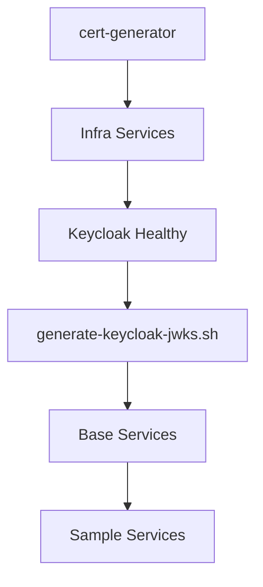

# Local Development Without GCP - Design Specification

**Date:** 2026-07-13  
**Status:** Approved  
**Author:** Atriya Patel (via brainstorming session)

---

## Problem Statement

The nexus-sdv project is heavily integrated with GCP services:
- **GKE** for Kubernetes orchestration
- **Bigtable** for telemetry storage
- **Secret Manager** for credentials
- **Certificate Authority Service (CAS)** for PKI
- **External DNS** for service discovery
- **Workload Identity** for auth

**Goal:** Run the entire stack locally using:
- Docker + Docker Compose
- Kubernetes-in-Docker (kind) for K8s-native testing
- Self-signed certificates
- Local emulators (Bigtable)
- No GCP account required

---

## Solution Overview

Create a `local-dev/` directory containing all local development infrastructure, completely isolated from production IaC. This directory is gitignored (except scripts) to prevent accidental commits of generated certificates and local configs.

### Key Principles

1. **Zero GCP dependencies** - All services run in containers locally
2. **Self-signed PKI** - Local CA generates all certificates
3. **Configuration via environment** - No Secret Manager, just `.env` files
4. **Kind-compatible** - Docker images work in kind clusters
5. **Minimal code changes** - Leverage existing env var patterns

---

## File Structure

```
nexus-sdv/
├── local-dev/                          # ALL local dev files (gitignored except scripts/)
│   ├── docker-compose.yml              # Main services (base + sample)
│   ├── docker-compose.infra.yml        # Infrastructure: NATS, Mosquitto, Bigtable, Keycloak
│   ├── docker-compose.keycloak.yml     # Keycloak with realm import (merged into infra)
│   ├── docker-compose.certs.yml        # Init container: generates CA, certs, JWKS
│   ├── certs/                          # Generated certs (gitignored)
│   │   ├── ca/
│   │   │   ├── ca.crt.pem
│   │   │   └── ca.key.pem
│   │   ├── registration/
│   │   │   ├── server.crt.pem
│   │   │   ├── server.key.pem
│   │   │   ├── ca.crt.pem
│   │   │   ├── ca.key.pem
│   │   │   └── factory-ca.crt.pem
│   │   ├── nats/
│   │   │   ├── server.crt.pem
│   │   │   ├── server.key.pem
│   │   │   └── ca.crt.pem
│   │   ├── keycloak/
│   │   │   ├── server.crt.pem
│   │   │   ├── server.key.pem
│   │   │   └── jwks.json
│   │   └── clients/
│   │       ├── device-vin123-dev456.crt.pem
│   │       └── device-vin123-dev456.key.pem
│   ├── keycloak/
│   │   └── nexus-realm.json            # Pre-configured realm export
│   ├── config/
│   │   ├── nats.conf                   # NATS config with auth callout
│   │   └── mosquitto.conf              # MQTT broker config
│   ├── env/
│   │   ├── .env.infra                  # Infra passwords, Keycloak admin
│   │   ├── .env.base-services          # Base service vars, cert paths
│   │   └── .env.sample-services        # Sample service vars
│   └── .env.local                      # Main env file (gitignored, generated)
├── scripts/                            # Shared scripts (COMMITTED)
│   ├── generate-certs.sh               # Cert generation (openssl)
│   ├── generate-keycloak-jwks.sh       # Extract JWKS from Keycloak
│   └── wait-for-services.sh            # Health check orchestration
└── .gitignore                          # Updated to ignore local-dev/certs, local-dev/.env.local
```

---

## Certificate Generation (`docker-compose.certs.yml`)

### Service: `cert-generator`
- **Runs once, exits** (init container pattern)
- Uses `scripts/generate-certs.sh` (bash + openssl)
- Outputs to shared volume: `local-dev/certs/`
- No dependencies (runs first)

### Certificates Generated

| Component | Certificates | Purpose |
|-----------|--------------|---------|
| **Root CA** | `ca.crt.pem`, `ca.key.pem` | Trust anchor for all services |
| **Registration Server** | `server.crt.pem`, `server.key.pem` | TLS for registration API (CN=registration.local) |
| **Registration CA** | `ca.crt.pem`, `ca.key.pem` | Signs vehicle CSRs (signed by root) |
| **Factory CA** | `factory-ca.crt.pem` | Validates factory-issued vehicle certs |
| **NATS Server** | `server.crt.pem`, `server.key.pem` | TLS for NATS (CN=nats.local) |
| **NATS CA** | `ca.crt.pem` | Signs NATS server cert (signed by root) |
| **Keycloak** | `server.crt.pem`, `server.key.pem` | HTTPS for Keycloak (CN=keycloak.local) |
| **Test Devices** | `device-*.crt.pem`, `device-*.key.pem` | Client certs for vehicle registration testing |

### JWKS for Keycloak
- Keycloak auto-generates keys on first start
- `generate-keycloak-jwks.sh` extracts JWKS after Keycloak healthy
- Base64 encoded → `KEYCLOAK_JWK_B64` env var for auth-callout

---

## Infrastructure Services (`docker-compose.infra.yml`)

### NATS (`nats:2.10-alpine`)
```yaml
command: ["-c", "/etc/nats/nats.conf"]
volumes:
  - ./certs/nats:/etc/nats/certs:ro
  - ./config/nats.conf:/etc/nats/nats.conf:ro
ports: ["4222:4222", "7422:7422", "8222:8222"]
healthcheck: curl -f http://localhost:8222/healthz
```

**nats.conf** - Configures:
- TLS listener on 4222 with certs from `/etc/nats/certs`
- Auth callout to `auth-callout:8080` on `$SYS.REQ.USER.AUTH`
- Accounts: `AUTH` (auth-callout-service), `APP` (vehicles), `SYS` (system)

### Mosquitto (`eclipse-mosquitto:2`)
```yaml
volumes:
  - ./config/mosquitto.conf:/mosquitto/config/mosquitto.conf:ro
ports: ["1883:1883", "8883:8883"]
```
- Port 1883: plaintext (local dev)
- Port 8883: TLS (optional, for testing)

### Bigtable Emulator (`gcr.io/google.com/cloudsdktool/cloud-sdk:emulators`)
```yaml
command: gcloud beta emulators bigtable start --host-port=0.0.0.0:8086 --project=test-project
ports: ["8086:8086"]
environment:
  - BIGTABLE_EMULATOR_HOST=localhost:8086
```
- Used by `data-api` via `BIGTABLE_EMULATOR_HOST`

### Keycloak (`quay.io/keycloak/keycloak:24.0`)
```yaml
command: start-dev --import-realm --http-port=8080 --https-port=8443
volumes:
  - ./certs/keycloak:/etc/keycloak/certs:ro
  - ./keycloak/nexus-realm.json:/opt/keycloak/data/import/nexus-realm.json:ro
ports: ["8080:8080", "8443:8443"]
environment:
  KC_BOOTSTRAP_ADMIN_USERNAME: admin
  KC_BOOTSTRAP_ADMIN_PASSWORD: admin
```

---

## Base Services (`docker-compose.yml`)

### auth-callout (`base-services/auth-callout`)
- **Env vars:** `NATS_URL`, `JWT_ACC_SIGNING_KEY`, `KEYCLOAK_JWK_B64`, `NATS_USER`, `NATS_PASSWORD`
- **No code changes** - already uses env vars

### data-api (`base-services/data-api`)
- **Env vars:** `GRPC_ADDR`, `BIGTABLE_EMULATOR_HOST`, `GCP_PROJECT=test-project`, `BT_INSTANCE=test-instance`, `BT_TABLE=telemetry`
- **No code changes** - already supports Bigtable emulator

### data-converter (`base-services/data-converter`)
- **Env vars:** `CONFIG_PATH`, `NATS_HOST`, `MQTT_HOST`, `NATS_TOKEN`, `NATS_USER`, `NATS_PASSWORD`
- **Config:** `local-dev/config/data-converter.yaml` (mounts local config)
- **No code changes** - uses `os.ExpandEnv` in config loader

### registration (`base-services/registration/server`)
- **Code change needed:** Make cert paths configurable via env vars
  - `REG_SERVER_CERT`, `REG_SERVER_KEY`, `REG_CA_CERT`, `REG_CA_KEY`, `FACTORY_CA_CERT`
- **Env vars:** `NATS_URL`, `KEYCLOAK_URL`, cert paths above

### Sample Services
- `data-api-sampler` (Java): `DATA_API_GRPC_ADDR=data-api:8080`
- `trip-analyzer` (Python): `DATA_API_GRPC_ADDR=data-api:8080`

---

## Keycloak Realm Configuration (`local-dev/keycloak/nexus-realm.json`)

Pre-configured realm with:
- **Clients:**
  - `vehicle-client` (confidential, client credentials flow)
  - `data-api-sampler` (confidential)
  - `trip-analyzer` (confidential)
- **Roles:** `edge-device`, `telemetry-client`, `telemetry-collector`
- **Users:** `test-device` (password: `test`, roles: `edge-device`, `telemetry-client`)
- **Keys:** RSA keys auto-generated on import

---

## Startup Sequence



### Commands

```bash
cd local-dev

# One-time setup: generate certificates
docker compose -f docker-compose.certs.yml up cert-generator

# Start infrastructure
docker compose -f docker-compose.infra.yml up -d
./scripts/wait-for-infra.sh

# Extract Keycloak JWKS (after Keycloak healthy)
./scripts/generate-keycloak-jwks.sh

# Start application services
docker compose -f docker-compose.yml up -d
./scripts/wait-for-services.sh

# Test
./scripts/test-local-flow.sh
```

---

## Health Checks

| Service | Health Check |
|---------|--------------|
| NATS | `curl -f http://localhost:8222/healthz` |
| Keycloak | `curl -f http://localhost:8080/health/ready` |
| Bigtable | `grpc_health_probe -addr=localhost:8086` |
| auth-callout | TCP 4222 + HTTP 8080 (if added) |
| data-api | gRPC health check on 8080 |
| registration | `curl -f http://localhost:8888/health` |

---

## Testing Strategy

### 1. Vehicle Registration Flow
```bash
# Register a vehicle using client certificate
curl -X POST https://registration.local:8443/registration \
  --cert local-dev/certs/clients/device-vin123-dev456.crt.pem \
  --key local-dev/certs/clients/device-vin123-dev456.key.pem \
  --cacert local-dev/certs/ca/ca.crt.pem \
  --data-binary @csr.pem
```

### 2. NATS JWT Authentication
```bash
# Get JWT from Keycloak (device credentials)
TOKEN=$(curl -X POST http://keycloak.local:8080/realms/nexus/protocol/openid-connect/token \
  -d grant_type=password -d client_id=vehicle-client \
  -d username=test-device -d password=test)

# Connect to NATS with JWT
nats --user "$TOKEN" --server nats://nats.local:4222 sub "telemetry.>"
```

### 3. Data Flow Test
```bash
# Send telemetry via data-api-sampler
docker compose exec data-api-sampler java -jar app.jar \
  --device-id=vin123 --count=10

# Verify in Bigtable emulator
cbt -project test-project -instance test-instance read telemetry
```

### 4. Telemetry Pipeline
```bash
# Start MQTT publisher (simulated device)
mosquitto_pub -h localhost -t "telemetry/vin123/sensors/temp" \
  -m '{"name":"temp","value":25.5,"unit":"C"}'

# Verify data-converter processes and publishes to NATS
docker compose logs data-converter | grep "message converted"
```

---

## Code Changes Required

### Minor Changes (1 service)

| Service | File | Change |
|---------|------|--------|
| registration | `base-services/registration/server/src/main.rs` | Add env vars for cert paths (currently hardcoded `"certificates/ca/ca.crt.pem"`) |

### No Code Changes Needed

| Service | Reason |
|---------|--------|
| auth-callout | Already uses `JWT_ACC_SIGNING_KEY`, `KEYCLOAK_JWK_B64`, `NATS_URL` env vars |
| data-api | Already supports `BIGTABLE_EMULATOR_HOST` |
| data-converter | Uses `os.ExpandEnv` in config loader |
| data-api-sampler | Connects to `DATA_API_GRPC_ADDR` |
| trip-analyzer | Connects to `DATA_API_GRPC_ADDR` |

---

## Kind Cluster Compatibility

All Docker images built from existing Dockerfiles work in kind:

```bash
# Build images
docker compose -f docker-compose.yml build

# Load into kind
kind load docker-image auth-callout:latest data-api:latest \
  data-converter:latest registration:latest \
  data-api-sampler:latest trip-analyzer:latest

# Deploy with Helm (local-dev helm values)
helm install nexus-local iac/helm/ -f local-dev/helm-values.yaml
```

---

## Security Considerations

1. **Self-signed certs** - Only trusted locally via explicit `--cacert` or trust store
2. **No secrets in git** - `local-dev/certs/`, `local-dev/.env.local` gitignored
3. **Default passwords** - Only for local dev (Keycloak admin/admin, NATS passwords in `.env.infra`)
4. **Network isolation** - Services communicate via Docker network, no host exposure except ports

---

## Future Enhancements

- [ ] **Tilt/DevSpace integration** - Live reload for development
- [ ] **Kind-native deployment** - Helm charts with local values
- [ ] **Testcontainers integration** - For integration tests in CI
- [ ] **Telemetry UI** - Local Grafana/Loki for observability

---

## Appendix: Environment Variable Reference

### `.env.infra`
```bash
NATS_AUTH_CALLOUT_PASSWORD=auth-callout-pass
NATS_BASIC_AUTH_USER=app-user
NATS_BASIC_AUTH_PASSWORD=app-pass
NATS_CONNECTOR_PASSWORD=connector-pass
NATS_AUTH_CALLOUT_NKEY_PUB=AAA...  # From generated NKey
KEYCLOAK_ADMIN_USER=admin
KEYCLOAK_ADMIN_PASSWORD=admin
```

### `.env.base-services`
```bash
# auth-callout
JWT_ACC_SIGNING_KEY=SAA...  # From generated NKey seed
KEYCLOAK_JWK_B64=eyJ...     # Base64 JWKS from Keycloak
NATS_URL=nats://nats:4222
NATS_USER=auth-callout-service
NATS_PASSWORD=auth-callout-pass

# data-api
GRPC_ADDR=0.0.0.0:8080
BIGTABLE_EMULATOR_HOST=bigtable-emulator:8086
GCP_PROJECT=test-project
BT_INSTANCE=test-instance
BT_TABLE=telemetry

# data-converter
CONFIG_PATH=/config/config.yaml
NATS_HOST=nats
MQTT_HOST=mosquitto

# registration
REG_SERVER_CERT=/certs/registration/server.crt.pem
REG_SERVER_KEY=/certs/registration/server.key.pem
REG_CA_CERT=/certs/registration/ca.crt.pem
REG_CA_KEY=/certs/registration/ca.key.pem
FACTORY_CA_CERT=/certs/registration/factory-ca.crt.pem
NATS_URL=nats://nats:4222
KEYCLOAK_URL=https://keycloak:8443
```

### `.env.sample-services`
```bash
DATA_API_GRPC_ADDR=data-api:8080
```

---

## Approval

- [x] **File Structure** - Approved
- [x] **Certificate Generation** - Approved
- [x] **Service Definitions** - Approved
- [x] **Startup Order & Testing** - Approved
- [x] **Code Changes Assessment** - Approved

**Next Step:** Invoke `writing-plans` skill to create implementation plan