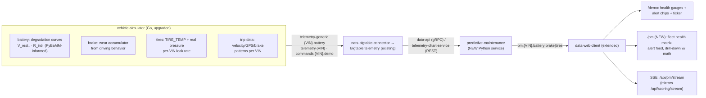

# Predictive Maintenance Prototype — Design

Date: 2026-08-09
Status: **Design — approved for spec, not yet implemented**
Purpose: Turn the predictive-maintenance research (2026-08-03 feasibility, 2026-08-05 algorithms/explained, 2026-08-09 battery open-algorithms) into a showcaseable local prototype: real degradation data → deterministic detector math → alert → visual dashboard. Target market: India (heat-driven calibration, EV-SOH story). Demoable end-to-end in the existing local docker-compose stack.

## 1. Goals & non-goals

### Goals
1. **Real end-to-end loop** — physics-informed degradation data → NATS → Bigtable → data-api → detector math → `pm.{VIN}.{component}` alerts → dashboard.
2. **All three components** — 12V battery (M1/M2), brake pads (energy integral), tires (temp-compensated pressure). Tires included fully: `TIRE_TEMP` field + realistic leak sim.
3. **Deterministic detection, no LLM** — pure threshold/trend math with templated plain-language explanations. (LLM narration deferred.)
4. **Two visual surfaces** — extend the existing `/demo` live pipeline (health gauges, alert chips, ticker) AND a new `/pm` fleet-health page (matrix, alert feed, drill-down with the math shown, predicted-vs-actual).
5. **Internal credibility + external polish** — precision/recall/lead-time numbers from an offline evaluator on simulator ground truth; a repeatable `make pm-demo` arc with hero VINs.
6. **India calibration** — heat-driven temperature reference (30 °C), shortened degradation windows, Indian temperature regime in the simulator.

### Non-goals (explicitly deferred)
- LLM narration/validation layer.
- Cloud/GCP deployment of the PM stack (local docker-compose only).
- Per-wheel tire pressure, EV-traction-battery SOH, production Bigtable retention tuning.
- Real fleet data ingestion.

## 2. Architecture & data flow



Key decisions:
- **Detector pattern = `trip_analyzer`**: FastAPI + pydantic-settings, poll data-api per VIN, compute, publish NATS. New subjects `pm.{VIN}.{component}`; `scoring.*` untouched.
- **No new storage**: alerts ride NATS → SSE; the web client keeps a bounded in-memory/session list (same pattern as `useScoringMessages`). No Bigtable writes for alerts.
- **Simulator control**: extend the existing `commands.{VIN}.demo` protocol with `{"action":"degradation","component":"<id>","preset":"healthy|degrading|critical"}` so the demo can dial VINs from the UI. Status reply exposes simulator **ground truth** (true health %, days-to-failure) for predicted-vs-actual, clearly labeled.

## 3. Degradation simulator + trip data (in vehicle-simulator, Go)

**Physics-informed, not runtime-PyBaMM.** PyBaMM's lead-acid models are run **offline once** to generate realistic voltage/SoC degradation curves across Indian temperature regimes (10–45 °C); curve parameters (degradation rate, noise floor, β compensation) are fitted and played back by the Go sim. The sim stays fast and dependency-free; the curve shapes are physics-derived.

**Calibration tooling**: an optional offline script (`sample-services/predictive-maintenance/scripts/calibrate_battery_curve.py`, requires `pybamm` only in that venv) fits the curve parameters and writes them to a JSON config the Go sim reads. **The Go sim's runtime has zero Python/PyBaMM dependency** — if the calibration script isn't run, the shipped defaults (fitted values checked into config) are used. The curve shapes themselves follow the published Sulzer/PyBaMM lead-acid equations, so the sim is physics-honest even without the offline run.

Per-component trajectories (from the 2026-08-05 specs, parameterized per VIN):

- **Battery**: $V_{\text{rest}}(t) = 12.63 - deg\cdot(t/H) + \mathcal{N}(0, 0.025)$ over horizon $H$ (60–180 days configurable); cranking $V_{\min}$ declines and $R_{\text{int}}$ rises with $deg$; temperature compensation uses India-calibrated β ≈ −0.011 V/°C with a **30 °C reference**. Healthy cohort drifts ±0.05 V.
- **Brake**: driving-behavior-driven wear accumulator — brake events × energy ($W = \sum m\cdot a\cdot v\cdot\Delta t$) against a known $E_{\text{budget}}$ per vehicle; ground-truth wear % known at every step.
- **Tires**: $P(t) = 2.3 - r\cdot t/30 + \Delta T(t)\cdot 0.0078 + \mathcal{N}(0, 0.01)$, leak rate $r \in [0, 0.25]$ bar/month, daily temperature cycle ±8 °C. Requires `TIRE_TEMP` proto field (small `VehicleTelemetryData` extension) + client emitting it.

**Dummy car trip data**: realistic drive cycles (city/highway mix), multiple trips/day per VIN, velocity/GPS/brake-pedal patterns — reusing existing drive-cycle + GPS trail logic. Trips drive the brake-wear model and give the /pm page "recent trips" context. Per-VIN schedules so the fleet isn't uniform.

## 4. Detector service (sample-services/predictive-maintenance/)

Structure mirrors `trip_analyzer` exactly (FastAPI, pydantic-settings, client/ core/ api/ modules, betterproto stubs). Detectors are **pure functions** — table-driven, unit-testable, deterministic.

| Component | Detector | Alert rule (from specs) |
|---|---|---|
| Battery | M1: temp-compensated resting-voltage trend (EWMA + 30-day slope) | EWMA < 12.4 V or slope < −0.5 mV/day → advisory; EWMA < 12.2 V → action |
| Battery | M2: cranking signature ($R_{\text{int}} = (V_{\text{rest}} - V_{\min})/I_{\text{crank}}$) | $V_{\min}$ < 9.5 V or $R_{\text{int}}$ > 1.5× baseline → action/critical |
| Brake | Energy integral $W = \sum m\cdot a\cdot v\cdot\Delta t$ vs $E_{\text{budget}}$ | wear index > 80 % → advisory; > 90 % → action |
| Tires | Temp-compensated pressure trend ($P_{\text{comp}} = P\cdot T_{\text{ref}}/T$), steady-driving samples only | slope < −0.15 bar/month → advisory; $P_{\text{comp}}$ < 1.8 bar → action |

Structured alert message on `pm.{VIN}.{component}`:

```json
{ "component": "battery", "health_score": 62, "severity": "advisory",
  "evidence": {"ewma_voltage": 12.38, "slope_mv_day": -0.6, "threshold": 12.4},
  "explanation": "Resting voltage 12.38 V, drifting -0.6 mV/day (threshold 12.4 V).",
  "timestamp": "..." }
```

- **No LLM** — `explanation` is a deterministic template from evidence.
- Composite per-VIN health score (0–100): battery 60/25/15 (resting trend / cranking / SOC drift); **brake = 100 − wear%** (min 0); **tires = linear 100→0 as $P_{\text{comp}}$ falls from the vehicle-recommended pressure to the 1.8 bar floor** (or 100 − |slope| normalized, whichever is lower — the binding constraint wins).
- **Publish cadence**: an alert is published when the severity changes or the health score crosses a band boundary (green/amber/red) — not every poll cycle, so the SSE feed stays readable. A VIN that stays healthy publishes nothing.
- Config: `SCHEDULED_VINS` + `POLL_INTERVAL` env (same shape as trip_analyzer); thresholds in settings with sane defaults.
- Docker: new compose service `predictive-maintenance` (depends on data-api + NATS); `make pm-demo` = `make demo` + this service + open `/pm`.

## 5. Web UI

**PM alert stream**: new `/api/pm/stream` SSE route mirroring `/api/scoring/stream` (NATS subscribe `pm.*`, protobuf decode, SSE). New `usePmMessages` hook (same sessionStorage cap pattern). `scoring.*` untouched.

**`/demo` extension**:
- Health gauges in `ComponentPanel`: 0–100 ring per component, colored green ≥ 70 / amber 50–69 / red < 50.
- Alert chips on `VehicleSchematic` nodes: pulsing severity-colored badge when a component has an active alert; click → /pm drill-down for that VIN+component.
- Recent alert ticker under the pipeline, fed by the same SSE stream.
- `DemoScene` zones get an alert-state prop to pulse red when alerting.

**`/pm` page (new)**:
- Fleet health matrix: rows = VINs, cols = 3 components; cell = health score + severity color; click → drill-down.
- Alert feed: chronological list (severity, component, VIN, evidence, timestamp, explanation).
- Drill-down per VIN+component: degradation trend chart (raw signal + EWMA/threshold overlays, 7d/30d), the computed math shown (slope, threshold, R_int, wear %, pressure slope), predicted-vs-actual (simulator ground truth vs predicted lead time, clearly labeled).
- Fleet overview cards: % healthy / at-risk / critical per component; counts.
- **Validation card**: precision/recall/mean lead-time numbers from the last offline evaluator run (static JSON loaded client-side, e.g. `public/pm-validation.json`), labeled as simulator-ground-truth evaluation — the "internal credibility" story for technical reviewers.

New files: `src/components/pm/{pm-health-matrix,pm-alert-feed,pm-drill-down}.tsx`, `src/lib/pm-types.ts` (shared alert schema), `src/app/pm/page.tsx`, `src/app/api/pm/stream/route.ts`, `src/hooks/usePmMessages.ts`. Sidebar entry "Predictive Maintenance".

Edge states: offline detector → "waiting for telemetry"; schema-validation failure → drop + log; SSE reconnect mirrors scoring stream.

## 6. Testing, verification, demo script

**Detector unit tests** (table-driven): per detector, healthy/degrading/critical → expected severity + health score; insufficient data → no alert; NaN/invalid → skip. Thresholds are the spec values; tests lock them in.

**Simulator**: trajectory smoke test — `deg=1.0` VIN produces known voltage/SoC decline + rising R_int; healthy VIN stays in ±0.05 V band. Ground-truth labels table `(VIN, component, event_time, severity)` generated as sim output, used by the offline evaluator.

**Offline evaluator** (script, not service): run detectors over simulator output, compare vs labels → precision, recall, mean lead time per component. Numbers shown on /pm ("P=0.82 R=0.75 across 20 simulated VINs").

**End-to-end**: extend `local-dev/scripts/test-local-flow.sh` (or pm variant) to assert simulator → connector → Bigtable → detector publishes `pm.{VIN}.{component}` → web SSE receives.

**Web client**: `bun run lint` + `bun run build`; new unit tests only where a new observable contract exists (health-score → severity-color mapping, alert schema parsing).

**Demo script (`make pm-demo`)**:
1. `go.sh` + simulator + detector + open `/pm`.
2. Fleet of 20 VINs, half healthy / half degrading at varied rates (config-preset "demo").
3. Showcase: /demo live charts + gauges → /pm fleet matrix → drill into a degrading battery VIN (alert + math) → a hero VIN whose known failure lands during the demo (scripted arc, real physics) → precision/recall numbers.
4. Teardown = existing `make stop`.

## 7. Repo grounding (integration surface)

- `sample-clients/vehicle-client/main.go` — battery JSON on `telemetry-generic.{VIN}.battery`; random-walk sim (§1186-1297) to replace with degradation trajectories; drive-cycle + GPS logic to reuse for trip data; `TIRE_PRESSURE` constant (line 842) → real value + `TIRE_TEMP`.
- `proto/vehicle_telemetry.proto` — add `TIRE_TEMP` field (minimal extension).
- `sample-services/trip_analyzer/` — the pattern to mirror (FastAPI, pydantic-settings, poll data-api → compute → publish NATS).
- `sample-clients/data-web-client/src/` — `/demo` page (component-panel, vehicle-schematic, demo-scene), `useScoringMessages` hook, `/api/scoring/stream` route (to mirror), sidebar, `proto/scoring.proto`.
- `local-dev/docker-compose.yml` — add `predictive-maintenance` service; `local-dev/Makefile` — add `pm-demo` target.
- `local-dev/scripts/test-local-flow.sh` — extend for the pm loop.

## 8. Sources

- `docs/superpowers/research/2026-08-03-predictive-maintenance-feasibility.md` — tiers, battery/brake/tire feasibility, open questions
- `docs/superpowers/research/2026-08-05-predictive-maintenance-algorithms.md` — M1/M2, energy integral, temp compensation; thresholds
- `docs/superpowers/research/2026-08-05-predictive-maintenance-explained.md` — worked math
- `docs/superpowers/research/2026-08-09-battery-open-algorithms.md` — PyBaMM-informed curves, India calibration (30 °C reference, shortened windows)
