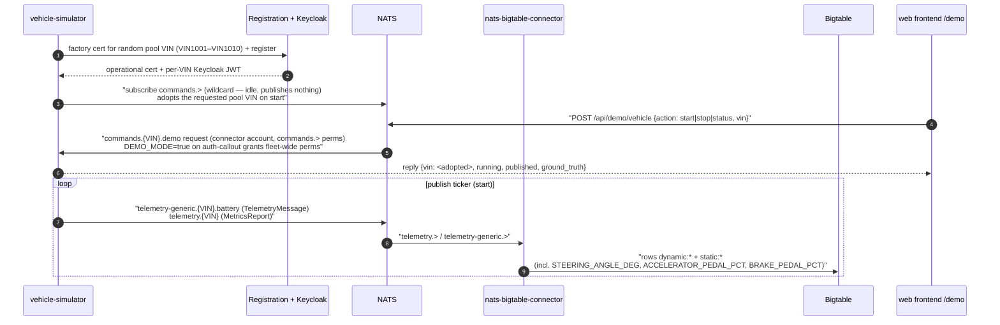
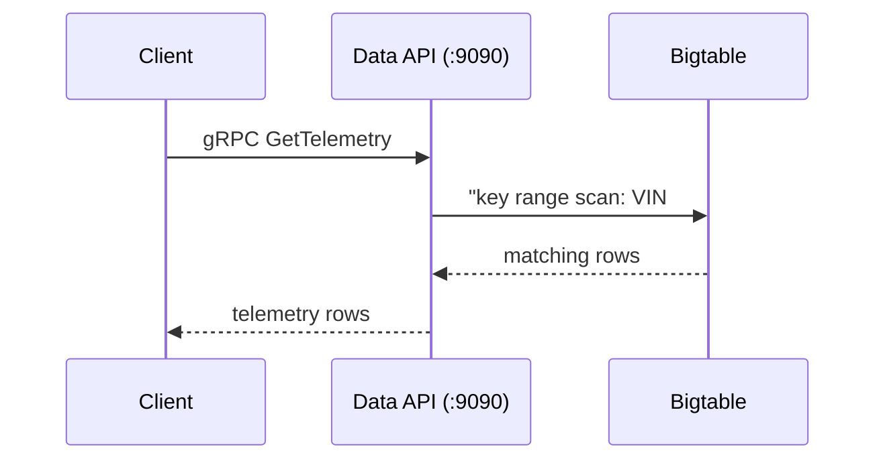
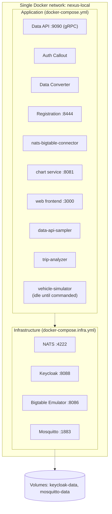

# Nexus SDV Local Development Architecture

> Companion to [README.md](./README.md). The README is the task-oriented guide
> (how to start, ingest, query, watch NATS). This doc explains **how the system
> is wired** and the design decisions behind it.

## Data Flow

### Telemetry ingestion

```mermaid
flowchart LR
  subgraph INGRESS["Ingress"]
    MQ["MQTT publish<br/>telemetry/&lt;VIN&gt;/sensors/*"]
    MOSQ["Mosquitto :1883"]
    SIM["vehicle-simulator<br/>(compose; idle until commanded)"]
    DC["Data Converter"]
  end

  subgraph TRANSPORT["Transport"]
    N["NATS :4222"]
  end

  subgraph STORAGE["Storage"]
    CONN["nats-bigtable-connector (Go)<br/>subscribes telemetry.> + telemetry-generic.>"]
    BT["Bigtable emulator :8086"]
  end

  subgraph SERVING["Serving"]
    API["Data API :9090 (gRPC)"]
    CS["chart service :8081 (REST + WS)"]
    WEB["web frontend :3000"]
  end

  MQ -->|"telemetry/&lt;VIN&gt;/sensors/*"| MOSQ
  MOSQ -->|"subscribes telemetry/#"| DC
  DC -->|"NATS telemetry-generic.>"| N
  SIM -->|"start → publishes telemetry-generic.{VIN}.battery<br/>(TelemetryMessage) + telemetry.{VIN} (MetricsReport)"| N
  N --> CONN
  CONN -->|"decodes protobuf → row key &lt;VIN&gt;#&lt;timestamp&gt;;<br/>families dynamic/static"| BT
  BT -->|"dynamics are persisted<br/>(incl. steering/accelerator/brake)"| API
  API --> CS
  CS --> WEB
```

`make ingest` remains available as a manual write path that bypasses NATS, and
the host wrapper `make vehicle-client` remains a manual publish path into
`telemetry.{VIN}`.

### Control flow (demo mode)

The `vehicle-simulator` compose service comes up with the stack but stays
**idle** until commanded over NATS:

Notes:
- `stop` pauses the ticker while keeping the NATS connection alive.
- The connector persists the dynamics so the /demo schematic and charts render
  live values.
- The web frontend renders the Command Deck HUD theme with lazy-loaded
  three.js scenes (fleet map, vehicle zones, demo pipeline) that fall back to
  static SVG content (demo), a notice plus the table (fleet), or the
  underlying charts/tables (device) without WebGL, and honor
  `prefers-reduced-motion`.

### Query path

### Authentication flow (vehicle client)

```mermaid
flowchart LR
  FC["factory cert"] -->|"mTLS"| REG["Registration :8444<br/>validate factory CA → sign CSR"]
  REG --> OC["operational cert<br/>(+ Keycloak/NATS URLs echoed back)"]
  OC -->|"client-secret auth<br/>(per-VIN client, e.g. VIN123)"| KC["Keycloak :8080"]
  KC --> JWT["JWT (RS256)"]
  JWT --> N["NATS"]
  N --> AC["Auth Callout verifies JWT kid<br/>against its JWKS snapshot"]
  AC -->|"maps realm roles → per-VIN NATS permissions<br/>(DEMO_MODE=true broadens to telemetry.>, commands.>)"| PERM["telemetry.&lt;VIN&gt;.>, commands.&lt;VIN&gt;.>"]
```

The JWKS snapshot is taken once at setup and never refetched. Keycloak's
persistent `keycloak-data` volume keeps the realm signing keys stable so the
snapshot stays valid (see README §Known gaps & gotchas).

---

## Component Details

### 1. NATS (localhost:4222)

- Accounts (from `config/nats.conf`, generated at setup): `AUTH`
  (auth-callout-service), `APP` (app-user), `SYS` (system).
- Subjects in use:
  - `telemetry-generic.<VIN>.battery` — TelemetryMessage (`--message-type telemetry`)
  - `telemetry.<VIN>` — MetricsReport (`--message-type metrics_report`, default)
  - `telemetry-generic.<VIN>.<sensor>` — data-converter output
  - `commands.<VIN>.>`, `scoring.<VIN>` — commands / trip-analyzer scores
- Authentication: Keycloak JWT via auth callout; bypass users (no callout):
  `connector`, `app-user`, `auth-callout-service`. Anonymous access is **denied**.
- Storage: in-memory (no persistence).

### 2. Keycloak (localhost:8088)

- Mode: `start-dev --import-realm`; realm `nexus-sdv`; admin admin/admin.
- Clients: `vehicle-client` plus **per-VIN confidential clients** (`VIN123`,
  secret `vin123-secret`) whose service accounts carry the `edge-device` /
  `telemetry-client` realm roles. With `client_credentials`, the token's `azp`
  equals the client id — i.e. the VIN — which is exactly what the auth-callout
  grants NATS permissions on. No code changes needed for new VINs: add a client
  (and its `service-account-<vin>` user) to the realm import.
- JWKS: `/realms/nexus-sdv/protocol/openid-connect/certs` (snapshotted into
  `KEYCLOAK_JWK_B64` at setup).
- Persistence: `keycloak-data` volume at `/opt/keycloak/data` so signing keys
  survive restarts (start-dev would otherwise regenerate them → stale snapshot).

### 3. Bigtable Emulator (localhost:8086)

- Project `test-project`, instance `test-instance`, table `telemetry`.
- Row key `<VIN>#<timestamp>`, timestamp format
  `2006-01-02T15:04:05.000000000Z07:00` — e.g.
  `VIN123#2026-07-13T17:00:00.000000000Z`.
- Column families `dynamic` (e.g. `dynamic:speed`) and `static` (e.g.
  `static:make`); values stored as raw bytes.
- Source of truth for the layout:
  `base-services/data-api/src/service/bigtable.go` + `time.go`.
- Storage: **in-memory** — a container restart wipes the table; `make ingest` /
  `make query` recreate the table + families.

### 4. Mosquitto MQTT Broker (localhost:1883)

- MQTT v5, port 1883 (bound to 127.0.0.1), anonymous allowed (local-only).
- Topics: `telemetry/#`; data-converter subscribes `telemetry/#` and forwards
  to NATS. No retained-message dependence.
- Config: `/mosquitto/config/mosquitto.conf`.

---

## Service Deployment Model

The network carries all inter-service traffic; infra comes up first
(`docker-compose.infra.yml` creates `nexus-local` and labels it), and the app
compose declares it `external: true`. PKI: generated certs in `certs/`
(gitignored); a JWKS snapshot is taken at setup and injected into auth-callout.

Key decisions:

- **One network, two compose files** — infra comes up first
  (`docker-compose.infra.yml` creates `nexus-local` and labels it); the app
  compose declares it `external: true`.
- **Dockerfile.local pattern** — local-only build changes never touch the
  GCP-deployed `Dockerfile` (see README §Build model).
- **Everything env-driven** — services read env vars only; canonical names in
  `configs/*.template`, injected into `.env.*` by `setup-automated.sh`.
- **In-network vs host hostnames** — inside the network services reach each
  other by service name (`nats`, `keycloak`, `bigtable-emulator`); from the
  host use `localhost:<port>`. This is why `nats-box` runs with
  `--server nats://nats:4222` while host tools use `nats://localhost:4222`.

---

## Setup pipeline (setup-automated.sh)

1. Certificates (cert-generator container; full-set gate, partial state wiped)
2. NATS NKey + `config/nats.conf` generation
3. `.env.*` from templates (fill-missing only)
4. Infra up (NATS/Keycloak/Bigtable/Mosquitto) + health wait
5. Bigtable schema bootstrap (`telemetry` table + families)
6. Keycloak JWKS snapshot (base64 → `KEYCLOAK_JWK_B64`)
7. Token injection + placeholder fail-fast
8. App build (`--no-cache`) + up; crash check; per-service verification

---

## Troubleshooting architecture issues

- **`network nexus-local not found`** — created by `docker-compose.infra.yml`:
  run `make go`. Do NOT `docker network create` it by hand — a manual network
  lacks the `com.docker.compose.*` labels the app compose's `external: true`
  expects.
- **TLS handshake failures** — `make clean && make go` (regenerates the full
  PKI, including `certs/`).
- **Data persistence** — Bigtable is in-memory (re-run `make ingest`); Keycloak
  persists in `keycloak-data` (removed by `make clean`'s `down -v`, forcing a
  fresh realm import + new signing keys, which the same `make go` re-snapshots).
- **`Authorization Violation`** — tooling: use `--user connector
  --password connector-pass`. Vehicle client: stale JWKS snapshot after key
  rotation (see README §Known gaps & gotchas).
