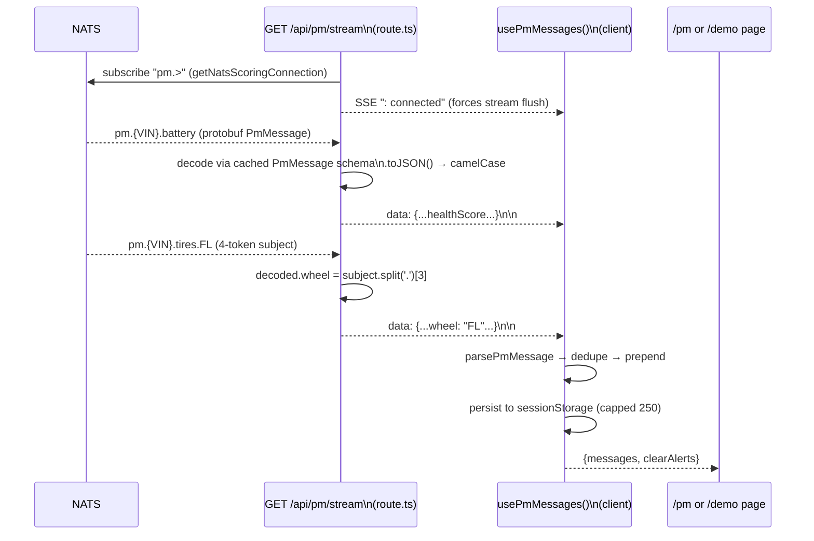

# PM Console — /pm and /demo Alert Feed Deep Dive

> Audience: engineers working on the `/pm` console, the `/demo` dashboard's
> PM integration, or the NATS→SSE bridge. Companion to
> [`howto-nats-sse.md`](./howto-nats-sse.md) (the general SSE pattern this
> app uses) — this document is specifically about the predictive-maintenance
> alert feed: how a `pm.{VIN}.{component}` NATS message becomes a chart
> update, a health gauge, or a pulsing dot on the vehicle schematic.
>
> Citations are file + function/component name, not line numbers.

---

## 1. What this piece of the app does, in plain terms

The `predictive-maintenance` service (see its own service docs) publishes
small JSON-shaped messages onto NATS whenever it finishes analyzing a
vehicle — "VIN1002's battery is at health score 42, severity action."
Browsers can't subscribe to NATS directly, so this app runs a small server
route that stays permanently subscribed to NATS on the server's behalf and
re-broadcasts everything it hears down a single long-lived HTTP connection
to the browser (Server-Sent Events, SSE) — like a radio repeater between
two networks that can't talk to each other directly. Once a message
reaches the browser, one shared hook decodes it, dedupes it, and remembers
it; every visual piece of the PM UI (`/pm`'s charts and alert feed,
`/demo`'s gauges and ticker) is just a different rendering of that same
shared, in-memory list of messages.

---

## 2. From NATS to the browser: the SSE bridge

**Server side** — `src/app/api/pm/stream/route.ts`, `GET`:

- Subscribes the wildcard **`pm.>`**, deliberately not `pm.*` — battery
  alerts are 3-token subjects (`pm.{VIN}.battery`) but tires/brake alerts
  are 4-token (`pm.{VIN}.tires.{wheel}`), and NATS's single-token `*`
  wildcard would silently miss the 4-token ones. This exact distinction is
  regression-tested in `__tests__/api/pm/stream.test.ts`.
- Uses a **separate, lower-privilege NATS connection**
  (`getNatsScoringConnection()`, `src/lib/nats.ts`) than the general
  connection used elsewhere in the app — a least-privilege credential
  separation documented further in `howto-nats-sse.md`.
- Decodes each message with an inline protobuf schema definition for
  `pm.PmMessage` (parsed once and cached via `getPmMessageType()`), then
  calls `.toJSON()` — which **camelCases** the fields, so the wire payload
  the browser receives is `healthScore`, not the proto's `health_score`.
  This is a common gotcha when cross-referencing this doc against the
  Python service's field names.
- For 4-token subjects, the route slices the wheel/pad token out of
  `msg.subject` and attaches it as `decoded.wheel` before serializing — so
  the client never has to re-parse the NATS subject itself to know which
  wheel an alert is about.
- Sends an initial `: connected\n\n` SSE comment purely to force
  intermediate proxies (nginx, in this stack) to flush and switch into
  streaming mode immediately — documented as a real pitfall, not a
  cosmetic touch, in `howto-nats-sse.md`.
- Disconnect handling races the NATS subscription's async iterator against
  an `AbortController` fed by both the incoming request's own abort signal
  and the stream's `cancel()` callback — whichever fires first triggers
  `cleanup()`, unsubscribing from NATS so a closed browser tab doesn't
  leave an orphaned server-side NATS subscription running forever.

**Client side** — `src/hooks/usePmMessages.ts`, `usePmMessages()`:

- Opens exactly one `EventSource('/api/pm/stream')` per mount.
  `source.onerror` is intentionally a no-op — **not** a bug, a deliberate
  choice to let `EventSource`'s built-in browser auto-reconnect handle
  transient NATS/route blips invisibly, rather than the hook tearing down
  and rebuilding its own reconnect logic.
- Parses each event with `parsePmMessage` (`src/lib/pm-types.ts`), which
  accepts *either* `health_score` or `healthScore` in the payload (a small
  defensive tolerance for the snake/camel mismatch described above) and
  validates the required shape; anything that doesn't parse is silently
  dropped rather than crashing the feed.
- **Dedupes** via a message identity string —
  `` `${vin}|${component}|${wheel ?? ''}|${timestamp}` `` — checked only
  against the current *newest* message in the list. This exists
  specifically to guard against `EventSource` reconnect replay: if the
  browser's SSE connection drops and reconnects, it's possible to receive
  the exact same message again, and this stops it from appearing twice in
  the feed.
- **Persists to `sessionStorage`** under key `pmMessages`, capped at 250
  entries, plus a `pmMessages.gen` "generation" marker used to coordinate
  clears across tabs/pages (see §4). Hydration on load uses a *lazy*
  `useState` initializer, not a `useEffect`, specifically to avoid an
  SSR/client hydration mismatch — reading `sessionStorage` in an effect
  would flash empty state before rehydrating.

**In plain terms:** the choice to make `onerror` a no-op is worth calling
out because it looks, at a glance, like an oversight — an empty error
handler that "swallows" a problem. It isn't: it's relying on a browser
platform feature (EventSource's automatic reconnect-with-backoff) instead
of reimplementing it, which is simpler and more battle-tested than custom
retry logic would be.

---

## 3. `/pm` — the single-vehicle console

Main file: `src/app/pm/page.tsx`, `PmPage`. Marked
`export const dynamic = 'force-dynamic'` — this page is never statically
prerendered, because it streams live data and touches browser-only APIs
(`sessionStorage`, `EventSource`) that don't exist at build time.

| Piece | Component / logic |
|---|---|
| Vehicle picker | Inline `<select>` in `page.tsx`, populated by polling `GET /api/devices` every 5s plus the simulator's currently-adopted VIN (discovered separately — see §6). Manually picking a VIN sets `userPicked.current = true` so the picker stops auto-following whichever VIN the simulator adopts. |
| Live charts (10-min window) | `src/components/pm/pm-charts.tsx` (`PmCharts`), loaded via `next/dynamic(..., { ssr: false })` because Chart.js touches browser APIs at module load. Window size (`CHART_WINDOW_MS = 10 * 60 * 1000`) and sample cap (`MAX_SAMPLES = 600`) are constants in `page.tsx`. |
| Route/lap panel | `src/components/pm/route-panel.tsx` (`RoutePanel`) — an SVG projection of the simulator's fixed route (`src/lib/pm-route.ts`) with an animated position marker and lap/progress readout. |
| PM events feed | Inline "PM events" section in `page.tsx`, rendering the 20 newest messages through `friendlyAlert()` (`src/lib/pm-health.ts`), which turns raw evidence into a plain-language headline plus a technical detail line. |
| Clear alerts | Inline button in the PM events section calling `clearAlerts()` from the shared hook, with a toast confirmation. |
| Simulator controls | Start/Stop, speed presets, Reset demo — see §6. |

**In plain terms — why the picker has two sources of truth**: the device
list (`/api/devices`) tells you every VIN that has ever reported
telemetry; the simulator-discovery mechanism tells you which one VIN is
*currently* the live, actively-driving demo vehicle. These can disagree
(e.g. right after a fresh stack start, before you've clicked Start), so
the page treats simulator discovery as authoritative for the *default*
selection, while still letting a human override it by hand.

---

## 4. `/demo` — the fleet dashboard's PM integration

Main file: `src/app/demo/page.tsx`, `DemoPage`.

- **Health gauges** — `src/components/demo/component-panel.tsx`
  (`ComponentPanel`), containing a local `HealthGauge` (an SVG donut,
  stroke color from `severityColor(severity)` in `src/lib/pm-types.ts`).
  `DemoPage` feeds it a `latestByComponent` map built from
  `usePmMessages()`, filtered to the selected VIN.
- **Alert chips on the vehicle schematic** —
  `src/components/demo/vehicle-schematic.tsx` (`VehicleSchematic`) accepts
  an `alertState` prop keyed by component id; any component whose latest
  severity isn't `healthy` gets a pulsing colored dot near its node on the
  schematic. Only components with a defined node position light up here —
  wheel/pad-level detail is **not** shown on `/demo` at all (see §5).
- **PM ALERTS ticker** — an inline, horizontally scrollable section in
  `page.tsx` (not a separate component file) showing the 8 newest
  messages with severity color, VIN, component, and explanation, plus its
  own independent "Clear alerts" button.

**In plain terms:** `/demo` is the "fleet overview, glanceable" surface —
it shows *that* something is wrong on a vehicle's schematic, in a color
and a pulse you can see from across a room, without the per-wheel detail
that would require reading closely. `/pm` is the "single vehicle,
diagnostic" surface — that's where the per-wheel breakdown lives. This
split is deliberate rather than a missing feature.

---

## 5. Per-wheel / per-pad rendering (`/pm`-only)

- `src/lib/pm-health.ts` defines `WHEELS = ['FL','FR','RL','RR']`,
  `pmMessageFromSubject()` (parses the 4-token subject shape), and
  `worstWheel()` (returns the entry with the lowest health score).
- **Worst-wheel summary**: `PmPage`'s `componentSummary` memo keys wheeled
  messages as `` `${component}.${wheel}` ``, then calls `worstWheel(...)`
  separately for the tire group and the brake group — so the top-level
  brake/tire badge always reflects the single worst corner, and one bad
  wheel is never masked by averaging it in with three healthy ones.
- **Expand dialog**: `PmChartCard`'s `Dialog`
  (`src/components/pm/pm-charts.tsx`) lists every wheel/pad as a
  `WheelHealthEntry` row (score, severity badge, reason), sorted
  worst-first.
- **Per-wheel chart lines**: `pm-charts.tsx`'s `wheelSeries()` builds four
  `ChartSeries` per component (tires use a purple/magenta palette, brake
  pads an orange/red palette) plus one aggregate "worst" series appended
  last, so the chart card's headline number always matches the summary
  badge.

**In plain terms:** a single "tire health: 62%" number would hide the
fact that three tires are at 95% and one is at 20% — averaging would make
a genuinely urgent single-wheel problem look like a mild overall one.
Always summarizing by the *worst* wheel, and always making the per-wheel
breakdown one click away, is what keeps the console honest about
localized problems.

---

## 6. Alert-feed lifecycle: Clear alerts vs. Reset demo

These two actions are easy to conflate but do genuinely different things,
and the operator guide's troubleshooting table calls this out as a common
point of confusion.

| Action | What it touches | Where |
|---|---|---|
| **Clear alerts** | Empties the in-memory message list and `sessionStorage['pmMessages']`, then bumps a shared `pmMessages.gen` generation timestamp | `usePmMessages.ts` · `clearAlerts()` |
| **Reset demo** (`/pm` only) | Sends a `reset` control command to the simulator (re-seeds battery age/tire wear server-side) **and** clears the local chart sample buffer **and** calls `clearAlerts()` | `src/app/pm/page.tsx` · `resetDemo()` |

The `pmMessages.gen` generation marker is the mechanism that keeps `/pm`
and `/demo`'s two independent "Clear alerts" buttons from fighting each
other: every mounted page snapshots the generation value at mount time
(`genRef`), and on every incoming SSE message compares it against the
live value in storage — if it's moved (someone cleared alerts from the
*other* page), the page discards its own stale in-memory list instead of
resurrecting it on its next write.

**In plain terms:** "Clear alerts" is purely a UI action — wipe what's
currently displayed. "Reset demo" is the "start the whole story over"
action — the simulated vehicle itself becomes healthy again, and the
displayed alert history is wiped to match, since old alerts from before a
reset don't mean the freshly-reset vehicle is still failing. Clicking
"Clear alerts" alone doesn't make a dying vehicle healthy again — it just
hides the evidence that it's dying, which is why the feed will immediately
repopulate on the next poll if the vehicle is still actually degrading.

`src/lib/pm-health.ts` also exports a shared `clearPmState()` helper
(messages + chart samples together, no simulator command), used
separately whenever the page detects the simulator has adopted a
*different* VIN at runtime — switching the picker to a new vehicle clears
the old vehicle's stale readings without touching the new vehicle's
actual health.

---

## 7. Control actions — how UI buttons reach the simulator

Shared hook: `src/hooks/use-simulator-state.ts`, `useSimulatorState()`,
used by `/pm`, `/demo`, `/fleet`, and `/device` — "one poll loop, every
page agrees on the simulator's current state."

- `refresh()` polls every 3 seconds: first `GET /api/demo/discover`
  (server route calling `discoverSimulator()` in `src/lib/demo-control.ts`,
  which fans a NATS status request out across every VIN in the pool and
  trusts whichever VIN replies as the currently-live simulator), then
  `POST /api/demo/vehicle` with `{action: 'status', vin}` for the full
  status payload.
- `command(action, preset?, component?, targetVin?)` is the single write
  path for `start | stop | speed | reset`. Every button — `/pm`'s
  Start/Stop, speed presets, and Reset demo; `/demo`'s Start/Stop and
  per-component toggle switches — ultimately calls this one function.
- `command()` posts to `/api/demo/vehicle` (`src/app/api/demo/vehicle/route.ts`),
  which validates the target VIN against pool membership **specifically to
  reject characters like `.`/`*`/`>` that could corrupt the NATS subject**
  (a real injection concern, since the VIN is interpolated directly into a
  subject string), then calls `demoControl()` (`src/lib/demo-control.ts`).
- `demoControl()` sends a NATS **request** (not fire-and-forget) to
  `commands.{VIN}.demo` with a 3-second timeout — the simulator's reply
  *is* the new UI state, not a separate confirmation.
- VIN selection in the picker itself is pure local React state — it only
  reaches NATS the moment a subsequent Start command names it as
  `targetVin`, which is the mechanism behind "runtime VIN switching"
  described in the vehicle-simulator docs (`controlState.adopt`).

**In plain terms:** every control button in this app is really just "send
a small JSON message to the simulator over NATS, and use whatever it
replies with as the new displayed state" — there's no separate REST API
for vehicle control, and no client-side simulation of what the button
*should* do. The UI never guesses; it always reflects the simulator's own
authoritative reply.

---

## 8. Validation card data (currently unwired)

The operator guide describes a `/pm` "validation card" that should read
`public/pm-validation.json` (written by the offline evaluator — see the
predictive-maintenance service docs §8) to show real precision/recall/lead
-time numbers. As of this writing, **no code in `src/` fetches or renders
that file** — there is no component consuming `pm-validation.json` today.
If you're looking for where that card lives, it doesn't yet; building it
would mean adding a fetch of the static JSON file plus a small display
component, not modifying an existing one.

---

## 9. Testing

| File | Covers |
|---|---|
| `__tests__/api/pm/stream.test.ts` | `pm.>` (not `pm.*`) subject correctness, 401 when unauthenticated, SSE headers, protobuf decode → JSON, 4-token subject → `wheel` field attachment |
| `src/hooks/usePmMessages.test.ts` | sessionStorage hydration (including legacy/corrupted entries), `clearAlerts()`, dedup of reconnect-replay duplicates |
| `src/lib/pm-health.test.ts` | `pmMessageFromSubject()` parsing, `worstWheel()` selection, `coherentHealth()` tire aggregation, `clearPmState()` |
| `src/lib/pm-types.test.ts` | `parsePmMessage()` valid/malformed cases, `severityColor()` mapping |
| `__tests__/demo/component-panel.test.tsx` | Per-component card rendering, offline state, toggle callback |
| `__tests__/demo/vehicle-schematic.test.tsx` | Node + sensor-chip rendering (does not specifically assert the PM `alertState` pulsing-dot path — a gap worth closing if you touch that code) |
| `src/lib/demo-control.test.ts` | Control-command plumbing shared by Start/Stop/Speed/Reset |

Not yet covered by a dedicated test: `pm-charts.tsx`'s per-wheel series
construction, and `/pm`'s `resetDemo()`/`clearAlerts()` as an integrated
page-level flow — both are exercised only indirectly today, through the
lower-level `pm-health.ts`/`usePmMessages.ts` unit tests.

Note: `__tests__/components/ScoringAlerts.test.tsx` covers a **different,
older** `scoring.*` SSE feed (`useScoringMessages`) — don't confuse it
with the PM alert feed described here; see `scoring-alerts-plan.md` for
that feature's own history.

---

## 10. Quick reference

| Question | File / Function |
|---|---|
| Where does the SSE stream come from? | `src/app/api/pm/stream/route.ts` · `GET` |
| Why `pm.>` and not `pm.*`? | Same file — 4-token wheel/pad subjects need the multi-token wildcard |
| Where is a raw SSE payload turned into app state? | `src/hooks/usePmMessages.ts` · `usePmMessages` |
| How are duplicate messages avoided? | Same file — `messageId()` |
| Where does /pm's chart+feed UI live? | `src/app/pm/page.tsx` · `PmPage`; `src/components/pm/pm-charts.tsx` |
| Where does /demo's gauge+schematic+ticker UI live? | `src/app/demo/page.tsx` · `DemoPage`; `src/components/demo/component-panel.tsx`, `vehicle-schematic.tsx` |
| What's the difference between Clear alerts and Reset demo? | `src/hooks/usePmMessages.ts` · `clearAlerts`; `src/app/pm/page.tsx` · `resetDemo` |
| How does a worst-wheel summary get computed? | `src/lib/pm-health.ts` · `worstWheel` |
| How do UI buttons reach the simulator? | `src/hooks/use-simulator-state.ts`, `src/lib/demo-control.ts` · `demoControl` |
| Is the validation card wired up? | Not yet — see §8 |
