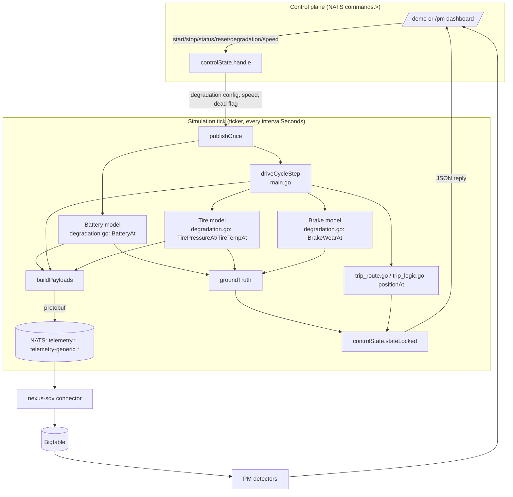
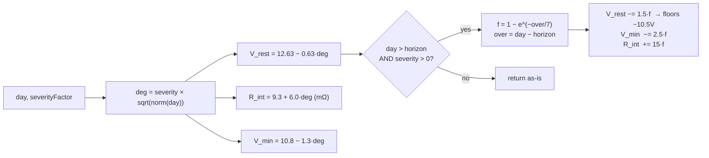
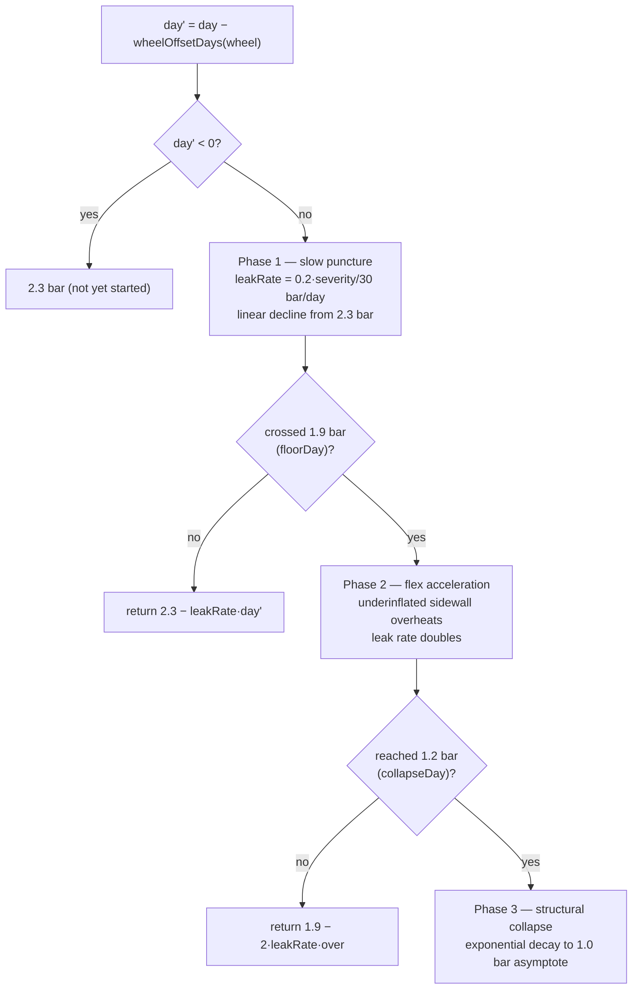
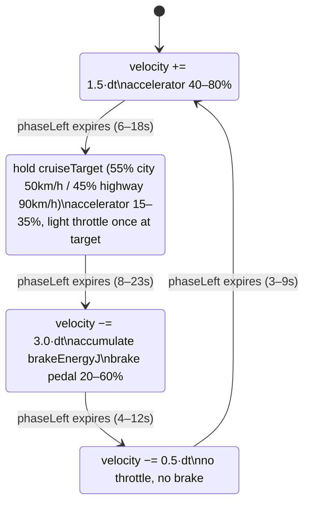
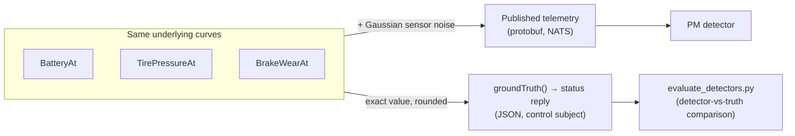
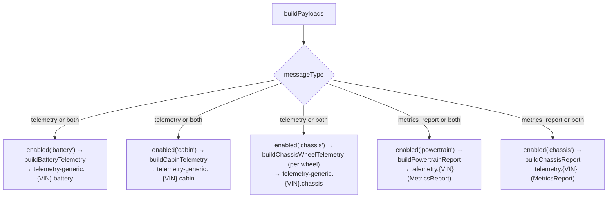

# Vehicle Simulator — Data Generation Deep Dive

> Companion to [`simulator-data-generation.md`](./simulator-data-generation.md).
> That doc is the quick-reference; this one traces the full data flow —
> every state variable, every curve, every control message — so a new
> engineer can reason about *why* a number on the `/pm` dashboard looks the
> way it does, without reading Go line-by-line.
>
> Package: `sample-clients/vehicle-client` (module `main`). Everything below
> refers to files and function names in that package unless stated otherwise.

---

## 1. What this binary is

`main.go` implements a single Go binary, `vehicle-client`, that runs in one
of two personalities depending on flags/env:

- **Real vehicle client** — does the mTLS-cert → Keycloak-JWT → NATS-publish
  dance and streams whatever telemetry a real device would produce.
- **Local demo simulator** — activated when `-control-subject` is set (the
  docker-compose default). In this mode the binary also subscribes to a NATS
  control subject, runs an internal physics/degradation model, and answers
  start/stop/status/reset/degradation requests from the `/demo` and `/pm` web
  dashboards.

This document is about the simulator personality — specifically the code
path started by `VehicleClient.PublishTelemetryContinuously`.

---

## 2. Top-level data flow



Two independent consumers see the same underlying state each tick:

1. **NATS telemetry** (protobuf) → connector → Bigtable → PM detectors →
   dashboards. This is the "sensor" path — noisy, realistic-looking values.
2. **Control status reply** (plain JSON, `stateLocked`) → dashboards
   directly. This is the "ground truth" path — the exact, noise-free value
   the model is walking, used to verify the detector is right. The reply's
   `observed_at` timestamp identifies the one simulator tick represented by
   every value in `live` and `ground_truth`.

The web client uses that status frame as the canonical current snapshot. The
`/demo`, `/device`, and `/fleet` surfaces overlay it onto their historical
Bigtable series/table values for the active simulator VIN. `/pm` samples the
same frame directly. Historical points remain sensor-path data; only the
current frame is aligned, so a chart does not appear to disagree with its
current-value KPI merely because the chart-service poll arrived earlier.

The status reply also includes `degradation`, a per-component map of the
active `healthy`/`degrading`/`critical` presets, and `live.battery_soc`. At
battery end-of-life, `ground_truth.battery.wear_fraction` is `1`,
`ground_truth.battery.days_to_failure` is `0`, and `live.battery_soc` is `0`.
The live voltage remains a voltage measurement; it is not the health score.

**In plain terms:** think of the simulator as a single imaginary car whose
"true" state (exact battery voltage, exact tire pressure, exact position)
lives only inside the Go process's memory. Every tick (e.g. every 2
seconds), the simulator does two things with that true state: it writes a
slightly-noisy version of it out to NATS — pretending to be a real car's
sensors, which are never perfectly accurate — and it also hands the *exact*
number straight to the dashboard whenever asked, labeled "ground truth."
Everything downstream (PM detectors, alerts, charts) only ever sees the
noisy sensor path, exactly like a real fleet-management system would; the
ground truth path exists purely so engineers can check "did the detector
get it right?" without needing a real, physically-degrading car to compare
against.

---

## 3. State owned by the simulator

Three structs carry all mutable simulation state. They are **not**
protected by the same mutex — `battery`/`drive` are only ever touched by the
single publish-loop goroutine inside `PublishTelemetryContinuously`;
`controlState` (`ctl`) is the only struct shared with the NATS-callback
goroutine, so it alone has a `sync.Mutex`.

| Struct | Owner | Purpose |
|---|---|---|
| `batteryState` (`main.go`) | publish-loop closure | voltage/current/SoC/temp + `deg *DegradationConfig` + `ageDays` |
| `driveState` (`main.go`) | publish-loop closure | velocity, engine, GPS, steering, accumulated brake energy |
| `controlState` (`main.go`) | shared, mutex-guarded | start/stop state, per-component `DegradationConfig`s, speed multipliers, ground truth, dead flag, timestamped live snapshot |

`controlState` is the bridge: the publish loop **writes** `groundTruth`,
`live`, `observedAt`, `routeDist`, `batteryAgeDays`, `dead` into it every tick (`setLiveAt`,
`setGroundTruth`), and **reads** `degradation`, `speed`, `degradationAccel`,
`components[*].enabled` from it every tick. NATS control callbacks only ever
touch `controlState` — they never touch `battery`/`drive` directly (they set
`resetRequested` or `ctl.degradation`, and the publish loop applies it on its
next tick, which keeps everything single-threaded from the state's point of
view).

**In plain terms:** there are two "actors" running concurrently inside the
process — a background loop that ticks like a clock and actually drives the
car forward in time, and a mailbox handler that wakes up whenever a
start/stop/status/degradation message arrives on NATS. Letting the mailbox
handler directly rewrite "the car is at this exact speed right now" while
the clock loop is mid-calculation would be a classic race condition (two
threads scribbling on the same variable at once, corrupting it). So the
mailbox handler is only ever allowed to leave a note ("please switch to
critical," "please reset," "please adopt VIN1003") in the shared,
lock-protected `controlState`. The clock loop reads that note at the *start*
of its own next tick and applies it itself — so the actual car state
(`battery`, `drive`) is only ever touched by one goroutine, and no locking
is needed around it at all. This is why, for example, a `reset` command
doesn't take effect instantly — it takes effect on the next tick, typically
milliseconds to a couple of seconds later.

---

## 4. The simulation clock

Two independent multipliers, both read from `controlState` each tick
(`newControlState`, env `DEMO_SPEED` / `DEGRADATION_ACCEL`, or the `speed`
control action):

| Multiplier | Field | Scales |
|---|---|---|
| `DEMO_SPEED` | `controlState.speed` | Trip distance (`driveCycleStep`'s `tripDist += velocity * dt * speed`) and brake-energy accrual. Sensor *values* are untouched — a 90 km/h cruise still reads 90 km/h. |
| `DEGRADATION_ACCEL` | `controlState.degradationAccel` | Simulated battery/tire age only: `battery.ageDays += realSeconds/86400 * speed * degradationAccel` (`PublishTelemetryContinuously`, inside `publishOnce`). |

Both multiply together for age accrual, so a showcase config
(`DEMO_SPEED=20`, `DEGRADATION_ACCEL=1200`) makes the car drive fast *and*
age 1200× on top of that — 100→0 health in ~2 minutes, while every
published number (volts, bar, °C) stays physically plausible. This is
deliberate: scaling the values themselves (e.g. publishing a 2000 V battery)
would break the PM detector's fixed thresholds and EWMA calibration. See
`simulator-data-generation.md` §2 for the rationale in more detail.

One second-order effect worth knowing: because the detector's EWMA/slope
math runs over *simulated days* with no concept of a wall-clock, a
`DEGRADATION_ACCEL=1200` run produces slopes like "−31 V/day" that are
numerically alarming but **correct** — the compressed lifecycle is real in
simulated time, not a bug in the detector.

**In plain terms:** imagine two separate dials on the simulator's dashboard,
and neither one touches the numbers you actually see on a gauge.

- **`DEMO_SPEED`** is like a video's playback speed control — 1× is normal
  speed, 20× is fast-forward. It only changes *how quickly the car
  covers ground and how quickly time passes for aging purposes* — it does
  not change what a speedometer or voltmeter reads. A car doing 90 km/h at
  20× still reads "90 km/h" on the dashboard; it just completes an 8.6 km
  lap in a fraction of the real-world time.
- **`DEGRADATION_ACCEL`** is a *second, independent* fast-forward dial that
  applies only to wear-and-tear (battery aging, tire leaking) — think of it
  as "how many days pass, per real second, purely for the purpose of aging
  parts." It does not affect how fast the car drives.

Multiplying them together is the trick that makes a demo work: you want the
car to visibly lap the map *and* visibly wear out within a 1–3 minute
presentation, without ever showing a number that would look fake (like
"14000 RPM" or a "9000-bar tire"). Every number a viewer sees stays exactly
as realistic as a real car's — only the *speed at which the story unfolds*
is compressed. It is the difference between watching a fast-forwarded
timelapse of a real event (still physically accurate, just sped up) versus
faking the footage (physically wrong at every frame).

---

## 5. Per-component models (`degradation.go`)

Every degradable component (`battery`, `tires`, and `brake`) is driven by a
`DegradationConfig{Component, Preset, HorizonDays}`. Battery and tires use
simulated age; brakes apply the preset as a multiplier to the drive cycle's
energy accumulator:

- `Preset` ∈ `healthy | degrading | critical` → `severityFactor()` → `0.0 |
  0.85 | 1.0`. A healthy config always returns 0, so its curves collapse to
  a flat baseline (no aging at all).
- `HorizonDays` — the simulated-day count at which the component reaches
  its worst state (default 120, 60 for `critical` — see
  `defaultDegradationConfig`).
- `norm(day)` — `day / horizon`, clamped to `[0,1]`. This is the shared "how
  far along the curve am I" fraction every model uses.

**In plain terms:** every degradable part is described by just two knobs —
"how bad is this going to get" (`Preset`: healthy / degrading / critical)
and "how many simulated days until it gets there" (`HorizonDays`). Given
just those two knobs and "what day is it," each model computes "what does
this part's sensor read right now." `norm(day)` is simply a percentage —
0% at the start of the part's life, 100% at the horizon — and every curve
below is built as some function of that percentage, scaled by how severe
the preset is. A healthy part's severity is 0, which zeroes out every aging
term below, so a healthy battery/tire simply never changes over time — it
reports the same number on day 1 and day 10,000.

### 5.1 Battery — `DegradationConfig.BatteryAt(day)`



- Returns `(V_rest, V_min, R_int_mΩ)`.
- Shape choice: `sqrt(norm(day))` gives the PyBaMM-inspired lead-acid
  sulfation curve — fast early drop, then a plateau — rather than a
  straight line, so the first 20% of the horizon looks like "just started
  aging," matching real batteries.
- **Terminal threshold**: when `day >= HorizonDays` and the preset is
  degrading/critical (healthy batteries never die), `groundTruth()` records
  `wear_fraction=1`, `days_to_failure=0`, and SoC `0%`. The status `live`
  voltage is still a physical terminal reading (about `12.00 V` at the exact
  threshold), not a charge percentage and not expected to become `0 V`.
- **Death collapse**: if `BatteryAt` is evaluated beyond `HorizonDays`, an
  exponential term (`1 - e^{-over/7}`) pulls `V_rest` toward ~10.5 V, drives
  `V_min` down further, and raises `R_int` toward ~30 mΩ. The death-stop now
  writes ground truth/live before stopping, so the final status is internally
  consistent; the simulator normally stops at the threshold before producing
  a later post-failure sample.
- `groundTruth()` (see §7) derives `wear_fraction` and `days_to_failure`
  from this same curve — the ground truth is not a separate model, it's a
  read-out of `BatteryAt`.

Battery **temperature** is a separate, simpler curve —
`BatteryTempAt(day)`: a 30 °C mean with a `±6 °C` diurnal `sin` cycle (India
climate reference matching the detector's temperature compensation), plus
up to `+4 °C` of self-heating as `severityFactor()*4` once degrading.

**In plain terms:** a lead-acid battery's resting voltage is the most
honest indicator of its health — a fresh one sits around 12.6 V, a worn one
settles lower even at rest. The simulator models three numbers that all
decline together as the battery ages: the resting voltage (`V_rest`), how
low the voltage sags for a moment while cranking the starter (`V_min` —
this is the "will it even start the car" number), and the internal
resistance (`R_int` — how much the battery fights back against delivering
current, which is what causes the cranking sag in the first place). Early
in life these decline slowly (a battery that's 10% through its life barely
seems different from new); as it nears its horizon the decline steepens.
Then, past the horizon, there's a distinct final act: rather than just
flatlining, the battery enters a scripted "death spiral" over about three
simulated weeks — voltage collapses toward 10.5 V and cranking becomes
impossible — mirroring how a real dying car battery doesn't fail
gracefully, it fails increasingly abruptly. Healthy-preset batteries skip
this entire story — they hold 12.6 V forever, exactly like a battery that's
simply never asked to age.

### 5.2 Tires — `TirePressureAt(wheel, day)` / `TireTempAt(wheel, day)`

Three-phase leak per wheel, each wheel offset in time by
`wheelOffsetDays(wheel)` (`FL=0, FR=15, RL=30, RR=45` days) so the four
wheels visibly fail out of sync instead of in lockstep:



- Healthy preset short-circuits to a flat `2.3 bar` forever (no leak model
  at all).
- The 1.2 bar "collapse" threshold is also the `isDeadLocked()` flat-tire
  trigger (see §8) — a wheel this flat ends the vehicle's life, same as a
  dead battery.
- `TireTempAt` layers flex-heating on top of a `28°C ± 8°C` diurnal cycle:
  below 1.9 bar, heat scales linearly with how far under that threshold the
  tire is, capped at `+14°C`. This exists because in reality underinflation
  → heat → faster leak is a feedback loop, and the PM detector's
  temperature-compensated pressure reading needs a temperature signal that
  actually correlates with the leak to be meaningfully testable.

**In plain terms:** a real tire doesn't go from "fine" to "flat" in one
smooth line — it tells a three-act story, and the simulator plays out all
three: first a slow, boring puncture leak (like a nail that's barely
nicked the tire) that most drivers wouldn't even notice for weeks; then,
once it's lost enough air, the tire starts flexing more as it rolls, which
generates heat, and heat makes rubber leak air faster — a real feedback
loop where the problem accelerates itself; and finally, once badly enough
underinflated, the tire's structure gives out and it goes flat quickly. The
four wheels are deliberately staggered in time (front-left goes first,
then front-right two weeks later, then the rears) purely so a demo can show
"one bad tire flagged while the other three are still fine" instead of all
four wheels failing in perfect unison, which would look artificial and
wouldn't test the detector's ability to distinguish per-wheel problems.

### 5.3 Brakes — `BrakeWearAt(pad, totalEnergyJ)`

Unlike battery/tires, brake wear has **no time-based curve** — it is purely
a function of kinetic energy dissipated under braking, accumulated in
`driveState.brakeEnergyJ` by `driveCycleStep`'s `case 2` (braking) branch:

```
vAvg := 0.5 * (vStart + vEnd)
brakeEnergyJ += speed * 1500.0 * |Δv| * vAvg     // per tick, mass = 1500 kg
```

Then, per pad, with the selected brake fault multiplier:

```
wear_fraction(pad) = clamp(totalEnergyJ * padWearBias(pad) * faultMultiplier / 6e9, 0, 1)
```

`faultMultiplier` is `1×` for `healthy`, `2×` for `degrading`, and `4×` for
`critical`. The multiplier is deliberately applied only to pad wear; speed,
brake-pedal percentage, brake energy, and tire pressure remain physical
signals. Brake wear is an inspectable PM failure, not an automatic vehicle
death condition.

| Pad | Bias | Rationale |
|---|---|---|
| FL | 1.4 | Front-left does the most work (weight transfer under braking) |
| FR | 1.25 | |
| RL | 0.8 | |
| RR | 0.55 | Rear-right does the least |

Biases sum to 4.0, so the *mean* pad wear equals the legacy single-channel
`E / 6e9` fraction before the fault multiplier — this keeps old
single-channel consumers correct while giving the per-wheel path (§9) a
realistic asymmetric spread, FL crossing the detector's threshold first.
`6e9` J is `brakeEnergyBudgetJ`, matched to the PM processor's own
`BRAKE_ENERGY_BUDGET_J` so detector wear and ground truth stay numerically
comparable.

**In plain terms:** brake pads don't wear out with the passage of time —
they wear out from being *used*. Every time the simulated car brakes, its
kinetic energy has to go somewhere, and physically it becomes heat at the
brake pads (this is exactly why brakes get hot). So instead of a "day
counter" like the battery/tire models, brake wear is driven by a running
total of "how much braking energy has this car dissipated so far in its
life" — the harder and more often it brakes, the faster this total grows.
That single running total is then split unevenly across the four wheels
because in a real car, weight shifts forward under braking, so the front
brakes do more of the work than the rear ones (and left slightly more than
right, in this model) — which is why the front-left pad always wears out
first.

---

## 6. The drive cycle (`driveCycleStep`, `main.go`)

A 4-phase finite-state machine walked every tick, each phase holding for a
randomized duration:



**In plain terms:** the simulated car doesn't drive at a single constant
speed — it behaves like a real commute, cycling endlessly through four
moods: speed up, hold a cruising speed for a while, slow down, sit still
for a moment, then speed up again. Each mood lasts a random amount of time
(so consecutive laps don't look identical, the way real traffic never
repeats exactly), and while cruising it picks a "vibe" for that stretch —
either city-street pace (~50 km/h) or highway pace (~90 km/h), weighted
55/45 toward city driving. Everything else about the car — engine RPM,
engine power, fuel burn — is not simulated as its own independent thing; it
is *computed from* the current speed and throttle, the same way that in a
real car, pressing the accelerator harder and going faster really does
directly cause the RPM gauge and the fuel gauge to move together. That's
why on the dashboard, the speed chart and the RPM chart always rise and
fall in lockstep — they're mathematically tied together, not two separate
random simulations that happen to agree.

Every tick, regardless of phase:

- Velocity is clamped to `[0, 130/3.6]` m/s (130 km/h hard cap).
- **Derived engine state** is computed from velocity + throttle, not
  modeled independently: `engineRPM ≈ 800 + velocity*35 + accelerator*8`
  (± Gaussian noise), `enginePower ≈ velocity*0.35 + accelerator*0.8` (±
  noise). This is why RPM/power charts always track the speed chart — they
  are literally derived from it, not separate simulations.
- `fuelLevel` drains proportional to RPM and free-resets to 60% below a 5%
  floor (an infinite-tank convenience for long demo runs, not a real fuel
  model).
- `steeringAngle` random-walks within `±45°` — cosmetic, not tied to the
  route geometry.
- **Position**: `tripDist += velocity * dt * speed`, then
  `simTrip.positionAt(tripDist)` (see §6.1) converts total distance into
  `(lat, lng, headingDeg)`.

### 6.1 The trip route (`trip_route.go`, `trip_logic.go`)

`tripRoute` is a fixed, hand-embedded list of ~120 `(lat, lng)` points — a
real 8.6 km OSRM-derived driving loop through Bangalore streets, resampled
to ~40 m spacing, first/last point coincident so it closes seamlessly.

`newTrip()` precomputes a cumulative-distance array (`cumDist`, via
Haversine `distanceM`) once at startup. `positionAt(d)`:

1. Wraps `d` into `[0, total)` with `math.Mod` (this is what makes it a
   *loop* — the car never runs off the map, it just keeps lapping).
2. Binary-searches `cumDist` for the segment containing `d`.
3. Linearly interpolates lat/lng within that segment.
4. Computes heading from the segment's bearing (equirectangular
   approximation, good enough at this scale).

The control status reply's `route.lap` (`controlState.lap()`) divides
`routeDist` by `simTrip.total` to report `{number, progress}` — this is how
the dashboard's "Lap 3, 42%" readout is computed; it's a pure function of
`tripDist`, not a separately tracked counter.

**In plain terms:** rather than inventing fake GPS coordinates, the
simulator has a real street map of a loop in Bangalore baked into it as a
list of waypoints, like beads on a closed loop of string. It keeps a single
running number — "total meters travelled since the drive started" — and to
figure out where the car is on the map right now, it just measures that
distance along the string of beads, wrapping back to the start every time
it completes a full loop (this is what makes "Lap 2," "Lap 3," etc. happen
naturally). This is also why the car's GPS trace on the dashboard map
follows actual streets and turns instead of drifting in random directions
— it is physically constrained to that one predefined route.

---

## 7. Ground truth vs. published telemetry

Every tick produces **two views of the same physics**:



- **Sensor path**: `battery.voltage = vRest + gauss(0.010)` — real sensors
  are noisy (thermal drift, ADC quantization), so a small Gaussian (not
  uniform) jitter is added per-signal: voltage ±10 mV, SoC ±0.5%, temp
  ±0.3°C, current ±0.4 A. Box-Muller (`gauss()`) is used instead of
  `math/rand/v2`'s normal source to keep the simulator dependency-free.
- **Ground truth path**: `VehicleClient.groundTruth()` calls the *same*
  `BatteryAt`/`TirePressureAt`/`BrakeWearAt` functions with no added noise,
  derives `wear_fraction` (0–1, distance travelled along the healthy→dead
  curve) and `days_to_failure`, and stores them via
  `controlState.setGroundTruth`. This is what `writeGroundTruthLabels`
  appends to a JSONL file for `evaluate_detectors.py`, and what the status
  reply exposes for the dashboards' "actual health" readout next to the
  detector's inferred health.

Because both paths read the same `DegradationConfig`, a detector accuracy
regression shows up as a real divergence between the two, not an artifact
of two different models drifting apart.

---

## 8. End of life (death-stop)

`controlState.isDeadLocked()` (called every tick from `publishOnce`, after
`driveCycleStep`) declares the vehicle dead when **either**:

- the battery's preset is degrading/critical *and* `batteryAgeDays ≥
  HorizonDays` (the terminal ground-truth threshold), or
- any wheel's `TirePressureAt(wheel, day) ≤ 1.2` bar (Phase 3 structural
  collapse floor).

When this flips true for the first time, the tick loop:

1. Sets `ctl.dead = true`.
2. Records the cause using `controlState.deathCauseLocked()`: `battery`, or
   `tires` plus the first failing wheel (`FL`, `FR`, `RL`, or `RR`).
3. Writes the final noise-free ground truth and live snapshot to the status
   state before stopping, so the dashboard can verify the terminal values.
4. Disables every component (`comp.enabled = false` for all), so no more
   telemetry publishes.
5. Sets `ctl.running = false`, logs, and returns — no payloads are built or
   published for the death tick.

The status reply produced by `controlState.stateLocked()` retains
`dead_component` and `dead_wheel` after the loop stops, plus the final battery
ground truth (`wear_fraction=1`, `days_to_failure=0`, SoC `0%`) when battery
caused the stop. This is important because the final status poll happens
after telemetry has stopped: a dashboard can explain the incident and verify
the terminal data without guessing from stale KPI values.
The web console still has a ground-truth fallback for rolling deployments
where an older simulator reports only `dead`.

This exists because "a dead vehicle publishing new GPS laps and battery
readings" is logically incoherent for a demo — once you're out of the
story, the sim should visibly stop, not degrade gracefully forever. `reset`
or adopting a different VIN (`start` with a new `vin`) both clear `dead` and
re-seed a fresh age/energy baseline (see §9). The active presets remain in
force until changed through the degradation action or `/pm` Test fault.

**In plain terms:** a car with a completely dead battery can't crank the
engine, and a car with a genuinely flat tire can't safely keep driving —
either condition means "this vehicle is now off the road." The simulator
checks for exactly those two conditions every tick, and the moment either
one is true for the first time, it treats the vehicle as having reached the
natural end of its story: it stops moving, stops sending fresh sensor
readings, and the dashboard should show it as dead/stopped rather than
still lapping the map with a battery reading of "10.5 V" forever. This
matters for a demo because letting a "dead" car keep driving forever would
look obviously wrong to anyone watching — the whole point of showing
degradation is to show it eventually *ends* in a failure, not plateau
indefinitely.

---

## 9. Control protocol (`controlState.handle`)

The simulator subscribes to the NATS wildcard `commands.>` (must be a
single trailing wildcard token — `commands.>` matches
`commands.<VIN>.demo`) and accepts JSON bodies on that subject, replying on
the request's reply subject with `stateLocked()`:

**In plain terms:** think of the simulator as a remote-controlled toy car —
the `/demo` and `/pm` web pages are the remote control, and NATS is the
radio signal between them. Every button on that remote (Start, Stop,
Reset, "jump straight to critical," "change playback speed") maps to one
message type below, and after handling any button press, the simulator
always radios back its complete current status so the remote control's
screen can refresh immediately, without a separate polling request.

| `action` | Effect | Handler |
|---|---|---|
| `start` | Enables component(s) (all, or one named in `component`). If `vin` names a *different* pool VIN, first calls `adopt(vin)` — rebinds identity, reseeds degradation to that VIN's fleet preset, and reruns the reset hook. | `controlState.handle`, `controlState.adopt` |
| `stop` | Disables component(s); `running=false` when no component remains enabled. | `controlState.handle`, `controlState.anyEnabledLocked` |
| `status` | No mutation — just returns `stateLocked()`. | `controlState.handle` |
| `reset` | Zeros `published`/`batteryAgeDays`/`routeDist`, clears `dead`, restores each degradation config's horizon to its VIN-preset default, and (via `resetFn`, run by the publish-loop goroutine) reinitializes `battery`/`drive` to their starting values. | `controlState.resetSimulation` |
| `degradation` (`component`, `preset`) | Rewrites one component's `DegradationConfig.Preset` for an instant state change. Components are `battery`, `tires`, and `brake`; `all` or empty updates all three. | `controlState.applyDegradation` |
| `speed` (`preset` carries the multiplier as a string) | Sets `controlState.speed` at runtime (equivalent to `DEMO_SPEED` but adjustable without restart). | `controlState.handle` |

`adopt(vin)` and `resetSimulation` both funnel through the same
`resetFn` closure (set once in `PublishTelemetryContinuously`), which just
flips an `atomic.Int32` flag (`resetRequested`) — the actual
`battery`/`drive` reassignment happens inside `publishOnce`, on the
publish-loop's own goroutine, avoiding any cross-goroutine mutation of
those unlocked structs.

**Fleet default presets** (`defaultDegradationConfig`, env
`DEGRADATION_PRESET`, default `"demo"`): given a VIN's index in `VIN_POOL`,
odd indices are healthy, index 0 is critical (horizon 60 days — the
dedicated "shows an alert fast" demo VIN), and all other even indices are
degrading (horizon 120 days). Setting `DEGRADATION_PRESET` to `healthy` /
`degrading` / `critical` overrides this per-VIN spread uniformly.

---

## 10. What gets published, and to which subjects

`VehicleClient.buildPayloads` (called once per tick with the current
`battery`/`drive` snapshot) emits, gated by `enabled(component)`:

**In plain terms:** the simulator actually speaks the *same* information
twice, in two different "dialects," for historical/compatibility reasons.
The older dialect (`telemetry.{VIN}`) is a single fixed-shape message with
one named slot per sensor — simple, but it can only hold one tire-pressure
number total, so it can't express "front-left is at 1.4 bar while the other
three are fine." The newer dialect (`telemetry-generic.{VIN}.{sensor}`) is
more like a flexible list of `(sensor name, value)` pairs, so it can send
one reading per wheel per sensor without needing the message format to
change. New consumers (like the per-wheel PM detector) read the newer
dialect; older consumers keep working off the simpler one. Both are sent
every tick so nothing that depends on the old format breaks.



- `telemetry.{VIN}` (`MetricsReport` → `VehicleTelemetryData`) is the
  **back-compat / typed** path: one flat proto message with named fields
  (`ENGINE_RPM`, `TIRE_PRESSURE`, `BRAKE_PEDAL_PCT`, `VELOCITY`, `GPS_*`,
  …). Per-wheel detail is *not* representable here — `buildChassisReport`
  publishes the FL value as the single `TIRE_PRESSURE` field.
- `telemetry-generic.{VIN}.{sensor}` (`TelemetryMessage` /
  `SensorReading`) is the **generic per-sensor** path. `buildChassisWheelTelemetry`
  emits one `TelemetryMessage` *per wheel*, each carrying
  `TIRE_PRESSURE.{FL,FR,RL,RR}`, `TIRE_TEMP.{FL,FR,RL,RR}`,
  `BRAKE_WEAR.{FL,FR,RL,RR}` as separate `SensorReading`s. The connector
  stores these as `dynamic:<sensor>` Bigtable columns, and this is the path
  the per-wheel PM detector polls.

Disabled components are **omitted entirely** from a report, not zeroed —
`buildPowertrainReport`/`buildChassisReport` only set proto fields for
enabled components, so a stopped component reads as "no data," not "0 W."

---

## 11. History backfill

Because a fresh stack has zero telemetry history, and the PM detector needs
a 30-day trend window (EWMA + slope) to say anything, `PublishTelemetryContinuously`
runs a synchronous backfill loop *before* starting the live ticker:
`BACKFILL_DAYS` (default 30) iterations, each advancing `battery.ageDays` by
exactly 1.0 simulated day and publishing one battery+tire sample stamped
with a backdated timestamp (`now - (backfillDays-i)*24h`). The drive cycle
itself is **not** stepped day-scale (velocity math would explode over a
1-day timestep) — only the age-dependent curves (`BatteryAt`, tire
pressure/temp) are advanced, and brake/tire ground truth accrues live once
the real ticker starts. This is why a fresh `docker compose up` shows PM
alerts within about a minute instead of after 30 real days.

**In plain terms:** the PM detectors work like a doctor looking at a
patient's chart over time — they need to see a trend across roughly 30
days of history before they can confidently say "this is declining." A
freshly started demo stack has no history at all, so without backfill,
you'd have to leave it running for 30 real days before the detector could
say anything. Instead, at startup the simulator quickly "writes" 30 days'
worth of backdated battery/tire readings straight into the database — as
if the car had actually been running and reporting in for the past month —
so the detector has a trend to look at from minute one. It only fast-fills
the slow-changing numbers (battery/tire health); it doesn't try to fake 30
days of driving, since that would require the car to have driven an absurd
distance in the blink of an eye.

---

## 12. Extending the simulator

To add a new degradable component (checklist from
`simulator-data-generation.md`, expanded):

1. **Model** — add a curve function in `degradation.go` (a method on
   `DegradationConfig`, following the `BatteryAt`/`TirePressureAt` pattern:
   accept `day` [+ instance key like `wheel`/`pad`], return the physical
   value(s), respect `severityFactor()==0` meaning "no aging").
2. **Publish** — emit it from `buildPayloads`: add a typed field to the
   relevant `MetricsReport` builder for back-compat, and/or a
   `TelemetryMessage`/`SensorReading` on the generic path if per-instance
   granularity is needed.
3. **Register** — add the component id to `degradableComponents` (if it
   should respond to the `degradation` control action) and to
   `newControlState`'s `components` map (so the dashboard discovers its
   sensors from the status reply).
4. **Ground truth** — add its live values to `stateLocked`/`groundTruth()`
   so the status reply and the labels file expose them.
5. **Detector** — no connector change needed; the Python PM detector polls
   `dynamic:<sensor>` Bigtable columns generically, so a new per-instance
   sensor just needs a corresponding detector rule.

---

## 13. Quick reference — where to look for what

| Question | File · Function |
|---|---|
| How fast does simulated time move? | `main.go` · `newControlState`, `publishOnce` (env `DEMO_SPEED`/`DEGRADATION_ACCEL`) |
| What does the battery voltage curve look like? | `degradation.go` · `DegradationConfig.BatteryAt` |
| Why do wheels fail at different times? | `degradation.go` · `wheelOffsetDays` |
| How is brake wear computed? | `degradation.go` · `BrakeWearAt`, `padWearBias`; `main.go` · `driveCycleStep` (energy accumulation) |
| How does the car move on the map? | `trip_route.go` (route data), `trip_logic.go` · `trip.positionAt` |
| How does start/stop/reset/degradation work? | `main.go` · `controlState.handle`, `adopt`, `resetSimulation`, `applyDegradation` |
| When does the vehicle "die"? | `main.go` · `controlState.isDeadLocked`, `PublishTelemetryContinuously`'s death-stop block |
| What's the difference between sensor values and ground truth? | `main.go` · `VehicleClient.groundTruth` vs. `publishOnce`'s noise-adding assignments |
| What gets published where? | `main.go` · `VehicleClient.buildPayloads` |
| Why does a fresh stack already have alerts? | `main.go` · `PublishTelemetryContinuously`'s backfill loop |
