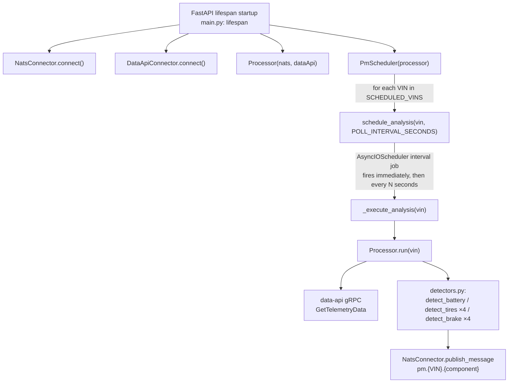

# predictive-maintenance — Detector Service Deep Dive

> Audience: engineers working on detection logic, alert publishing, or the
> offline evaluator. This document is about the **service** — process
> architecture, scheduling, data flow, config, testing — paired with plain-
> language explanations of *why* it's built this way.
>
> The detection **math** (EWMA formulas, temperature compensation, worked
> examples) already has a canonical reference — don't duplicate it, read
> it: [`docs/superpowers/research/2026-08-14-pm-algorithms-implementation.md`](../../../docs/superpowers/research/2026-08-14-pm-algorithms-implementation.md)
> and its battery/brake/tires first-principles companions in the same
> folder. This document links to specific sections of that reference where
> relevant instead of restating the formulas.
>
> Service: `sample-services/predictive-maintenance`. All paths below are
> relative to this directory unless stated otherwise. Citations are file +
> function/class name, not line numbers.

---

## 1. What this service does, in plain terms

Every 60 seconds (configurable), for every VIN it's told to watch, this
service asks `data-api` for that vehicle's last 30 days of slow-changing
signals — battery voltage, tire pressure per wheel, brake wear per pad —
runs a fixed set of threshold rules against them (no machine learning, no
LLM call, nothing probabilistic), and broadcasts the result on NATS as a
small message: "here's VIN1002's battery, health score 42, severity
action, here's why." It never remembers anything between polls in this
codebase's current form — it recomputes the full picture fresh, every
single poll, for every VIN, and always publishes, even when everything is
perfectly healthy (see §4 for why this matters and where it differs from
older documentation).

The deliberate absence of ML/LLM is a design choice, not a limitation: a
fixed set of threshold rules is auditable (you can always explain exactly
why an alert fired), deterministic (the same input always produces the
same output — critical for testing and for the offline evaluator's
precision/recall scoring), and requires no API keys or model calls, which
matters for a demo that has to run entirely offline.

---

## 2. Process architecture

- **Entrypoint**: `src/predictive_maintenance/main.py` — a FastAPI app
  whose `lifespan` async context manager does all startup wiring: connect
  to NATS, connect to data-api, build a `Processor`, build a
  `PmScheduler`, then schedule one recurring job per VIN in
  `settings.scheduled_vins`.
- **Scheduling** (`core/scheduler.py`, class `PmScheduler`): wraps
  APScheduler's `AsyncIOScheduler` with an in-memory job store — chosen
  specifically because it shares FastAPI's own asyncio event loop rather
  than spinning up separate worker processes/threads. `schedule_analysis`
  registers an `'interval'` job per VIN with `next_run_time=datetime.now()`,
  so a freshly started service polls every watched VIN **immediately** on
  boot rather than waiting a full interval first — this is why alerts can
  appear within seconds of `docker compose up`, not a minute later.
- **Concurrency model**: pure asyncio, one event loop, no threads or
  separate processes. Each VIN's job is independent — nothing serializes
  polls across VINs, and there is **no re-entrancy guard** within a single
  VIN's job either: if a poll ever took longer than `POLL_INTERVAL_SECONDS`
  to complete, APScheduler could in principle start a second overlapping
  poll for the same VIN. This isn't a practical concern at demo data
  volumes but is worth knowing before scaling up polling frequency or
  fleet size.
- `stop_analysis(vehicle_id)` and `retrieve_jobs()` exist on `PmScheduler`
  but nothing in `main.py` currently calls them — there is no runtime
  "start/stop watching this VIN" HTTP endpoint yet, only the fixed set
  read from `SCHEDULED_VINS` at boot.

**In plain terms:** think of `PmScheduler` as a simple alarm clock with one
alarm per vehicle, all sharing the same clock (the asyncio event loop)
instead of each vehicle getting its own separate thread. When VIN1002's
alarm goes off, it runs `Processor.run("VIN1002")` to completion, then
waits for the next ring — a lightweight design appropriate for a handful
of VINs polled once a minute, not built to fan out to a large fleet
without revisiting the concurrency model.

---

## 3. Data ingestion — what it asks data-api for

`core/processor.py`, `Processor.run(vin)` builds one `GetTelemetryDataRequest`
per poll (see `data-api`'s own docs for how this request is served) with:

- `vehicle_id = vin`
- `data_types` — an explicit, fixed list of 18 column names: battery
  (`dynamic:battery.voltage`, `dynamic:battery.temp`), driving signals
  (`dynamic:VELOCITY`, `dynamic:BRAKE_PEDAL_PCT`), legacy single-channel
  tire columns (`dynamic:TIRE_PRESSURE`, `dynamic:TIRE_TEMP`), and the
  full per-wheel/per-pad set (`dynamic:TIRE_PRESSURE.{FL,FR,RL,RR}`,
  `dynamic:TIRE_TEMP.{FL,FR,RL,RR}`, `dynamic:BRAKE_WEAR.{FL,FR,RL,RR}`).
  Recall from `data-api`'s docs that there's no wildcard query — this is
  why every wheel/pad has to be spelled out here individually.
- `last_duration = BATTERY_WINDOW_DAYS × 86400` seconds — **one window
  size drives everything**, not just the battery. Even though the setting
  is named for battery, tire and brake data are pulled over the same
  30-day lookback.

**In plain terms:** every poll, this service re-downloads the vehicle's
entire recent history rather than just "what's new since last time." This
is deliberate simplicity — the detectors (EWMA, 30-day slope) need the
whole window to recompute a trend anyway, so there would be little benefit
to incremental fetching, and re-fetching the whole window means the
service carries no memory of what it saw last time, which makes it simple
to reason about and safe to restart at any moment without losing state.

---

## 4. What actually gets published — and the cadence discrepancy

**Read this section even if you've read the README** — the shipped
behavior has moved on from what some of the service's own documentation
still says.

`Processor.run` computes a fresh `DetectorResult` for every component on
every poll and **always publishes**, healthy included — confirmed by
`tests/test_processor_cadence.py::test_processor_publishes_healthy_state`
and by an explicit comment in `Processor.run` itself: *"Demo mode: publish
the current state every poll for every VIN (healthy included) so the /pm
board always reflects live health."*

This is **not** what the service's `README.md` and the evaluator script's
own comment (`scripts/evaluate_detectors.py`) currently claim — both still
describe an older "publish only on severity/band change, healthy VINs
publish nothing" design. There is a vestigial `Processor._band_of(score)`
static method left over from that design, but nothing in `run()` calls it
to gate publishing.

**In plain terms:** two different mental models exist for this service —
"tell me only when something changes" (quiet, event-driven, matches the
original spec) versus "tell me the full picture every time, so a live
dashboard never has to guess whether it's looking at stale data" (what
actually ships today, chosen because the `/pm` console needs to always
show current health for every visible VIN, not just the VINs that most
recently had *something interesting* happen). If you're extending this
service, treat the always-publish behavior in `Processor.run` as the
source of truth, and treat the README/evaluator comments as stale
documentation to eventually fix, not as a spec to preserve.

**Alert subject construction** (`Processor.run`, one publish per
`component` key in the detector results dict):

| Component key | NATS subject | When |
|---|---|---|
| `"battery"` | `pm.{VIN}.battery` | always (single-channel) |
| `"tires.{wheel}"` | `pm.{VIN}.tires.{wheel}` | per-wheel `TIRE_PRESSURE.{wheel}`+`TIRE_TEMP.{wheel}` data present |
| `"tires"` (legacy) | `pm.{VIN}.tires` | only when per-wheel columns are absent but single-channel `TIRE_PRESSURE`/`TIRE_TEMP` are present |
| `"brake.{pad}"` | `pm.{VIN}.brake.{pad}` | per-pad `BRAKE_WEAR.{pad}` data present |
| `"brake"` (legacy) | `pm.{VIN}.brake` | only when no `BRAKE_WEAR.*` present but braking-energy was accumulated from velocity/pedal data |

Publishing itself (`client/nats_client.py`, `NatsConnector.publish_message`)
serializes the `PmMessage` proto (betterproto) and does a **plain
core-NATS publish + flush** — not a JetStream durable publish, even though
a JetStream context is initialized elsewhere in the connector. This means
a `pm.*` message published while no subscriber is listening is simply
gone; there's no message replay for a dashboard that connects late (the
next poll, up to `POLL_INTERVAL_SECONDS` later, will refresh it).

**Payload schema** (`model/pm_message.py`, from `proto/pm-message.proto`):
`vin`, `component`, `health_score` (0–100 int), `severity` (`healthy` /
`advisory` / `action` / `critical`), `evidence` (`map<string,string>` —
string-only because betterproto's map codec needs it, which is why the
detectors format numbers as strings before putting them in evidence — see
the "cranking_only": "true" string-boolean example in the algorithms
reference), `explanation` (a fixed-template sentence, never LLM-generated),
`timestamp` (RFC3339, built from `datetime.now().isoformat()` at publish
time, not from the underlying telemetry's own timestamp).

---

## 5. Detector module — pointer to the canonical reference

`core/detectors.py` holds all threshold constants and the three detector
functions (`detect_battery`, `detect_tires`, `detect_brake`). **Do not
re-derive the math here** — it's fully worked, with formulas and hand-
verified examples, in
[`2026-08-14-pm-algorithms-implementation.md`](../../../docs/superpowers/research/2026-08-14-pm-algorithms-implementation.md)
§3–§5, with first-principles justification in the companion battery/brake/tires
docs in the same folder. The short version, for orientation:

- **`detect_battery(rest, crank, baseline_r_int_mohm=None)`** — EWMA (α=0.1)
  + 30-day OLS slope on temperature-compensated resting voltage, plus an
  optional cranking-signature check (`V_min`, internal resistance). Returns
  a **continuous** health score (12.63V→100, 10.5V→0) that penalty rules
  can only pull down via `min()`, and a **separately** threshold-driven
  severity — the two are decoupled, so a battery can score 75 on the meter
  yet still alert as `action` because its EWMA sits below the 12.2V line.
  Fewer than 5 resting samples and no cranking data → hard-coded
  `healthy`/100, no evidence (`core/detectors.py`, insufficient-data
  guard).
- **`detect_tires(samples, recommended_bar=2.3, wheel=None)`** — same
  temperature-compensation-then-EWMA-then-slope shape, reference 20°C
  (293.15K), continuous score 2.3 bar→100 / 0.9 bar→0, severity thresholds
  at 1.8 bar (action) and 1.2 bar (critical). Needs ≥14 samples or returns
  `healthy`/100. Note: `recommended_bar` is accepted but never used inside
  the function body — a dead parameter in the current implementation.
- **`detect_brake(wear_fraction, wear_rate_per_km=None, pad=None)`** — the
  simplest of the three: `score = round(100 × (1 − wear_fraction))`,
  thresholds at 80% (advisory) and 90% (action). No `critical` severity
  path exists for brakes at all — a brake pad detector result is always
  `healthy`, `advisory`, or `action`, never `critical`.

**In plain terms — why the score and the severity are separate things**:
the health score answers "how worn is this part, as a smooth percentage,"
which is what you'd want for a chart that shows a gradual decline. The
severity answers "should a human be alerted right now," which is a
discrete yes/no/how-urgent decision. Coupling them (e.g. "score < 30 means
critical") sounds simpler but produces worse alerts — a part can be
*mostly* fine on average (a decent score) while one specific reading (a
cranking sag, a slope crossing a line) is genuinely alarming *right now*.
Keeping them separate means the threshold rules can fire based on the
specific physical thing that actually predicts failure, while the score
stays a faithful, continuous read-out of "percent of life used" for
charting.

---

## 6. State tracking — there isn't any

Unlike a lot of alerting systems, this service keeps **no memory of
previous poll results** anywhere in `src/`. Every poll is computed fully
fresh from the current 30-day window pulled from data-api; nothing is
cached, diffed, or compared against a "last known severity" dict. This is
consistent with — and is the underlying reason for — the always-publish
cadence described in §4: since there's no stored "last state," there's
nothing to compare a fresh result against to decide "did this change,"
so the simplest correct behavior is "publish what I just computed, every
time."

**In plain terms:** if you're used to alerting systems that say "only
notify me when something changes," this service intentionally doesn't
work that way today. It's closer to a gauge that's always being read aloud
than a smoke detector that only speaks up when triggered. If you need
change-based notification (e.g. to reduce NATS traffic at fleet scale),
that would be new code — a `(vin, component) → last severity` dict checked
before publish — not a matter of flipping an existing flag.

---

## 7. Explanation generation

There is no separate templating module or LLM call — every explanation
string is built inline in its detector function with plain Python
f-strings/`.format()` (`core/detectors.py`). The service's own module
docstring states the intent directly: *deterministic predictive-maintenance
detectors (no ML, no LLM)*. One documented quirk lives in
`detect_battery`'s explanation composition (an `or` fallback that's
unreachable because the primary template string is never falsy) — see the
algorithms-implementation reference §3.9 for the exact mechanics; it's a
live, tested behavior, not a bug to silently fix without checking test
expectations first.

**In plain terms:** every alert's "why" text is assembled from a small set
of fixed sentence templates with the actual numbers plugged in — nothing
is generated by a language model, and nothing is free-text. This is what
makes every alert reproducible and auditable: given the same inputs, you
get the exact same explanation string every time, which the test suite
relies on directly (asserting on substrings of the explanation).

---

## 8. Ground-truth evaluation tooling

`scripts/evaluate_detectors.py` is the offline scoring tool referenced in
the operator guide's §8 ("Validation — getting real numbers"). CLI:
`--vins`, `--soak-days` (default 60), `--labels` (ground-truth JSONL path,
default `local-dev/data/sim-ground-truth.jsonl`), `--output` (default
`sample-clients/data-web-client/public/pm-validation.json`),
`--data-api-addr`.

**In plain terms:** the detector's job is to predict failures *before*
they happen, early enough to be useful. But how do you know if it's any
good at that, without waiting for real vehicles to actually break over
months? The simulator already knows, deterministically, exactly when each
component will die (it's walking a scripted curve — see the vehicle-client
docs) and writes that "the true answer" out to a ground-truth label file as
it runs. This script re-runs the *exact same* detector code against a
recorded soak, compares the detector's alert timing against the
simulator's known failure timing, and reports precision (how often an
alert corresponds to a real failure), recall (how often a real failure got
an alert at all), and mean lead time (how many days of warning the alerts
gave on average) — real numbers instead of "trust me, it works."

Mechanically: `run_detectors_for_vin` replays the identical
`Processor.run` parsing/detector logic but requests an explicit
`TimeRange(start, end)` instead of `last_duration`, and — unlike the live
service — only records an alert when `severity != "healthy"` (its own
comment says "matching the service cadence," which is now stale per §4;
this doesn't affect scoring correctness, since ground-truth comparison
only cares about the first time a real alert would have fired, but it's
worth knowing the evaluator and the live service no longer agree on what
"cadence" means).

`_first_alert_epoch` finds the first sample that would have crossed a
component's threshold (battery: first compensated voltage ≤ 12.4V; tires:
first compensated pressure ≤ 1.8 bar, per-wheel when scoring
`tires.{wheel}`); brakes have no single-sample crossing point (wear is a
cumulative integral, not a threshold on one reading) so brake lead time
uses the window start as a conservative lower bound.

`collect_ground_truth` reads the simulator's JSONL labels and derives a
per-VIN, per-component failure epoch: battery `days_to_failure <= 0`,
tires `pressure_bar <= TIRE_FLOOR_BAR` (1.8), brake `energy_joules >=
BRAKE_ENERGY_BUDGET_J` (6e9 J — mirrored from `processor.py`'s own
constant so the evaluator's failure definition matches the detector's own
physics).

`compute_metrics` classifies each (VIN, component) pair as a true
positive (alerted, and the first alert precedes the known failure), false
positive (alerted but doesn't precede failure, or missing an epoch), or
false negative (failed but never alerted) and reports precision/recall/
mean-lead-days per component; a component with neither ground truth nor
alerts reports `null` ("not measured") rather than a misleading 1.0.
`write_validation_json` writes the scored output to the path the `/pm`
console's validation card reads.

---

## 9. Configuration

`config/config.py`, class `Settings` (pydantic-settings), singleton
`settings`, documented identically in `example.env`:

| Env var | Default | Purpose |
|---|---|---|
| `NATS_HOST` / `NATS_PORT` | `nats` / `4222` | NATS server |
| `NATS_USER` / `NATS_PASSWORD` | `connector` / `connector-pass` | NATS auth — this account needs `pm.>` publish permission |
| `DATA_API_GRPC_ADDR` | `data-api:8080` | gRPC address of `data-api` |
| `SCHEDULED_VINS` | `""` (empty) | comma/whitespace-separated VINs to poll; empty means nothing is scheduled |
| `POLL_INTERVAL_SECONDS` | `60` | per-VIN polling cadence |
| `BATTERY_WINDOW_DAYS` | `30` | lookback window for the data-api request — drives tire/brake lookback too, not just battery |
| `LOG_LEVEL` | `info` | `structlog` level; `debug` switches to a human-readable console renderer instead of JSON lines |

One implementation note worth flagging: `main.py`'s startup log calls
`settings.model_dump(context={"redact": True})`, apparently intending to
redact secrets like `nats_password` from logs — but no custom serializer
implementing that redaction exists in `config.py`, so this call's actual
effect (whether it errors, is ignored, or genuinely redacts, depending on
the pydantic-settings version in use) hasn't been verified against a
running instance. Don't assume secrets are actually being redacted from
logs without checking directly.

---

## 10. Testing

`tests/` (pytest, `asyncio_mode = "auto"`, run via `make test` →
`uv run pytest tests/ -v`):

| File | Covers |
|---|---|
| `test_detectors.py` | Core detector math: battery healthy/advisory/cranking-critical/insufficient-data; brake advisory/action; tire slow-leak and flat-tire critical, temperature compensation; per-wheel/per-pad evidence keys present/absent correctly |
| `test_detectors_guard.py` | Regression guard: `detect_battery` with an empty `rest` list must not crash |
| `test_detectors_serialize.py` | Regression guard: cranking-only evidence must be all-string (protobuf `map<string,string>` would reject a bool), round-trips through `PmMessage` |
| `test_pm_message.py` | Basic `PmMessage` serialize/parse round-trip |
| `test_processor.py` | `Processor.run` end-to-end with a mocked gRPC stub and mocked `NatsConnector` |
| `test_processor_cadence.py` (largest suite) | The "always publish, healthy included" cadence; per-wheel/per-pad subject routing and legacy single-channel fallback; poll-exception handling (must log and return, never crash the scheduler); NATS connect/publish failure paths |
| `test_evaluate.py` | Evaluator's pure logic: `_first_alert_epoch`, `collect_ground_truth`, `compute_metrics`, `write_validation_json` — does not require a live data-api |

`tests/conftest.py` adds the repo's `scripts/` directory to `sys.path` so
`scripts.evaluate_detectors` is importable in tests without a running
stack.

---

## 11. Quick reference

| Question | File / Function |
|---|---|
| How does a VIN get scheduled and re-polled? | `main.py` · `lifespan`; `core/scheduler.py` · `PmScheduler.schedule_analysis` |
| What does one poll actually request from data-api? | `core/processor.py` · `Processor.run` |
| Does it publish only on change, or every poll? | `core/processor.py` · `Processor.run` (always publishes — see §4) |
| Where do the threshold constants live? | `core/detectors.py` (module-level constants) |
| How is a per-wheel/per-pad alert subject built? | `core/processor.py` · `Processor.run` |
| How is an alert actually sent to NATS? | `client/nats_client.py` · `NatsConnector.publish_message` |
| What's in a published alert? | `model/pm_message.py` (from `proto/pm-message.proto`) |
| How is detector accuracy actually measured? | `scripts/evaluate_detectors.py` · `run_detectors_for_vin`, `compute_metrics` |
| What env vars configure it? | `config/config.py` · `Settings` |
| Where's the underlying math derived? | [`docs/superpowers/research/2026-08-14-pm-algorithms-implementation.md`](../../../docs/superpowers/research/2026-08-14-pm-algorithms-implementation.md) |
